# البنية التقنية

[[toc:2-2]]

## نظرة عامة

تجمع البنية التقنية لـ Cosmicrafts بين قوة البلوكتشين وكفاءة الاتصال في الوقت الفعلي، مما يوفر:
- ملكية آمنة للأصول الرقمية
- تجربة لعب سريعة وسلسة
- حوكمة شفافة وقابلة للتدقيق
- بنية تحتية قابلة للتطوير

## التصميم التقني الأساسي

### لغة البرمجة Motoko

تم تطوير Cosmicrafts باستخدام لغة Motoko، مما يوفر:
- إدارة ذاكرة متقدمة
- تمثيل حالة فعال
- عمليات غير متزامنة محسنة
- أمان النوع في وقت التجميع

### تصميم الكانستر الموحد

على عكس الأنظمة متعددة الكانسترات التقليدية، يستخدم Cosmicrafts تصميماً موحداً:

| الميزة | النظام التقليدي | نهج Cosmicrafts |
|---------|------------------|------------------|
| وقت الاستجابة | 2-5 ثوانٍ | >500 مللي ثانية |
| تكلفة الحوسبة | عالية | منخفضة |
| تعقيد النشر | معقد | مبسط |
| قابلية التطوير | محدودة | عالية |

### مزايا التصميم الموحد

1. **أداء محسن**
   - تأخير منخفض
   - تكلفة حوسبة أقل
   - كفاءة الذاكرة

2. **تبسيط العمليات**
   - نشر أسهل
   - صيانة أبسط
   - تحديثات أسرع

3. **موثوقية محسنة**
   - نقاط فشل أقل
   - استعادة أسرع
   - تناسق أفضل

## طبقة الاتصال في الوقت الفعلي

### بوابة WebSocket لـ IC

يستخدم النظام بوابة IC WebSocket للاتصال الثنائي الاتجاه:

| الميزة | التنفيذ | الفائدة |
|---------|-------------|----------|
| توقيع الرسائل | Ed25519 | أمان الرسائل |
| تشفير SSL/TLS | AES-256 | حماية البيانات |
| ضغط البيانات | GZIP | كفاءة النقل |

### ميزات الأمان

1. **حماية الرسائل**
   - توقيع رقمي
   - التحقق من التكامل
   - منع التلاعب

2. **أمان الاتصال**
   - تشفير من طرف إلى طرف
   - مصادقة العميل
   - حماية من الهجمات

3. **حماية البيانات**
   - تخزين مشفر
   - نسخ احتياطي آمن
   - استعادة موثوقة

## إدارة الموارد

### بيئة خالية من الغاز

يوفر Internet Computer بيئة خالية من رسوم الغاز:

| الميزة | الفائدة | التنفيذ |
|---------|----------|-------------|
| لا رسوم معاملات | تجربة مستخدم أفضل | معالجة تلقائية |
| حوسبة مدعومة | تكلفة تشغيل أقل | إدارة موارد ذكية |
| معاملات فورية | أداء محسن | معالجة متزامنة |

### عمليات النظام

1. **إدارة الذاكرة**
   - تخصيص ديناميكي
   - جمع القمامة التلقائي
   - تحسين الاستخدام

2. **معالجة المعاملات**
   - تنفيذ متوازٍ
   - توازن الحمل
   - استعادة الأخطاء

3. **تخزين البيانات**
   - تجزئة فعالة
   - تخزين موزع
   - نسخ احتياطي تلقائي

## التبعيات والخدمات الخارجية

### محرك اللعبة

| المكون | الحالة | الخطط المستقبلية |
|---------|--------|------------------|
| Unity | حالي | تحديثات دورية |
| Unreal | مخطط | تكامل 2024 |
| Godot | مخطط | تكامل 2025 |

### تبعيات الواجهة الأمامية

- React.js للواجهة
- Three.js للرسومات
- Web3.js للتكامل
- Socket.io للاتصال

### تبعيات الخلفية

- Motoko للعقود
- Rust للأداء
- Node.js للخدمات
- Redis للتخزين المؤقت

### خدمات البنية التحتية

1. **الحوسبة**
   - Internet Computer
   - خوادم WebSocket
   - معالجة موزعة

2. **التخزين**
   - IPFS للأصول
   - تخزين IC
   - نسخ احتياطي موزع

3. **الشبكة**
   - CDN عالمي
   - توازن حمل تلقائي
   - حماية DDoS

## مراجعة الأمان

### الحالة الحالية

- التركيز على بناء قاعدة المستخدمين
- تحسين وظائف الكانستر
- اختبار أمان مستمر

### الخطط المستقبلية

1. **تدقيق شامل**
   - مراجعة الكود
   - اختبار الاختراق
   - تحليل الثغرات

2. **تحسينات الأمان**
   - تشفير إضافي
   - مصادقة معززة
   - مراقبة متقدمة

3. **توثيق الأمان**
   - سياسات الأمان
   - إجراءات الاستجابة
   - إرشادات المستخدم

## خارطة الطريق التقنية

### المرحلة 1: الأساس (الأشهر 1-6)
- تحسين أداء الكانستر
- تعزيز الاتصال في الوقت الفعلي
- تطوير أدوات المراقبة

### المرحلة 2: التوسع (الأشهر 7-12)
- إضافة محركات ألعاب جديدة
- تحسين تجربة المستخدم
- توسيع قدرات الشبكة

### المرحلة 3: التحسين (الأشهر 13+)
- تنفيذ ميزات متقدمة
- تكامل تقنيات جديدة
- تحسين الأداء العام

```mermaid
graph TD
    %% Core User Layer
    User(("🧑 User"))
    
    %% Frontend Layer
    subgraph "Frontend Layer"
        UI["🖥️ User Interface"]
        Client["📱 Game Client"]
    end
    
    %% Communication Layer
    subgraph " "
        WS["📡 WebSocket Gateway"]
        API["🔌 API Interface"]
    end
    
    %% Blockchain Layer
    subgraph "Blockchain Layer"
        Canister["⚡ Game Canister"]
        DAO["SNS Governance"]
    end
    
    %% Connections
    User --> UI
    User --> Client
    UI --> WS
    UI --> API
    Client --> WS
    Client --> API
    WS --> Canister
    API --> Canister
    Canister -.->|"Reports to"| DAO
    DAO -->|"Controls"| Canister
    
    %% Styles
    classDef user fill:#1a2d40,stroke:#fff,stroke-width:2px
    classDef frontend fill:#0FB9FD20,stroke:#0FB9FD,stroke-width:2px
    classDef comms fill:#FFB80020,stroke:#FFB800,stroke-width:2px
    classDef blockchain fill:#00E5A420,stroke:#00E5A4,stroke-width:2px
    
    %% Apply styles
    class User user
    class UI,Client frontend
    class WS,API comms
    class Canister,DAO blockchain
```

