# Architecture

## Overview

Cosmicrafts implements a hybrid architecture that strategically integrates blockchain and WebSockets to deliver:
- Secure asset ownership and trading
- Fast, responsive gameplay
- Transparent governance
- Scalable infrastructure

## Core Technical Design

### Unified Canister Architecture

Cosmicrafts utilizes a single-canister architecture for core game logic, NFTs, and token operations, providing significant performance advantages:

| Traditional Multi-Canister | Cosmicrafts Single-Canister | Performance Impact |
|----------------------------|-----------------------------|--------------------|
| Cross-canister calls require consensus rounds | Internal function calls within same memory space | 3-10x faster operations |
| State changes across canisters need synchronization | Atomic state updates in a unified data model | Consistent data with no reconciliation |
| Multiple network round trips for complex operations | Single-hop execution for most game activities | Dramatically reduced latency |
| Serialization/deserialization overhead between canisters | Direct memory access to all system components | Lower computational overhead |

This architecture enables complex game operations like trading, crafting, and battling to execute immediately without the latency typically associated with blockchain applications. Players experience performance similar to traditional gaming platforms, while still benefiting from blockchain's security and ownership features.

```mermaid
graph TD
    %% Core User Layer
    User(("👤"))
    
    %% Frontend Layer
    subgraph "Frontend Layer"
        UI["🖥️ User Interface"]
        Client["📱 Game Client"]
    end
    
    %% Communication Layer
    subgraph " "
        WS["📡 WebSocket Gateway"]
        API["🔌 API Interface"]
    end
    
    %% Blockchain Layer
    subgraph "Blockchain Layer"
        Canister["⚡ Game Canister"]
        DAO["SNS Governance"]
    end
    
    %% Connections
    User --> UI
    User --> Client
    UI --> WS
    UI --> API
    Client --> WS
    Client --> API
    WS --> Canister
    API --> Canister
    Canister -.->|"Reports to"| DAO
    DAO -->|"Controls"| Canister
    
    %% Styles
    classDef user fill:#1a2d40,stroke:#fff,stroke-width:2px
    classDef frontend fill:#0FB9FD20,stroke:#0FB9FD,stroke-width:2px
    classDef comms fill:#FFB80020,stroke:#FFB800,stroke-width:2px
    classDef blockchain fill:#00E5A420,stroke:#00E5A4,stroke-width:2px
    
    %% Apply styles
    class User user
    class UI,Client frontend
    class WS,API comms
    class Canister,DAO blockchain
```

::: info Technical Implementation
The Motoko programming language enables our single-canister design through:
- Advanced memory management
- Efficient state representation
- Powerful type system
- Optimized asynchronous operations within a single canister

Our smart contracts are [open source on GitHub](https://github.com/cosmicrafts/cosmicrafts-dao) and [deployed publicly](https://dashboard.internetcomputer.org/canister/opcce-byaaa-aaaak-qcgda-cai) on the Internet Computer for full transparency.
:::

## Resource Management & Operations

### Gas-Free Environment

The Internet Computer eliminates the complexity of blockchain gas fees, returning to the simplicity of normal internet usage:

| Traditional Blockchain | Internet Computer |
|-----------------------|-------------------|
| Users pay gas fees for every transaction | Canister pays for its own computation with cycles |
| Complex fee system creates friction and barriers | Users experience Web2-like simplicity with no fees |

Unlike other blockchains where users must manage gas fees, the Internet Computer handles computation costs behind the scenes. This allows Cosmicrafts to deliver:

- **Mainstream Accessibility**: No cryptocurrency knowledge required to play
- **Micro-Transactions**: Even small in-game actions remain economically viable
- **Predictable Experience**: No surprising costs or failed transactions due to gas issues

### Operational Monitoring & Cycles Management

To maintain our gas-free environment and ensure optimal performance, Cosmicrafts employs industry-leading tools:

| Tool | Purpose | Implementation |
|------|---------|----------------|
| [Cycleops](https://cycleops.dev) | - Cycles management - Automated top-ups - Threshold alerts | Integrated with our deployment pipeline for proactive cycles management |
| [Canistergeek](https://github.com/usergeek/canistergeek-ic-motoko) | - Performance monitoring - Memory usage tracking - Log collection | Embedded in our Motoko codebase for real-time canister analytics |

::: info Infrastructure Resilience
Our monitoring stack ensures operational continuity through:
- Automated cycles management to prevent outages
- Memory utilization alerts to optimize storage
- Update call tracking for load balancing
- Comprehensive logging for rapid issue resolution
:::

## Strategic Components

### Digital Asset Management

- **Secure Ownership**: Blockchain-verified ownership of in-game items and currencies
- **Transparent Trading**: Fully visible marketplace operations and history
- **Verifiable Properties**: Cryptographically-secured item attributes and rarity

### Game Operations

- **Responsive Gameplay**: Real-time action with minimal latency
- **Fair Competition**: Transparent matchmaking and tournament systems
- **Secure Profiles**: Protected player identities and achievements

### Community Governance

- **Transparent Decision-Making**: Open voting and proposal systems
- **Community-Driven Development**: Direct stakeholder input into priorities 
- **Efficient Treasury Management**: Optimized resource allocation

## Performance & User Experience

### Speed and Responsiveness

- **Instant Feedback**: Immediate game actions and responses
- **Fast Transactions**: Quick processing of all economic activities
- **Smooth Multiplayer**: Seamless interaction between players

### Security and Trust

- **Verified Ownership**: Cryptographically-secured digital assets
- **Transparent Operations**: Visible and auditable systems
- **Protected Accounts**: Advanced security measures for player safety

### Mainstream Player Experience

- **No Learning Curve**: No blockchain knowledge required
- **Familiar Interactions**: Traditional gaming experiences  
- **True Digital Ownership**: Full control of in-game assets
- **Community Participation**: Direct input into development decisions

## Infrastructure & Scaling

### Comprehensive Security

- **Asset Protection**: Secure ownership verification and protected trading systems
- **Account Security**: Strong authentication and fraud prevention  
- **Operational Safety**: Regular security audits and continuous monitoring

### Scalability Framework

- **Player Growth**: Efficient support for expanding user base
- **Feature Expansion**: Seamless integration of new game modes and capabilities
- **Economic Scaling**: Support for growing transaction volume and marketplace activities

## Future-Ready Foundation

Our architecture is designed for long-term evolution and growth:

- **Adaptability**: Flexible systems that easily incorporate new technologies
- **Sustainability**: Efficient resource usage and cost-effective operations
- **Innovation Support**: Technical foundation for advanced gameplay and economic features

::: info Continuous Evolution
The Cosmicrafts architecture is designed for progressive enhancement, allowing us to:
- Implement emerging technologies
- Optimize based on real-world usage patterns
- Expand capabilities without disrupting existing systems
- Scale with the growth of our community
:::

