# Architecture

```mermaid
graph TD
    subgraph "Cosmicrafts Hybrid Architecture"
    A[Internet Computer Protocol] --> B[Decentralized Infrastructure]
    A --> C[On-Chain Components]
    A --> D[Off-Chain Components]
    
    B --> B1[Subnet Architecture]
    B --> B2[Global Node Distribution]
    
    C --> C1[Asset Management]
    C --> C2[Game Logic]
    C --> C3[DAO Governance]
    
    D --> D1[WebSocket Multiplayer]
    D --> D2[Client-Side Processing]
    D --> D3[Low-Latency Interactions]
    end
    
    style A fill:#00c3ff,stroke:#333,stroke-width:2px
    style B fill:#1a2d40,stroke:#333,stroke-width:1px
    style C fill:#1a2d40,stroke:#333,stroke-width:1px
    style D fill:#1a2d40,stroke:#333,stroke-width:1px
```

[[toc:2-2]]

Cosmicrafts represents a paradigm shift in blockchain gaming with a hybrid architecture **strategically integrating on-chain and off-chain components**, harnessing the [unparalleled capabilities](https://genfinity.io/2024/07/19/a-conversation-with-dfinitys-cto-jan-camenisch/) for [scalability](https://internetcomputer.org/capabilities/limitless-scaling), [cost-efficiency](https://www.reddit.com/r/devops/comments/1cwi1gn/when_did_the_cloud_become_so_stupid_expensive/), and [decentralized infrastructure](https://internetcomputer.org/how-it-works) of the **Internet Computer**. 

Unlike traditional games reliant on [centralized servers](https://www.geeksforgeeks.org/comparison-centralized-decentralized-and-distributed-systems/), Cosmicrafts implements critical game logic, asset management, and governance in a single unified canister deployed across a [decentralized network of datacenters](https://internetcomputer.org/node-providers), positioned strategically around the globe, while using specialized WebSocket technologies for real-time multiplayer functionality. This approach significantly reduces latency while still eliminating [single points of failure](https://en.wikipedia.org/wiki/Single_point_of_failure) through [cryptographic consensus](https://crypto.com/en/university/consensus-mechanisms-explained).

---

## Strategic Blockchain Integration

```mermaid
flowchart TD
    %% Main components with icons
    User["👤 Player"]
    Frontend["🖥️ User Interface"]
    Multiplayer["📡 Multiplayer"]
    Canister["🧠 Unified Game Canister"]
    DAO["🏛️ DAO Governance"]
    
    %% Connections
    User --> Frontend
    Frontend --> Multiplayer
    Frontend --> Canister
    Canister --> DAO
    DAO -.->|"Controls"| Canister
    
    %% Style definitions
    classDef user fill:#1e2b38,stroke:#ffffff4d,stroke-width:2px
    classDef frontend fill:#00c3ff30,stroke:#00c3ff,stroke-width:2px
    classDef hybrid fill:#ffa20030,stroke:#ffa200,stroke-width:2px
    classDef blockchain fill:#00ff9530,stroke:#00ff95,stroke-width:2px
    
    %% Apply styles
    class User user
    class Frontend frontend
    class Multiplayer hybrid
    class Canister,DAO blockchain
    
    %% Add labels
    subgraph "On-Chain Components" 
    Canister
    DAO
    end
    
    subgraph "Off-Chain Components"
    Frontend
    Multiplayer
    end
```

The design of Cosmicrafts intelligently bridges on-chain and off-chain elements to create an optimized gaming experience:

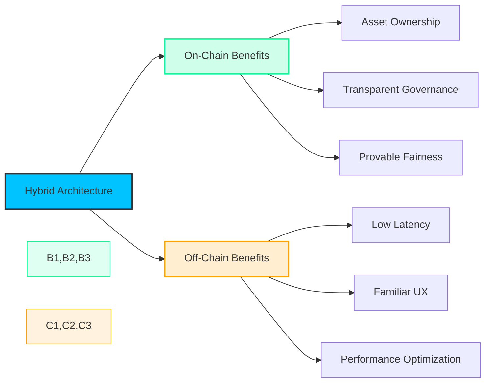

### On-Chain Components

- **Game Assets & Ownership**: All in-game assets exist as on-chain tokens, ensuring true player ownership
- **Core Game Logic**: Critical game mechanics are executed as verifiable on-chain operations
- **Governance Systems**: All DAO operations occur on-chain with complete transparency

Cosmicrafts maximizes blockchain benefits while ensuring optimal performance for real-time gaming. Our core game logic, token system, and NFT functionality all run in a single unified canister for maximum performance, while the DAO governance runs on SNS canisters. This architecture eliminates inter-canister call hops, significantly reducing latency for critical game operations.

> You can [view our public smart contracts on the Internet Computer dashboard](https://dashboard.internetcomputer.org/canister/opcce-byaaa-aaaak-qcgda-cai) along with our [open-source code](https://github.com/worldofunreal/cosmicrafts-motoko-backend).

### Optimized Single-Canister Design

Cosmicrafts uses a performance-optimized single-canister approach where game logic, token, and NFT functionality are integrated into one unified canister:

| Component | Implementation | Benefits |
|-----------|----------------|----------|
| **Game Logic** | Core mechanics in main.mo | Fast, responsive gameplay without inter-canister latency |
| **Token System** | ICRC-1 implementation in same canister | Instant token operations with zero inter-canister hops |
| **NFT Assets** | ICRC-7 implementation in same canister | Seamless NFT minting and management |
| **DAO Governance** | External SNS canisters | Community-driven platform governance |

### Multiplayer Implementation

For real-time multiplayer gaming, we utilize Internet Computer secure WebSocket gateways, providing:

- Millisecond-level response times for competitive gameplay
- Secure identity verification using Internet Computer authentication
- Verified game outcomes recorded on-chain

---

## Unified Canister Architecture

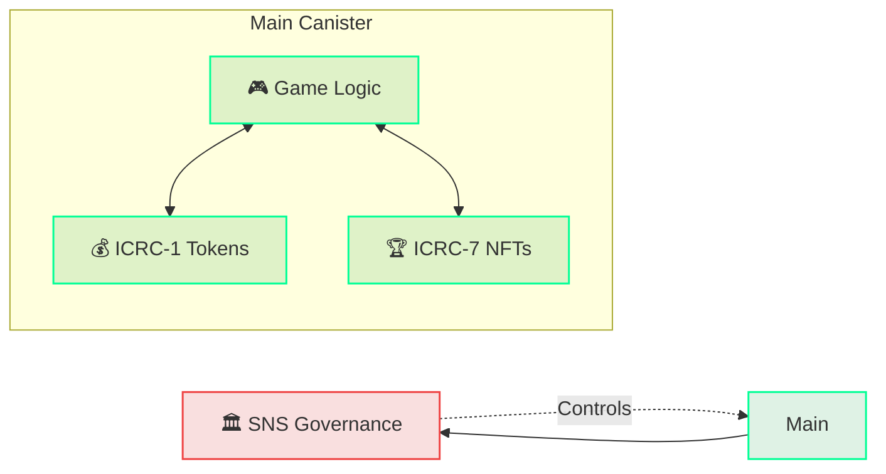

Our unified canister architecture integrates multiple functions within a single canister, delivering significant performance benefits over multi-canister approaches:

### Game Logic
- **Player Management:** Securely stores player profiles, achievements, and progression
- **Game Rules:** Ensures fair gameplay through transparent, immutable rules
- **Statistics:** Tracks game progress, leaderboards, and player achievements

### Token Implementation (ICRC-1)
- **In-Game Currency:** Handles token transactions for the game economy
- **Exchange Support:** Provides compatibility with DEX/CEX platforms
- **Rewards:** Distributes tokens for in-game accomplishments instantly

### NFT Implementation (ICRC-7)
- **Game Assets:** Manages in-game collectibles and items
- **Ownership Records:** Maintains verifiable ownership of digital assets
- **Metadata:** Stores dynamic properties for NFT upgrades and evolution

### External DAO Governance
The DAO uses standard [SNS Canisters](https://internetcomputer.org/docs/current/developer-docs/daos/sns/overview) to enable:
- **Community Voting:** Stakeholder decision-making on platform direction
- **Treasury Management:** Transparent handling of community funds
- **Canister Control:** Ability to update the main canister through proposals

---

## Advanced Internet Computer Features

The **Internet Computer** stands apart from other [blockchains](https://chainspect.app/compare/icp-vs-solana) by eliminating the need for traditional cloud services to operate at scale. Its [architecture](https://internetcomputer.org/how-it-works/architecture-of-the-internet-computer/) allows it to run applications natively on-chain, combining the speed and ease of cloud platforms with the trust and transparency of blockchain. 

### 1. Scalability
- **Dynamic Resource Allocation**: Automatically adapts to meet growing demand
- **Concurrent Users**: Supports a [huge number](https://internetcomputer.org/capabilities/limitless-scaling) of users without breaking

### 2. Speed and Performance
- **Near-Instant Transactions**: Operations are [fast](https://medium.com/dfinity/the-internet-computers-transaction-speed-and-finality-outpace-other-l1-blockchains-8e7d25e4b2ef#:~:text=The%20Internet%20Computer's%20performance%20evaluation,with%20a%201%2Dsecond%20finality.), responsive, and natural
- **Web-Speed**: Feels as [smooth](https://www.reddit.com/r/dfinity/comments/mum43f/how_fast_is_dfinity_exatcly/?rdt=38691) as any modern application

### 3. Cost-Effectiveness (Reverse Gas Model)
- **Zero Fees for Users**: Players don't need [wallets](https://internetcomputer.org/docs/current/developer-docs/defi/wallets/overview) or [tokens](https://www.coinbase.com/learn/crypto-basics/what-are-gas-fees)—just jump in
- **Affordable for Developers**: [Transaction costs](https://internetcomputer.org/docs/current/developer-docs/gas-cost) are [lower](https://icp.guide/costs-on-the-internet-computer/) than traditional blockchains or cloud solutions

---

## Technical Implementation

The **Internet Computer** introduces a new approach to smart contracts through its **canister architecture**. [Canisters](https://internetcomputer.org/docs/current/tutorials/developer-journey/level-0/intro-canisters) are the Internet Computer's version of smart contracts, designed to provide greater functionality and scalability than traditional blockchain contracts.

### Canister Technology

Cosmicrafts leverages a single unified canister built with:

| Feature | Implementation | Benefits |
|---------|----------------|----------|
| **[Motoko](https://github.com/dfinity/motoko) Programming** | Internet Computer's native language | Type safety, memory management, optimized performance |
| **[ICRC-7](https://github.com/dfinity/ICRC/blob/main/ICRCs/ICRC-7/ICRC-7.md) NFT Standard** | Integrated within main canister | Programmable assets, standardized metadata, cross-game utility |
| **[ICRC-1](https://internetcomputer.org/docs/current/developer-docs/defi/tokens/token-standards) Token Standard** | Integrated within main canister | Exchange compatibility, transparent transactions |
| **[ICP.NET](https://github.com/BoomDAO/ICP.NET)** | C# library for Unity integration | Seamless communication between Unity game client and blockchain canister |

### Performance Advantages

Our single-canister design offers significant advantages:

1. **Reduced Latency:** Eliminates inter-canister call hops
2. **Atomic Operations:** Token/NFT operations complete in a single transaction
3. **Data Consistency:** All game state maintained in one place
4. **Simplified Architecture:** Easier to reason about and maintain
5. **Better Player Experience:** Faster response times and smoother gameplay

---

## Cross-Platform Integration

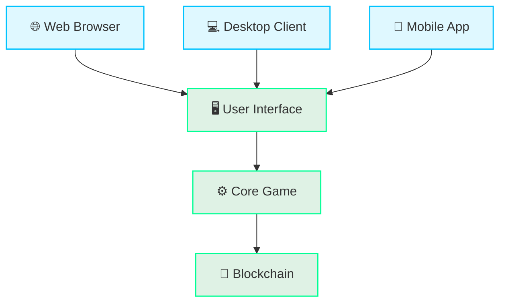

### Seamless Gameplay Across Devices

The Internet Computer architecture enables Cosmicrafts to deliver consistent experiences across platforms:

- **Web Browsers**: Direct browser access without downloads, using WebAssembly for near-native performance
- **Desktop Clients**: Enhanced experience for PC, Mac, and Linux with optimized rendering and controls
- **Mobile Gaming**: Touch-optimized interfaces for iOS and Android with synchronized progression

### Unity for Game Development
- Supports [cross-platform compatibility](https://unity.com/solutions/multiplatform), targeting web, desktop, and mobile with one codebase
- Uses [WebAssembly and WebGL](https://docs.unity3d.com/6000.1/Documentation/Manual/webgl-intro.html) for high-performance browser gameplay
- Offers a vast [ecosystem of plugins and tools](https://assetstore.unity.com/) to accelerate development

---

## Future Expansions

Our architecture is designed to evolve with Internet Computer technology advancements:

### Decentralization Evolution

As Internet Computer capabilities progress, we plan to migrate more components to fully on-chain solutions.

### Cross-Chain Interoperability
The **Internet Computer** is leading the way in building a **multichain** future through its [Chain Fusion technology](https://internetcomputer.org/chainfusion), enabling integration with other blockchains and unlocking new possibilities for cross-chain assets and gameplay.

### On-Chain AI
Advanced **AI-driven gameplay** and **data analytics** will be supported by ICP's evolving capabilities to run [AI models on-chain](https://internetcomputer.org/ai), creating possibilities for dynamic and personalized gaming experiences.

## Blockchain Gaming Challenges Solved

Traditional blockchain games face significant challenges that limit their appeal to mainstream players. Cosmicrafts has overcome these limitations through innovative technical solutions.

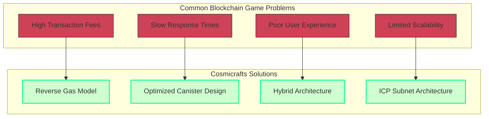

### 1. Cost Efficiency

Unlike Ethereum-based games where players face prohibitive gas fees, Cosmicrafts leverages the Internet Computer's **reverse gas model**, creating a seamless experience without transaction fees for players.

| Traditional Blockchain | Internet Computer |
|--------------------------|----------------------|
| Users pay gas fees | Canister pays for computation |
| Expensive for frequent actions | Ideal for high-frequency gaming |
| Barrier to entry for new players | Seamless onboarding experience |

### 2. Response Time

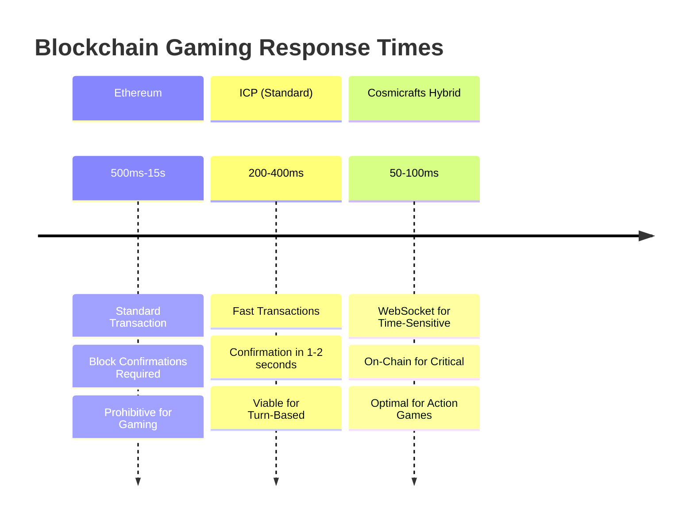

Cosmicrafts delivers responsive gameplay through:

- **Seamless WebSocket Integration**: Real-time multiplayer interactions occur through optimized WebSocket connections, keeping latency under 100ms
- **Unified Canister Architecture**: All critical game functions consolidated in a single canister to eliminate inter-canister call latency
- **Strategic On/Off-Chain Balance**: Time-sensitive operations handled client-side when appropriate, with critical state changes verified on-chain

### 3. User Experience

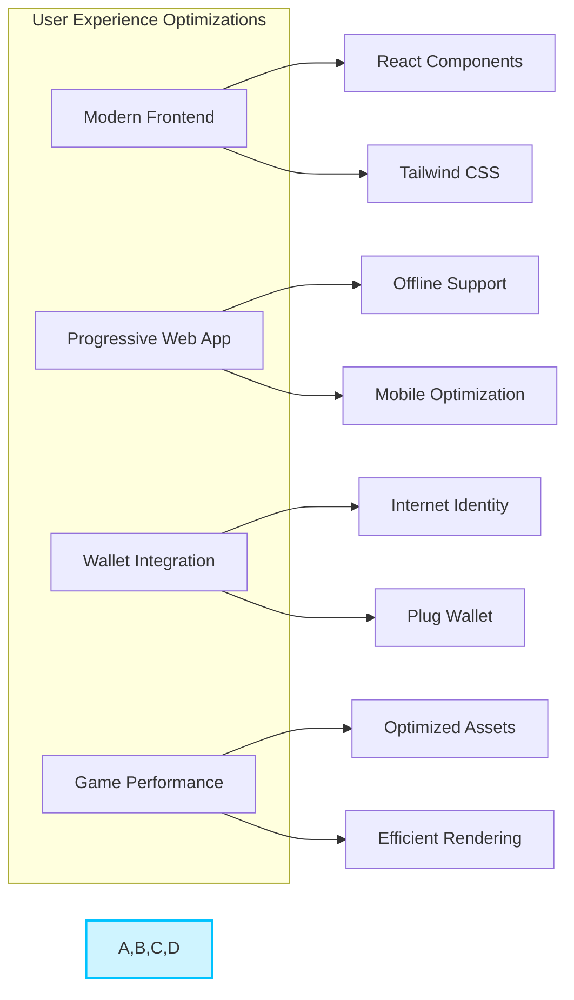

Cosmicrafts delivers a superior user experience through:
- **Seamless Onboarding**: Internet Identity for simplified authentication without seed phrases
- **Progressive Web App**: Game loads quickly and can be installed as a native app
- **Responsive Design**: Optimized for play across desktop, tablet, and mobile devices

## Technical Achievements

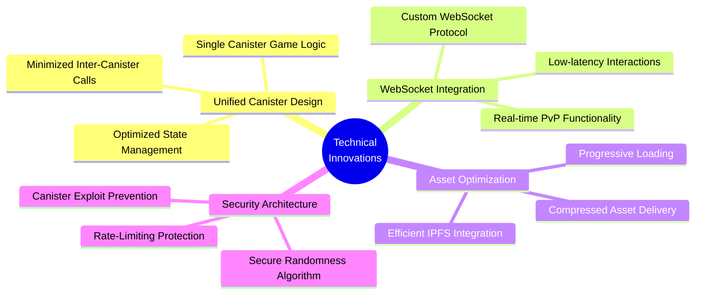

### 1. Unified Canister Architecture

Our groundbreaking approach consolidates all core game functionality into a single, optimized canister:

```mermaid
graph TD
    subgraph "Traditional Multi-Canister System"
        TC1[Game Logic Canister]
        TC2[Token Canister]
        TC3[NFT Canister]
        TC4[Marketplace Canister]
        
        TC1 <-->|"Inter-Canister Calls<br>(High Latency)"| TC2
        TC1 <-->|"Inter-Canister Calls<br>(High Latency)"| TC3
        TC3 <-->|"Inter-Canister Calls<br>(High Latency)"| TC4
    end
    
    subgraph "Cosmicrafts Unified Canister"
        UC[Single Unified Canister]
        
        UC1[Game Logic Module]
        UC2[Token System Module]
        UC3[NFT Module]
        UC4[Marketplace Module]
        
        UC --> UC1
        UC --> UC2
        UC --> UC3
        UC --> UC4
        
        UC1 <-->|"Internal Function Calls<br>(Near-Zero Latency)"| UC2
        UC1 <-->|"Internal Function Calls<br>(Near-Zero Latency)"| UC3
        UC3 <-->|"Internal Function Calls<br>(Near-Zero Latency)"| UC4
    end
    
    style TC1,TC2,TC3,TC4 fill:#ce425730,stroke:#ce4257,stroke-width:1px
    style UC fill:#00ff9530,stroke:#00ff95,stroke-width:2px
    style UC1,UC2,UC3,UC4 fill:#00ff9520,stroke:#00ff95,stroke-width:1px
```

**Benefits**:
- Eliminates inter-canister call latency for critical game operations
- Provides atomic transactions across game systems
- Simplifies state management and data consistency

### 2. WebSocket Integration for Real-time Gameplay

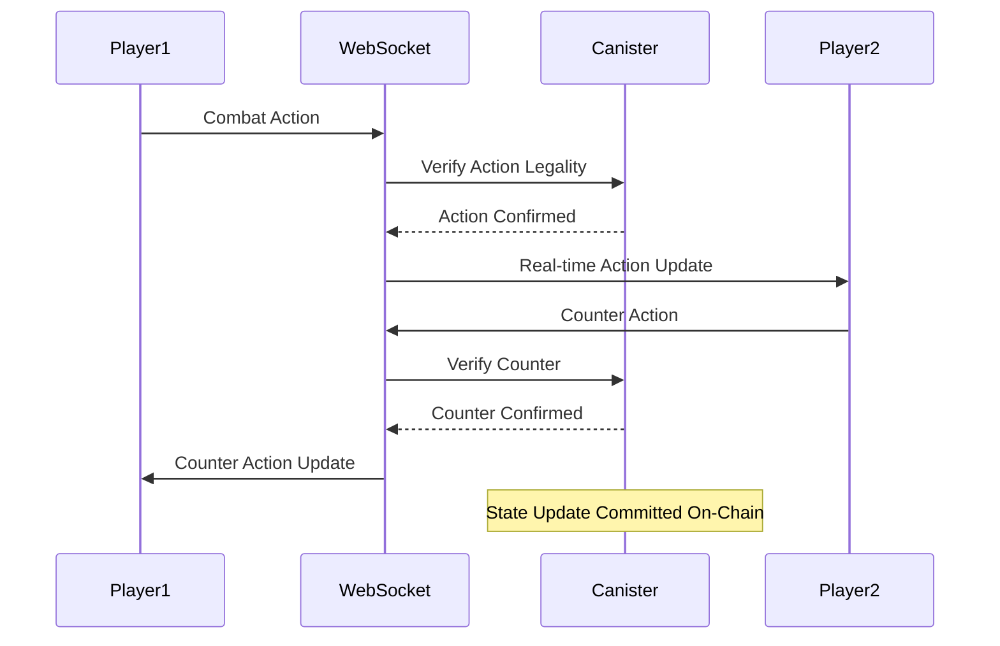

Our custom WebSocket integration enables:
- **Sub-100ms Response**: Action games require <100ms latency, which our architecture delivers
- **On-Chain Verification**: Critical state changes and outcomes verified on-chain without slowing gameplay
- **Secure Randomness**: Cryptographically secure random number generation for fair gameplay

This innovative system allows for seamless real-time multiplayer interactions while maintaining the security and verifiability benefits of blockchain technology.
