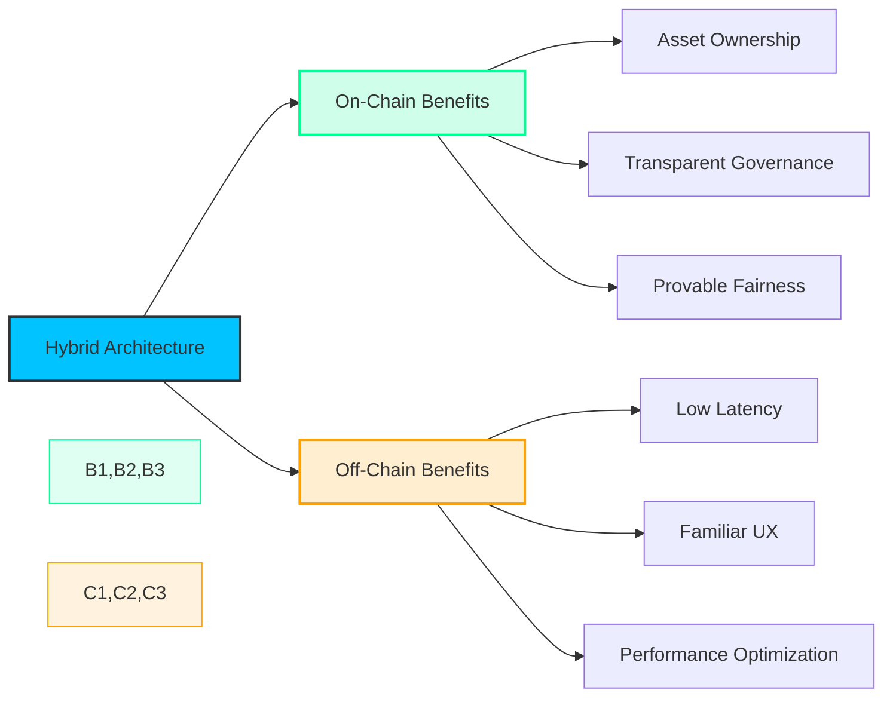
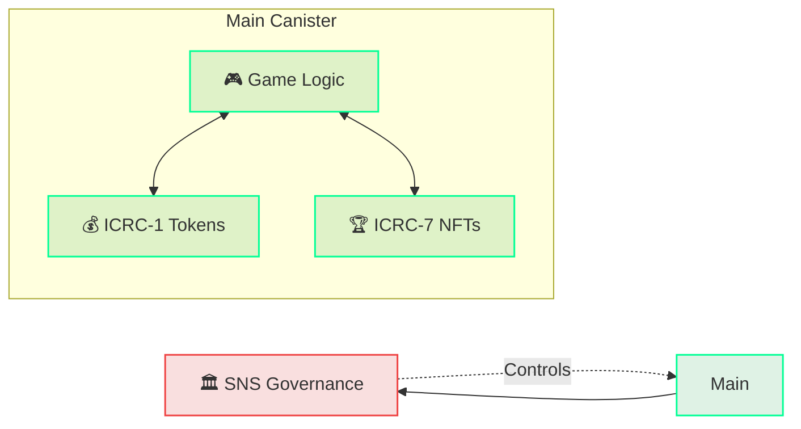
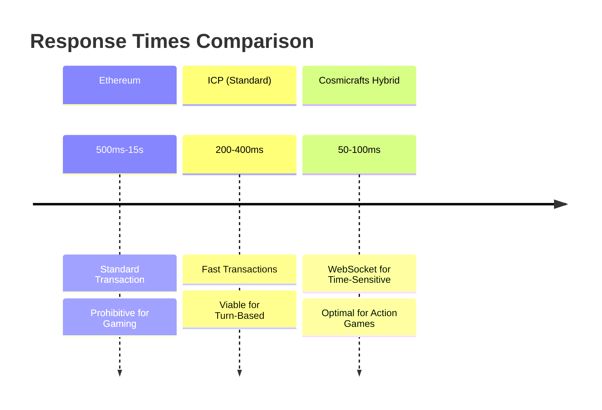

# Architecture

```mermaid
graph TD
    subgraph "Cosmicrafts Hybrid Architecture"
    A[Internet Computer Protocol] --> B[Decentralized Infrastructure]
    A --> C[On-Chain Components]
    A --> D[Off-Chain Components]
    
    B --> B1[Subnet Architecture]
    B --> B2[Global Node Distribution]
    
    C --> C1[Asset Management]
    C --> C2[Game Logic]
    C --> C3[DAO Governance]
    
    D --> D1[WebSocket Multiplayer]
    D --> D2[Client-Side Processing]
    D --> D3[Low-Latency Interactions]
    end
    
    style A fill:#00c3ff,stroke:#333,stroke-width:2px
    style B fill:#1a2d40,stroke:#333,stroke-width:1px
    style C fill:#1a2d40,stroke:#333,stroke-width:1px
    style D fill:#1a2d40,stroke:#333,stroke-width:1px
```

[[toc:2-2]]

Cosmicrafts implements a hybrid architecture that strategically integrates on-chain and off-chain components, leveraging Internet Computer's scalability, cost-efficiency, and decentralized infrastructure.

Unlike traditional games, Cosmicrafts implements critical game logic, asset management, and governance in a single unified canister, while using specialized WebSocket technologies for real-time multiplayer. This approach reduces latency while eliminating single points of failure.

## Architecture Highlights

1. **Unified Canister Design**: Single canister minimizes cross-canister calls, reducing latency
2. **Hybrid On-Chain/Off-Chain Model**: Critical ownership on-chain, gameplay optimized for performance
3. **Scalable State Management**: Efficient data structures to handle growing player base
4. **Secure Upgrade Path**: Designed for continuous improvement while maintaining state
5. **Transaction Speed**: Sub-second finality for critical operations

---

## Strategic Blockchain Integration

```mermaid
flowchart TD
    %% Main components with icons
    User["👤 Player"]
    Frontend["🖥️ User Interface"]
    Multiplayer["📡 Multiplayer"]
    Canister["🧠 Unified Game Canister"]
    DAO["🏛️ DAO Governance"]
    
    %% Connections
    User --> Frontend
    Frontend --> Multiplayer
    Frontend --> Canister
    Canister --> DAO
    DAO -.->|"Controls"| Canister
    
    %% Style definitions
    classDef user fill:#1e2b38,stroke:#ffffff4d,stroke-width:2px
    classDef frontend fill:#00c3ff30,stroke:#00c3ff,stroke-width:2px
    classDef hybrid fill:#ffa20030,stroke:#ffa200,stroke-width:2px
    classDef blockchain fill:#00ff9530,stroke:#00ff95,stroke-width:2px
    
    %% Apply styles
    class User user
    class Frontend frontend
    class Multiplayer hybrid
    class Canister,DAO blockchain
    
    %% Add labels
    subgraph "On-Chain Components" 
    Canister
    DAO
    end
    
    subgraph "Off-Chain Components"
    Frontend
    Multiplayer
    end
```

The design bridges on-chain and off-chain elements to create an optimized gaming experience:

### On-Chain Components

- **Game Assets & Ownership**: All in-game assets exist as on-chain tokens
- **Core Game Logic**: Critical game mechanics executed as verifiable on-chain operations
- **Governance Systems**: All DAO operations occur on-chain with complete transparency

Cosmicrafts maximizes blockchain benefits while ensuring optimal performance. Core game logic, token system, and NFT functionality run in a single unified canister, while DAO governance runs on SNS canisters. This architecture eliminates inter-canister call latency for critical operations.

> You can [view our public smart contracts](https://dashboard.internetcomputer.org/canister/opcce-byaaa-aaaak-qcgda-cai) and [open-source code](https://github.com/worldofunreal/cosmicrafts-motoko-backend).

### Optimized Single-Canister Design

| Component | Implementation | Benefits |
|-----------|----------------|----------|
| **Game Logic** | Core mechanics | Fast, responsive gameplay |
| **Token System** | ICRC-1 standard | Instant token operations |
| **NFT Assets** | ICRC-7 standard | Seamless NFT management |
| **DAO Governance** | SNS canisters | Community-driven control |

### Multiplayer Implementation

Real-time multiplayer gaming through WebSocket gateways provides:

- Millisecond-level response times for competitive gameplay
- Secure identity verification
- Verified game outcomes recorded on-chain

---

## Unified Canister Architecture

Our unified architecture delivers significant performance benefits:

### Game Logic
- **Player Management:** Secure profiles, achievements, and progression
- **Game Rules:** Fair gameplay through transparent rules
- **Statistics:** Game progress, leaderboards, and player achievements

### Token Implementation (ICRC-1)
- **In-Game Currency:** Token transactions for the game economy
- **Exchange Support:** Compatibility with external platforms
- **Rewards:** Instant distribution for accomplishments

### NFT Implementation (ICRC-7)
- **Game Assets:** In-game collectibles and items
- **Ownership Records:** Verifiable ownership
- **Metadata:** Dynamic properties for upgrades and evolution

### External DAO Governance
- **Community Voting:** Stakeholder decision-making
- **Treasury Management:** Transparent fund handling
- **Canister Control:** Community-driven upgrades

---

## Internet Computer Advantages

The Internet Computer provides unique advantages for gaming:

### 1. Scalability
- Dynamic resource allocation to meet growing demand
- Support for large numbers of concurrent users

### 2. Speed and Performance
- Near-instant transactions with 1-2 second finality
- Web-speed interactions

### 3. Cost-Effectiveness
- Zero gas fees for players
- Lower operational costs

---

## Blockchain Gaming Challenges Solved

### 1. Cost Efficiency

Unlike Ethereum-based games, Cosmicrafts leverages the Internet Computer's reverse gas model, creating a seamless experience without transaction fees for players.

| Traditional Blockchain | Internet Computer |
|--------------------------|----------------------|
| Users pay gas fees | Canister pays for computation |
| Expensive for frequent actions | Ideal for high-frequency gaming |
| Barrier to entry for new players | Seamless onboarding experience |

### 2. Responsive Gameplay

Cosmicrafts delivers responsive gameplay through:

- WebSocket integration for real-time interactions under 100ms
- Unified canister to eliminate inter-canister call latency
- Strategic balance of on-chain and off-chain operations

### 3. Security Focus

Our comprehensive security approach includes:

1. **Principal-Based Authentication**: Secure identity verification
2. **Threshold Signatures**: Distributed trust
3. **Input Validation**: All boundaries secured
4. **Least Privilege Design**: Compartmentalized access
5. **Audit Logging**: Comprehensive event tracking
