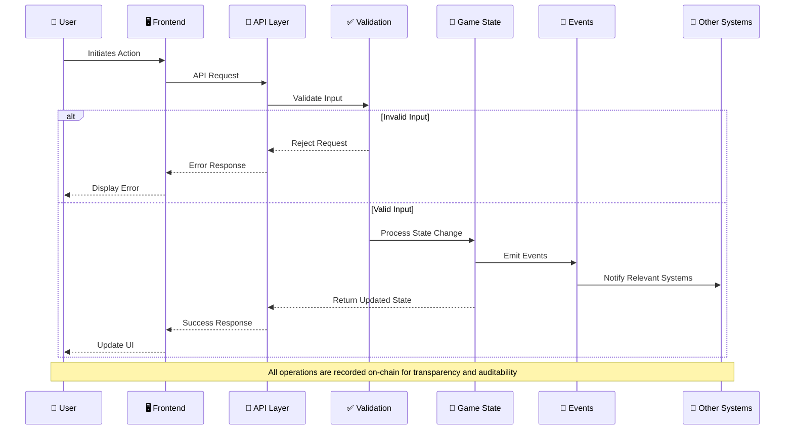
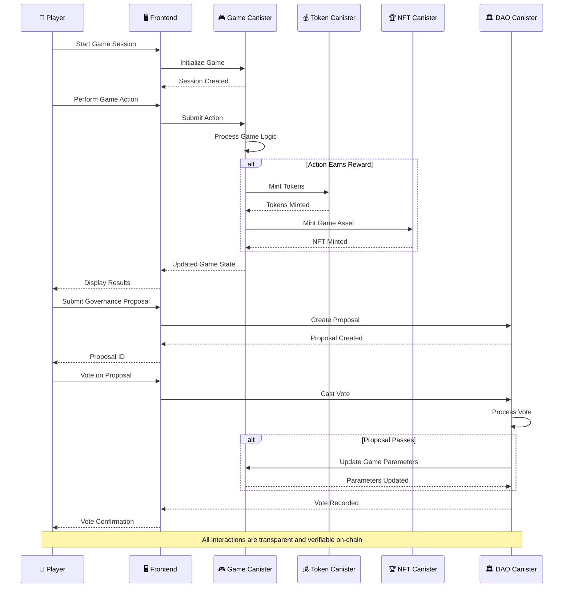
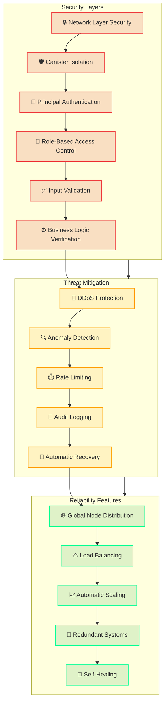

# Architecture


[[toc:2-2]]

::: info What Makes Cosmicrafts Different
Cosmicrafts represents a paradigm shift in blockchain gaming with its architecture **built entirely on blockchain**, leveraging the [unparalleled capabilities](https://genfinity.io/2024/07/19/a-conversation-with-dfinitys-cto-jan-camenisch/) for [scalability](https://internetcomputer.org/capabilities/limitless-scaling), [cost-efficiency](https://www.reddit.com/r/devops/comments/1cwi1gn/when_did_the_cloud_become_so_stupid_expensive/), and [decentralized infrastructure](https://internetcomputer.org/how-it-works) of the **Internet Computer**. 
:::

Unlike traditional games reliant on [centralized servers](https://www.geeksforgeeks.org/comparison-centralized-decentralized-and-distributed-systems/), Cosmicrafts' architecture resides on a [decentralized network of datacenters](https://internetcomputer.org/node-providers), positioned strategically around the globe, eliminating [single points of failure](https://en.wikipedia.org/wiki/Single_point_of_failure) through [cryptographic consensus](https://crypto.com/en/university/consensus-mechanisms-explained).

> This section outlines the key architectural components of Cosmicrafts, showcasing its technical advantages and investment potential.

---

## Fully On-Chain

All critical operations are conducted entirely on-chain, ensuring transparency, security, and scalability.

::: info Transparency
You can [view our public smart contracts on the Internet Computer dashboard](https://dashboard.internetcomputer.org/canister/opcce-byaaa-aaaak-qcgda-cai) along with our [open-source code](https://github.com/worldofunreal/cosmicrafts-motoko-backend) to explore how we achieve this level of trust and decentralization.
:::

<div class="mermaid-large">



</div>


```mermaid
flowchart TD
    %% Define diagram direction and layout
    %% Use TD (top-down) for vertical flow
    
    subgraph "User Layer"
        direction TB
        User["👤 User/Player"]
        Browser["🌐 Web Browser"]
        Client["💻 Game Client"]
    end
    
    subgraph "Frontend Layer"
        direction TB
        UI["🖥️ User Interface"]
        ClientLogic["⚙️ Client Logic"]
        APIcalls["🔌 API Calls"]
    end
    
    subgraph "Blockchain Layer"
        direction TB
        GameLogic["🎮 Game Logic"]
        TokenSystem["💰 Token System"]
        NFTSystem["🏆 NFT System"]
        DAO["🏛️ DAO Governance"]
    end
    
    %% Connections between nodes with clear vertical flow
    User --> Browser
    User --> Client
    Browser --> UI
    Client --> UI
    UI --> ClientLogic
    ClientLogic --> APIcalls
    
    APIcalls --> GameLogic
    GameLogic --> TokenSystem
    GameLogic --> NFTSystem
    TokenSystem --> DAO
    NFTSystem --> DAO
    DAO -.->|"Controls"| GameLogic
    DAO -.->|"Controls"| TokenSystem
    DAO -.->|"Controls"| NFTSystem
    
    %% Styling classes for visual distinction
    classDef userLayer fill:#1e2b38,stroke:#ffffff4d,stroke-width:1.5px
    classDef frontendLayer fill:#00c3ff20,stroke:#00c3ff,stroke-width:1.5px
    classDef blockchainLayer fill:#00993320,stroke:#00ff95,stroke-width:1.5px
    
    %% Apply styles to nodes
    class User,Browser,Client userLayer
    class UI,ClientLogic,APIcalls frontendLayer
    class DAO,GameLogic,TokenSystem,NFTSystem blockchainLayer
```

### Key Components of Fully On-Chain Architecture

| Component | Description | Functions |
|-----------|-------------|-----------|
| **Web App ([User Frontend](https://elevatex.de/blog/it-insights/frontend-explained/))** | Graphic interface for player interaction | - Fetches real-time data from on-chain<br>- Designed for cross-device accessibility<br>- Responsive UI |
| **DAO ([SNS Canisters](https://internetcomputer.org/docs/current/developer-docs/daos/sns/overview))** | Decentralized governance system | - **Governance:** Stakeholder decision-making<br>- **Ledger:** Transparent token transactions<br>- **Index:** Maps stakeholder activity<br>- **Root:** Oversees canister upgrades |
| **Game Logic ([Core Canisters](https://dashboard.internetcomputer.org/canister/opcce-byaaa-aaaak-qcgda-cai))** | Game mechanics and player data | - **Rewards:** Automates XP, tokens, NFT distribution<br>- **Matchmaking:** Real-time player pairing<br>- **Statistics:** Tracks progress and leaderboards<br>- **Progress:** Stores player states across games |
| **Economy Canisters ([ICRCs](https://github.com/dfinity/ICRC))** | Token and asset management | - **Tokens:** In-game transactions, DEX/CEX compatible<br>- **NFTs:** Dynamic metadata for upgrades and traits |

> This architecture ensures trust, enhances transparency, and establishes a robust foundation for expanding the Cosmicrafts ecosystem.

---

## Current Dependencies and Future Integration

While Cosmicrafts is designed to be fully on-chain, we currently rely on certain off-chain services to deliver the optimal gaming experience. We are committed to transitioning these dependencies to on-chain solutions as the technology becomes available.

::: info Transparency About Dependencies
In accordance with DFINITY's SNS preparation guidelines, we believe in full transparency about our current dependencies and our roadmap for complete decentralization.
:::

### Current Off-Chain Dependencies

| Dependency | Current Implementation | Decentralization Plan |
|------------|------------------------|------------------------|
| **WebSocket Communication** | We use traditional WebSocket services for real-time multiplayer functionality | As Internet Computer develops native WebSocket capabilities, we will migrate to fully on-chain solutions |
| **SSL Certification** | Standard SSL certificates for secure connections | We will adopt Internet Computer's native security protocols as they become available |
| **Content Delivery** | Some static assets are delivered via traditional CDNs for optimal performance | Progressive migration to Internet Computer's asset canister storage as capabilities expand |

### Decentralization Roadmap

1. **Phase 1 (Current)**: Hybrid architecture with core game logic on-chain and supporting services off-chain
2. **Phase 2 (2024-2025)**: Migration of communication protocols to Internet Computer's native solutions
3. **Phase 3 (2025-2026)**: Complete transition to fully on-chain infrastructure as Internet Computer capabilities mature

::: warning Investor Note
While these dependencies exist, they do not compromise the security or integrity of the core game mechanics, token economy, or DAO governance. All critical operations remain fully on-chain and transparent.
:::

---

## Technical Deep Dive

This section provides a deeper look at Cosmicrafts' technical implementation, offering insights into how the system actually works under the hood. Understanding these details helps both developers and technically-inclined investors appreciate the robustness of our architecture.

### Canister Structure

Cosmicrafts employs a modular canister architecture that separates concerns while maintaining efficient communication between components:

```
Cosmicrafts Architecture
├── Core Game Logic Canister
│   ├── Player Management
│   ├── Matchmaking System
│   ├── Game State Management
│   └── Achievement System
├── Token Canister (ICRC-1)
│   ├── Spiral Token Implementation
│   ├── Transaction Processing
│   └── Balance Management
├── NFT Canister (ICRC-7)
│   ├── Game Asset Management
│   ├── Metadata Storage
│   └── Transfer Logic
└── DAO Governance Canisters (SNS)
    ├── Proposal Management
    ├── Voting Mechanisms
    └── Treasury Management
```

### Core Game Logic Implementation

The main game canister (`main.mo`) implements the core game mechanics using Motoko, the Internet Computer's native programming language. Here's how some key systems are implemented:

#### Player Management System

```rust
// Player data structure
pub struct Player {
    id: PlayerId,
    username: String,
    avatar: AvatarID,
    title: String,
    description: String,
    registration_date: u64,
    level: u32,
    elo: f64,
    friends: Vec<FriendDetails>,
    language: String,
}
```

Our player management system stores all player data on-chain, including profiles, statistics, and social connections. This enables:

- **Persistent Player Identity**: Player data remains consistent across all game modes and platforms
- **Verifiable Achievements**: All player accomplishments are cryptographically verifiable
- **Social Graph Management**: Friend relationships and social interactions are managed on-chain

#### Matchmaking System

The matchmaking system uses a sophisticated algorithm that considers multiple factors:

```rust
pub struct MMInfo {
    player_id: PlayerId,
    elo: f64,
    preferred_factions: Vec<String>,
    preferred_game_modes: Vec<String>,
    search_start_time: u64,
}
```

This system:
- Pairs players based on skill level (ELO rating)
- Considers player preferences for factions and game modes
- Implements wait-time adjustments to ensure reasonable queue times
- Stores all match history on-chain for transparency and analysis

#### Achievement and Mission System

Achievements and missions are fully implemented on-chain, with progress tracking and reward distribution handled automatically:

```rust
pub struct Mission {
    id: String,
    title: String,
    description: String,
    category: MissionCategory,
    mission_type: MissionType,
    requirement: u64,
    reward: RewardType,
    reward_amount: u64,
}
```

This system:
- Tracks player progress across multiple achievement categories
- Automatically distributes rewards when conditions are met
- Maintains a verifiable history of all player accomplishments

### Token Implementation (ICRC-1)

The Spiral token implements the ICRC-1 standard, ensuring compatibility with the broader Internet Computer ecosystem:

```rust
// ICRC-1 Transfer implementation
pub struct TransferArgs {
    from_subaccount: Option<Subaccount>,
    to: Account,
    amount: Tokens,
    fee: Option<Tokens>,
    memo: Option<Vec<u8>>,
    created_at_time: Option<u64>,
}
```

Key features include:
- **Standard Compliance**: Full implementation of the ICRC-1 interface
- **Efficient Transfers**: Optimized for low-latency, high-throughput transactions
- **Metadata Support**: Rich token metadata for better integration with wallets and exchanges
- **Fee Management**: Configurable transaction fees with treasury allocation

### NFT Implementation (ICRC-7)

Game assets are implemented as NFTs using the ICRC-7 standard, providing:

```rust
// NFT metadata structure
pub struct Metadata {
    name: String,
    description: Option<String>,
    image: Option<String>,
    attributes: Vec<Attribute>,
}
```

- **Dynamic Metadata**: NFT properties can evolve based on game events
- **Composable Assets**: Game items can be combined or upgraded
- **Verifiable Ownership**: Cryptographic proof of asset ownership
- **Cross-Game Compatibility**: Assets can be used across different games in the ecosystem

### Data Flow Architecture

The data flow within Cosmicrafts follows a carefully designed pattern to ensure efficiency and security:

<div class="mermaid-small">



</div>

This architecture ensures:
- **Data Consistency**: All game state remains consistent across the system
- **Auditability**: Every action is recorded and can be verified
- **Scalability**: The system can handle increasing load through efficient data management

### Security Implementation

Security is implemented at multiple levels:

1. **Principal-Based Authentication**: All actions are authenticated using Internet Computer principals
2. **Role-Based Access Control**: Different functions have different access requirements
3. **Input Validation**: All user inputs are validated before processing
4. **Rate Limiting**: Protection against spam and DoS attacks
5. **Formal Verification**: Critical components are formally verified for correctness

### Performance Optimizations

Several optimizations ensure the game remains responsive despite being fully on-chain:

1. **Efficient Data Structures**: Custom data structures minimize storage and processing costs
2. **Batched Updates**: Related state changes are batched to reduce the number of transactions
3. **Lazy Loading**: Data is loaded only when needed to minimize resource usage
4. **Caching Strategies**: Frequently accessed data is cached for faster access
5. **Asynchronous Processing**: Non-critical operations are processed asynchronously

### Cross-Canister Communication

Communication between canisters is handled through a well-defined API layer:

```mermaid
flowchart TD
    %% Game Canister nodes
    GameLogic["🎮 Game Logic"]
    PlayerData["👤 Player Data"]
    Events["📢 Event System"]
    
    %% Token Canister nodes
    TokenLogic["💰 Token Logic"]
    Balances["💵 Balances"]
    Transfers["📊 Transfer History"]
    
    %% NFT Canister nodes
    NFTLogic["🖼️ NFT Logic"]
    Assets["🏆 Asset Metadata"]
    Ownership["📜 Ownership Records"]
    
    %% DAO Canister nodes
    Governance["🏛️ Governance"]
    Proposals["📝 Proposals"]
    Voting["🗳️ Voting System"]
    
    %% Internal connections
    GameLogic --> PlayerData
    GameLogic --> Events
    TokenLogic --> Balances
    TokenLogic --> Transfers
    NFTLogic --> Assets
    NFTLogic --> Ownership
    Governance --> Proposals
    Governance --> Voting
    
    %% Cross-canister connections
    GameLogic -->|"reward_player()"| TokenLogic
    GameLogic -->|"mint_asset()"| NFTLogic
    GameLogic -->|"query_governance()"| Governance
    TokenLogic -->|"notify_transfer()"| Events
    NFTLogic -->|"notify_mint()"| Events
    Governance -->|"update_params()"| GameLogic
    
    %% Subgraph definitions
    subgraph GameCanister["Game Canister"]
        GameLogic
        PlayerData
        Events
    end
    
    subgraph TokenCanister["Token Canister"]
        TokenLogic
        Balances
        Transfers
    end
    
    subgraph NFTCanister["NFT Canister"]
        NFTLogic
        Assets
        Ownership
    end
    
    subgraph DAOCanister["DAO Canister"]
        Governance
        Proposals
        Voting
    end
    
    %% Styling classes for visual distinction
    classDef gameCanister fill:#00c3ff20,stroke:#00c3ff,stroke-width:1.5px
    classDef tokenCanister fill:#ffa20020,stroke:#ffa200,stroke-width:1.5px
    classDef nftCanister fill:#00993320,stroke:#00ff95,stroke-width:1.5px
    classDef daoCanister fill:#cc000020,stroke:#ef4444,stroke-width:1.5px
    
    %% Apply styles to nodes
    class GameLogic,PlayerData,Events gameCanister
    class TokenLogic,Balances,Transfers tokenCanister
    class NFTLogic,Assets,Ownership nftCanister
    class Governance,Proposals,Voting daoCanister
```

<div class="mermaid-large">



</div>

```rust
// Example of cross-canister call to the token canister
pub async fn reward_player(player_id: Principal, amount: u64) -> Result<(), String> {
    let token_canister = ic_cdk::api::call::call_with_payment(
        TOKEN_CANISTER_ID,
        "transfer",
        (TransferArgs {
            from_subaccount: None,
            to: Account { owner: player_id, subaccount: None },
            amount: amount,
            fee: None,
            memo: Some("Game Reward".as_bytes().to_vec()),
            created_at_time: Some(ic_cdk::api::time()),
        },),
        0,
    ).await;
    
    match token_canister {
        Ok(block_index) => Ok(()),
        Err(transfer_error) => Err(format!("Transfer failed: {:?}", transfer_error)),
    }
}
```

This approach:
- Maintains clear separation of concerns between different system components
- Enables modular upgrades without disrupting the entire system
- Provides clear error handling and recovery mechanisms

### DAO Governance Integration

The SNS governance system is tightly integrated with the game mechanics:

```yaml
# SNS Configuration Excerpt
Token:
    name: Spiral
    symbol: SPIRAL
    transaction_fee: 1_000_000 e8s
    logo: logo.png

Proposals:
    rejection_fee: 1000 tokens
    initial_voting_period: 7 days
    maximum_wait_for_quiet_deadline_extension: 1 day

Neurons:
    minimum_creation_stake: 1000 tokens
```

This integration enables:
- **Community-Driven Development**: Game features can be proposed and voted on by token holders
- **Transparent Treasury Management**: All financial decisions are made through DAO governance
- **Decentralized Upgrades**: Game updates are controlled by the community, not a central authority

---

## Advanced Internet Computer Features

The **Internet Computer** stands apart from other [blockchains](https://chainspect.app/compare/icp-vs-solana) by eliminating the need for traditional cloud services to operate at scale. Its [architecture](https://internetcomputer.org/how-it-works/architecture-of-the-internet-computer/) allows it to run applications natively on-chain, combining the speed and ease of cloud platforms with the trust and transparency of blockchain.

### 1. Scalability
- [x] **Dynamic Resource Allocation**: Automatically adapts to meet growing demand
- [x] **Concurrent Users**: Supports a [huge number](https://internetcomputer.org/capabilities/limitless-scaling) of users without breaking

### 2. Speed and Performance
- [x] **Near-Instant Transactions**: Operations are [fast](https://medium.com/dfinity/the-internet-computers-transaction-speed-and-finality-outpace-other-l1-blockchains-8e7d25e4b2ef#:~:text=The%20Internet%20Computer's%20performance%20evaluation,with%20a%201%2Dsecond%20finality.), responsive, and natural
- [x] **Web-Speed**: Feels as [smooth](https://www.reddit.com/r/dfinity/comments/mum43f/how_fast_is_dfinity_exatcly/?rdt=38691) as any modern application

### 3. Cost-Effectiveness (Reverse Gas Model)
- [x] **Zero Fees for Users**: Players don't need [wallets](https://internetcomputer.org/docs/current/developer-docs/defi/wallets/overview) or [tokens](https://www.coinbase.com/learn/crypto-basics/what-are-gas-fees)—just jump in
- [x] **Affordable for Developers**: [Transaction costs](https://internetcomputer.org/docs/current/developer-docs/gas-cost) are [lower](https://icp.guide/costs-on-the-internet-computer/) than traditional blockchains or cloud solutions

### 4. Security
- [x] **Cryptographic Protection**: Transactions are secured through [advanced cryptography](https://support.dfinity.org/hc/en-us/articles/360057605551-What-is-chain-key-cryptography)
- [x] **Global Redundancy**: Data is [distributed](https://internetcomputer.org/docs/current/developer-docs/getting-started/network-overview) worldwide, removing single points of failure

### 5. Developer-Friendly Infrastructure
- [x] **Powerful Tools**: Frameworks like [dfx](https://github.com/dfinity/sdk), [agent-js](https://github.com/dfinity/agent-js), [ICP.NET](https://github.com/BoomDAO/ICP.NET), and [Motoko](https://github.com/dfinity/motoko) simplify development
- [x] **Community and Grants**: Supported by DFINITY's [funding](https://dfinity.org/grants) and a thriving [developer network](https://forum.dfinity.org/)
- [x] **Expert R&D**: Backed by one of the most [innovative teams](https://dfinity.org/#team) in the tech industry

::: info Investment Advantage
This technology stack eliminates many of the limitations found in other blockchains and cloud services, creating a foundation for faster, more efficient, and more secure applications—translating to better user experiences and stronger market positioning.
:::


## Canister Architecture

The **Internet Computer** introduces a new approach to smart contracts through its **canister architecture**. [Canisters](https://internetcomputer.org/docs/current/tutorials/developer-journey/level-0/intro-canisters) are the Internet Computer's version of smart contracts, designed to provide greater functionality and scalability than traditional blockchain contracts.

```mermaid
flowchart TD
    %% WebAssembly Module nodes
    Code["💻 Code (Logic)"]
    Memory["🧠 Memory (State)"]
    API["🔌 API Interface"]
    
    %% Canister State nodes
    Stable["💾 Stable Memory"]
    Heap["📊 Heap Memory"]
    Cycles["⚡ Cycles (Gas)"]
    
    %% Internet Computer Network nodes
    Consensus["🔗 Consensus Layer"]
    Execution["⚙️ Execution Environment"]
    Networking["🌐 Networking Layer"]
    
    %% External Systems node
    External["🌍 External Systems"]
    
    %% Internal Canister Connections
    Code <--> Memory
    API <--> Code
    Memory <--> Stable
    Memory <--> Heap
    Cycles --> Code
    
    %% Network connections
    Networking --> Consensus
    Consensus --> Execution
    
    %% External connections
    External <--> API
    
    %% Subgraph definitions
    subgraph CanisterStructure["Canister Architecture"]
        subgraph WasmModule["WebAssembly Module"]
            Code
            Memory
            API
        end
        
        subgraph CanisterState["Canister State"]
            Stable
            Heap
            Cycles
        end
    end
    
    subgraph IC["Internet Computer Network"]
        Networking
        Consensus
        Execution
    end
    
    %% Connect the major components
    Execution --> CanisterStructure
    
    %% Styling classes for visual distinction
    classDef module fill:#00c3ff20,stroke:#00c3ff,stroke-width:1.5px
    classDef state fill:#ffa20020,stroke:#ffa200,stroke-width:1.5px
    classDef ic fill:#00993320,stroke:#00ff95,stroke-width:1.5px
    classDef external fill:#1e2b38,stroke:#ffffff4d,stroke-width:1.5px
    
    %% Apply styles to nodes
    class Code,Memory,API module
    class Stable,Heap,Cycles state
    class Networking,Consensus,Execution ic
    class External external
```

<div class="mermaid-large">



</div>

### What Are Canisters?

::: info Smart Contracts on Steroids
Canisters are a combination of code (logic) and state (data), encapsulated in a way that makes them highly efficient for decentralized applications.
:::

| Feature | Description |
|---------|-------------|
| **Self-Sufficient Units** | Each canister contains everything it needs to execute functions, interact with other canisters, and process user requests |
| **Unlimited Capacity** | Canisters can dynamically grow in size, supporting large-scale applications without hitting traditional blockchain limitations |

### How Canisters Enable Smart Contracts

| Capability | Advantage |
|------------|-----------|
| **Native Execution** | Canisters are directly hosted and [executed](https://es.quarkus.io/guides/building-native-image) on the Internet Computer, eliminating the need for external servers or cloud solutions |
| **High Performance** | Unlike traditional blockchains that process transactions in batches, canisters can handle [multiple requests concurrently](https://dashboard.internetcomputer.org/canisters), enabling real-time interactions and near-instant responses |
| **Scalable Design** | Canisters scale automatically with demand, ensuring consistent performance as applications grow |

### Developer-Friendly Features

- **Flexible Language Support**: Canisters can be developed using [Motoko](https://github.com/dfinity/motoko) or [Rust](https://www.rust-lang.org/), serving diverse developer needs
- **Interoperability**: Canisters integrate seamlessly with other on-chain and off-chain services, enabling a wide range of use cases
- **Continuous Improvement**: The architecture is actively maintained and improved by the [DFINITY Foundation](https://dfinity.org/), ensuring cutting-edge performance and features

::: warning Revolutionary Approach
With canisters at its core, the Internet Computer redefines what smart contracts can achieve, supporting complex applications such as games, DeFi platforms, and enterprise-grade systems—all [without relying on traditional cloud infrastructure](https://internetcomputer.org/docs/current/tutorials/developer-journey/level-1/1.6-managing-canisters).
:::

## Smart Contracts

### Motoko

Cosmicrafts backend is coded in the Internet Computer's native programming language, [Motoko](https://github.com/dfinity/motoko), it powers advanced smart contracts with the following features:

```rust
// Example code for NFT ownership verification
pub async fn verify_ownership(token_id: TokenId, owner: Principal) -> bool {
    match tokens.get(&token_id) {
        None => false,
        Some(token) => token.owner == owner
    }
}
```

- **Robust Security**: Built specifically for blockchain, it includes features like [type checking](https://internetcomputer.org/docs/current/motoko/main/getting-started/basic-concepts) and [memory safety](https://internetcomputer.org/docs/current/motoko/main/stable-memory/stablememory) to minimize vulnerabilities
- **Optimal Performance**: Motoko canisters are [compiled, not interpreted](https://www.freecodecamp.org/news/compiled-versus-interpreted-languages/), producing small binaries with good performance
- **Continuous Evolution**: Actively maintained by the [DFINITY Foundation's R&D team](https://dfinity.org/#team) with regular updates and new features

### NFTs

Cosmicrafts employs the [iCRC-7 standard](https://github.com/dfinity/ICRC/blob/main/ICRCs/ICRC-7/ICRC-7.md) for its **Non-Fungible Tokens (NFTs)**, offering features that go beyond basic ownership representation:

| Feature | Benefit |
|---------|---------|
| **Programmability** | iCRC-7 NFTs support custom smart contracts, enabling dynamic behavior and functionality |
| **Interoperability** | These NFTs are designed to function with other dApps built on the Internet Computer, promoting an interconnected ecosystem |
| **Improved Security** | The iCRC-7 standard incorporates best practices for security, minimizing vulnerabilities and ensuring the safety of assets |
| **Metadata Standards** | iCRC-7 includes robust and standardized metadata storage mechanisms, ensuring accurate, consistent, and easily searchable information |

### Tokens

The native Spiral token adheres to the [iCRC standards](https://internetcomputer.org/docs/current/developer-docs/defi/tokens/token-standards) with the following benefits:

- **Standard Compliance**: Ensures compliance with Internet Computer infrastructure and other dApps
- **Exchange Integration**: Designed for compatibility on both centralized (CEX) and decentralized exchanges (DEX)

## Frontend Integration

The [frontend architecture](https://www.maibornwolff.de/en/know-how/good-frontend-architecture/) focuses on delivering a responsive and efficient experience using modern technologies.

### Web and Game Clients

Lightweight clients retrieve data directly from the blockchain for real-time updates:

#### Unity for Game Development:
- [x] Supports [cross-platform compatibility](https://unity.com/solutions/multiplatform), targeting web, desktop, and mobile platforms with one codebase
- [x] Uses [WebAssembly and WebGL](https://docs.unity3d.com/6000.1/Documentation/Manual/webgl-intro.html) for high-performance browser gameplay
- [x] Offers a vast [ecosystem of plugins and tools](https://assetstore.unity.com/) to accelerate development
- [x] Enables real-time [rendering capabilities](https://docs.unity3d.com/6000.0/Documentation/Manual/render-pipelines-overview.html) for visually stunning graphics

### Cross-Platform Compatibility

::: info Play Anywhere
The Internet Computer makes it easy to access games across different platforms, no matter where you play:
:::

| Platform | Features |
|----------|----------|
| **Web Browsers** | - **Decentralized Hosting**: The entire game can be [hosted](https://internetcomputer.org/capabilities/serve-web-content/) on the Internet Computer's, so there's no need for traditional servers<br>- **Performance**: [WebAssembly](https://medium.com/dfinity/webassembly-on-the-internet-computer-a1d0c71c5b94) run almost as [fast](https://www.adservio.fr/post/how-fast-and-efficient-is-wasm) as they would on your own device, even for demanding applications<br>- **Data Integrity**: On-chain hosting guarantees the data is secure and can't be hacked<br>- **Accessibility**: Games run directly in browsers, avoiding the need for large downloads |
| **Desktop Clients** | Optimized apps are available for PC, Mac, and Linux, giving players extra features and better performance when they want a richer experience |
| **Mobile Games** | Mobile versions let players enjoy the game on the go while keeping the experience consistent with other platforms |

### Interaction Diagram


<div class="mermaid-large">



</div>

### Layers Explained

#### 1. Frontend Layer

The **User Layer** represents the entry point for users, allowing them to access Cosmicrafts, includes lightweight and optimized user interfaces that:

- **Mobile**: Players can use smartphones or tablets to connect to the game via dedicated apps or browser-based interfaces
- **Desktop**: Desktop users enjoy the full gaming experience through web browsers or standalone clients
- **Web Application**: Offer web-based access from within the blockchain without downloading additional software

#### 2. Backend Layer

The **Backend Layer** is powered entirely by the **Internet Computer** and handles all critical operations, including:

- **Governance**: Implements the DAO for decentralized decision-making and voting mechanisms
- **Game Logic**: Manages all in-game mechanics, rules, and interactions directly on-chain
- **Assets**: Handles NFT management, in-game currency, and other digital assets

---

## Security and Reliability

::: info Investor Confidence
Security is a cornerstone of our architecture, designed to protect both player assets and the integrity of the gaming experience.
:::

<div class="mermaid-large">

