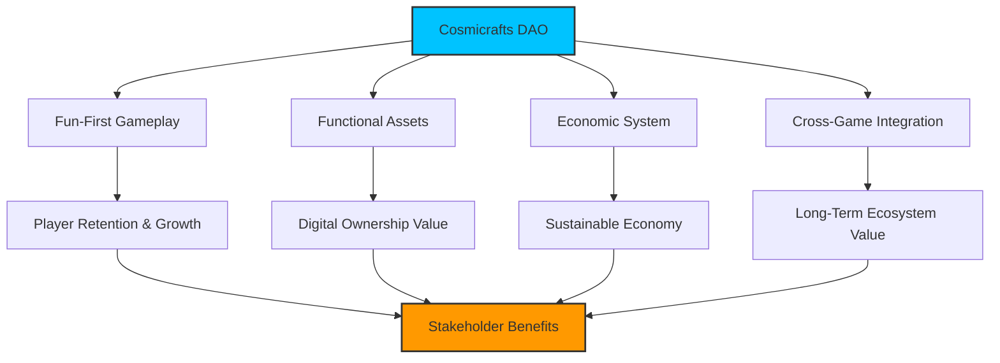

# Core Features

[[toc:2-2]]

## Overview

At its core, Cosmicrafts DAO revolves around building a franchise that integrates **fun-first gameplay**, **functional NFTs**, **deflationary tokenomics**, and an **interconnected backend** where players' profiles, progress, and assets carry over across all games in the franchise.

```mermaid
graph TD
    A[Cosmicrafts DAO Core Vision] --> B[Fun-First Gameplay]
    A --> C[Functional NFTs]
    A --> D[Deflationary Tokenomics]
    A --> E[Interconnected Backend]
    
    B --> B1[Competitive Multiplayer]
    B --> B2[Engaging Mechanics]
    B --> B3[Rich Content]
    
    C --> C1[Game-Enhancing Assets]
    C --> C2[Cross-Game Portability]
    C --> C3[Real Ownership]
    
    D --> D1[Token Utility]
    D --> D2[Sustainable Rewards]
    D --> D3[Value Capture]
    
    E --> E1[Unified Player Profile]
    E --> E2[Asset Interoperability]
    E --> E3[Shared Economy]
    
    style A fill:#00c3ff,stroke:#333,stroke-width:2px
    style B,C,D,E fill:#1a2d40,stroke:#333,stroke-width:1px
```

## Core Pillars

| Pillar | Implementation | Stakeholder Value |
|--------|---------------|-------------------|
| **Gameplay First** | Engaging real-time strategy mechanics | Enjoyable, skill-based experience that stands on its own merits |
| **True Ownership** | Assets as ICRC-7 NFTs with utility | Players truly own in-game assets with provable rarity and utility |
| **Economic Model** | Deflationary SPIRAL token with fee burn | Sustainable economic system with long-term value protection |
| **Cross-Game Vision** | Unified backend with shared assets | Assets, progress, and rewards carry across multiple games |

## NFT System Implementation

| Feature | Implementation | Player Benefit |
|---------|----------------|----------------|
| **Soul-Binding** | NFTs track combat history and experience | Units grow in value through gameplay |
| **Functional Utility** | NFTs have in-game abilities and stats | Assets provide tangible gameplay advantages |
| **On-Chain Metadata** | All asset properties stored on-chain | Verifiable rarity and characteristics |
| **Cross-Game Compatibility** | Unified asset standard across games | Use assets across the Cosmicrafts universe |
| **Composability** | Assets can be combined and upgraded | Create unique combinations and strategies |

## Player Statistics System

| Statistic Type | Implementation | Stakeholder Value |
|----------------|----------------|-------------------|
| **Game Records** | Tracks games played, wins, losses | Players can showcase skill progression and achievements |
| **Combat Statistics** | Measures damage, kills, survivability | Competitive players gain insights to improve strategy |
| **Asset Performance** | Records NFT battle effectiveness | Helps players identify their most valuable assets |
| **Achievement Tracking** | Monitors milestone completion | Creates engagement through goal-oriented gameplay |
| **Leaderboards** | Ranks players by various metrics | Provides social recognition and competitive incentives |

## Asset Integration System

| Feature | Implementation | Stakeholder Value |
|---------|----------------|-------------------|
| **Experience Tracking** | NFTs gain experience through use | Assets become more valuable through gameplay rather than speculation |
| **Metadata Evolution** | Asset properties develop over time | Creates unique history and provenance for each digital asset |
| **Cross-Game Stats** | Performance metrics across games | Assets maintain continuity and relevance throughout the ecosystem |
| **Statistical Analysis** | Performance tracking and averages | Players can make informed decisions about asset utilization |
| **Value Reinforcement** | Gameplay history increases rarity | Asset value tied to actual utility and achievement |

## Token Economics

| Token | Implementation | Stakeholder Value |
|-------|----------------|-------------------|
| **SPIRAL** | Governance token with deflationary mechanism | Long-term value preservation through supply reduction and ecosystem growth |
| **Stardust** | In-game utility token earned through gameplay | Accessible economy participation without direct cryptocurrency purchase |

#### SPIRAL Token Design

- **Deflationary Model**: Transaction fee burning systematically reduces supply over time
- **Governance Rights**: Token holders influence development priorities and treasury allocation
- **Liquidity Incentives**: Staking rewards create sustainable token economy
- **Microtransaction Utility**: Lower fees for in-game purchases compared to fiat options

#### Stardust Token Design

- **Gameplay Integration**: Earned through missions, achievements, and combat
- **Asset Enhancement**: Used to upgrade NFTs and unlock advanced features
- **Free-to-Play Access**: Enables non-crypto players to participate in the economy
- **Value Exchange**: Can be traded for services and items within the ecosystem

## Matchmaking & Tournament System

| Feature | Implementation | Stakeholder Value |
|---------|----------------|-------------------|
| **ELO-Based Matchmaking** | Dynamic skill-based player matching | Fair and competitive gameplay experience for all skill levels |
| **Tournament Brackets** | Automated tournament organization | Regular competitive opportunities with meaningful rewards |
| **Cross-Game Rankings** | Unified player skill tracking | Consistent competitive identity across the ecosystem |
| **Prize Distribution** | On-chain reward allocation | Transparent and immediate reward delivery |
| **Spectator Mode** | Tournament viewing capabilities | Community engagement through spectatorship and analysis |

#### Key Benefits

- **Fair Competition**: Skill-based matching ensures balanced gameplay
- **Growth Path**: Clear progression from casual play to tournament competition
- **Community Building**: Regular events foster player engagement and retention
- **Economic Opportunities**: Tournaments provide token circulation and NFT distribution
- **Meritocratic Structure**: Success based on skill rather than spending power

## Summary: The Cosmicrafts Ecosystem

The Cosmicrafts ecosystem delivers value through an interconnected set of systems, each designed to enhance player experience and stakeholder returns:

The core features work together to create a self-reinforcing ecosystem where:

1. **Gameplay attracts and retains users** - The foundation of sustainable growth
2. **NFT assets gain value through utility** - Creating tangible digital ownership
3. **Token systems enable economic activity** - Driving value capture and distribution
4. **Cross-game integration preserves investment** - Extending asset and progress value

This interconnected approach ensures that stakeholders benefit from both immediate gameplay enjoyment and long-term ecosystem growth.
