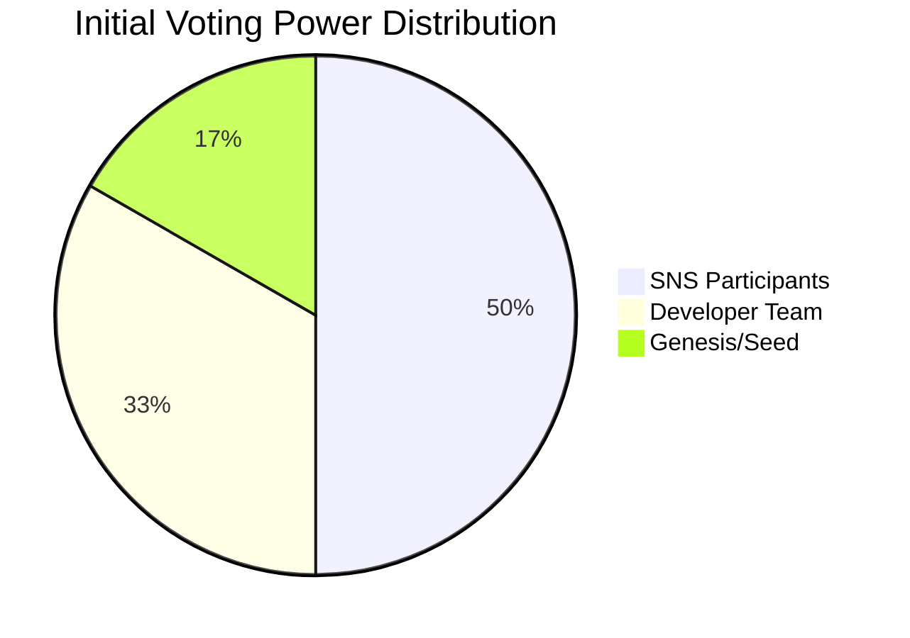
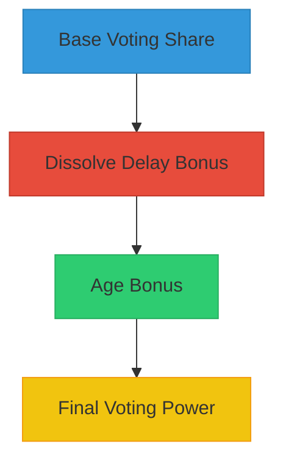

# Governance


## Introduction

The Cosmicrafts DAO puts the community at the center, giving Stakeholders a real say in how the franchise grows. Built on proven technology, the DAO uses fairness, transparency, and community-driven decision-making to ensure Cosmicrafts stays true to its vision.

::: info Reading Guide
This document outlines the governance framework of the Cosmicrafts DAO, focusing on decision-making processes, proposal systems, and community participation. It complements the [Tokenomics](/tokenomics) document, which covers economic aspects.

- **Primary Focus**: Governance processes, voting, and community decision-making
- **Companion Document**: [Tokenomics](/tokenomics) for token economics and utility
- **Cross-References**: Look for tip boxes linking to relevant tokenomics sections
:::

## DAO Core Principles

| Principle | Description | Implementation |
|-----------|-------------|----------------|
| **Meritocratic Governance** | • Power scales with commitment and contribution<br>• Technical excellence drives decision-making<br>• Long-term alignment through stake-weighted voting | • On-chain verification of proposals<br>• Automated execution of decisions<br>• Time-locked stake requirements |
| **Sustainable Innovation** | • Technology-first approach to growth<br>• Resource allocation driven by value creation<br>• Scalable and future-proof development | • Smart contract-based treasury management<br>• Performance-based incentives<br>• Data-driven proposal evaluation |
| **Ecosystem Integration** | • Cross-game value creation<br>• Interoperable systems and assets<br>• Community-driven expansion | • Standardized integration protocols<br>• Cross-chain compatibility<br>• Unified technical standards |

### System Components

- Neuron-based voting system with dissolve delay bonuses
- Proposal filtering and categorization
- Execution of approved proposals
- Quadratic voting elements to prevent whale dominance

## Voting Power Distribution

### Initial Token Allocation



| Stakeholder Group | Voting Share | Base Tokens | Purpose |
|-------------------|--------------|-------------|----------|
| **SNS Participants** | 50% | 120M | - Largest voting bloc<br>- Community-driven governance<br>- Potential for increased influence through participation |
| **Developer Team** | 33.3% | 80M | - Strategic decision-making<br>- 8-year dissolve delay with 1-year vesting<br>- Gradual reduction of influence |
| **Genesis/Seed** | 16.7% | 40M | - Early supporter representation<br>- Staggered dissolve delays (0-7 years)<br>- Balanced initial influence |

::: info Treasury Note
While the Treasury holds 76% (760M) of total tokens, these are not part of the initial voting power distribution. Treasury allocations are controlled through DAO governance decisions made by the voting participants above.
:::

### Potential Voting Power

::: info Voting Power Dynamics
The actual governance power can shift significantly based on:
1. Dissolve delay commitments
2. Neuron age accumulation
3. Active participation patterns

For example:
- SNS Participants (50%) could reach up to 150% equivalent power with max multipliers
- Developer Team (33.3%) could reach up to 100% equivalent power with max multipliers
- Genesis/Seed (16.7%) varies based on their dissolve delay schedule
:::



### Power Multipliers

| Factor | Maximum Bonus | Time to Achieve |
|--------|---------------|-----------------|
| **Dissolve Delay** | +100% | 8 years |
| **Neuron Age** | +100% | 1 year |
| **Minimum Dissolve Delay** | N/A | 1 month |
| **Combined Cap** | 3x base power | N/A |

## Neuron Fund Integration

The Cosmicrafts DAO incorporates a Neuron Fund (NF) mechanism, inspired by the Internet Computer's Network Nervous System (NNS), to enhance governance participation and ecosystem development.

### Key Components

1. **Participation Mechanism**
   - Users can opt-in to the NF through the DAO interface
   - Maturity exposure to ecosystem initiatives
   - Flexible entry and exit options

2. **Matched Funding Framework**
   ```mermaid
   graph TD
       A[Direct Participation] --> B[Calculate Match]
       B --> C[NF Contribution]
       C --> D[Treasury Allocation]
       D --> E[SNS Neurons]
   ```

3. **Governance Rights**
   - Hotkey-based voting delegation
   - Proportional voting power based on maturity
   - Maximum of 3 delegated voting keys

### Maturity and Rewards

| Action | Effect on Maturity | Reward Mechanism |
|--------|-------------------|------------------|
| **Join NF** | Exposure to ecosystem risks | Participation in ecosystem growth |
| **Successful Swap** | Proportional reduction | SNS neuron allocation |
| **Failed Swap** | Maturity restored | Protection against losses |
| **Dissolve Event** | Value determination | Proportional maturity increase |

::: warning Important Note
The Neuron Fund's participation in ecosystem initiatives is determined by market interest through the Matched Funding scheme, ensuring alignment with community sentiment.
:::

## Governance Parameters

| Parameter | Value | Purpose |
|-----------|--------|---------|
| **Rejection Fee** | 1000 SPIRAL | Prevent spam proposals |
| **Initial Voting Period** | 7 days | Standard deliberation time |
| **Maximum Deadline Extension** | 1 day | Allow for late participation |
| **Minimum Neuron Creation Stake** | 1000 SPIRAL | Base participation threshold |

## Decision Making Framework

### Governance Areas

1. **Treasury Management**
   - Marketing Campaigns
   - Development Funding
   - Strategic Partnerships

2. **Economic Policies**
   - Tokenomics Adjustments
   - Staking Rates
   - Fee Structures

3. **Development Roadmap**
   - Feature Prioritization
   - Game Expansions
   - Technical Improvements

### Proposal System

| Stage | Duration | Requirements |
|-------|----------|--------------|
| **Submission** | N/A | 1,000 SPIRAL stake |
| **Review** | 24 hours | Community feedback |
| **Voting** | 7 days | Active neuron required |
| **Execution** | Variable | Automated if approved |

## Relationship with Tokenomics

The Governance and Tokenomics systems of Cosmicrafts DAO are deeply interconnected but serve distinct purposes:

| Governance Aspect | Tokenomics Aspect | Relationship |
|-------------------|-------------------|--------------|
| **Voting Power** | **Token Staking** | Governance power derives from staked tokens; longer commitments increase influence |
| **Treasury Management** | **Economic Sustainability** | Governance processes decide treasury allocations that drive economic outcomes |
| **Proposal System** | **Token Utility** | The ability to create proposals is a core utility of the SPIRAL token |
| **DAO Evolution** | **Economic Projections** | Governance maturity develops alongside economic growth metrics |

::: info Note
For detailed information about token economics, rewards, and incentive structures, please refer to the [Tokenomics](/tokenomics) document.
:::
