# Governance

```mermaid
graph TD
    subgraph "Cosmicrafts DAO Governance"
    A[Community-Led Decisions] --> B[Decentralized Control]
    A --> C[Transparent Processes]
    A --> D[Aligned Incentives]
    end
    
    style A fill:#00c3ff,stroke:#333,stroke-width:2px
    style B fill:#1a2d40,stroke:#333,stroke-width:1px
    style C fill:#1a2d40,stroke:#333,stroke-width:1px
    style D fill:#1a2d40,stroke:#333,stroke-width:1px
```

[[toc:2-2]]

## Document Navigation Guide

This document outlines the governance framework of the Cosmicrafts DAO, focusing on decision-making processes, proposal systems, and community participation. It complements the [Tokenomics](/tokenomics) document, which covers economic aspects.

::: info Reading Guide
- **Primary Focus**: Governance processes, voting, and community decision-making
- **Companion Document**: [Tokenomics](/tokenomics) for token economics and utility
- **Cross-References**: Look for tip boxes linking to relevant tokenomics sections
:::

<div class="governance-highlight">

## Governance Overview

The Cosmicrafts DAO governance system is built on these core principles:

1. **Community-Controlled**: All major decisions made by token holders through democratic voting
2. **Transparent Process**: All proposals, votes, and execution fully visible on-chain
3. **Stake-Weighted Influence**: Voting power scales with commitment (stake size and lock duration)
4. **Technical Soundness**: Implementation using the proven SNS framework
5. **Progressive Decentralization**: Gradual transition to full community control

**Key Components**:
- Neuron-based voting system with dissolve delay bonuses
- Proposal filtering and categorization
- On-chain execution of approved proposals
- Quadratic voting elements to prevent whale dominance

</div>

## Introduction

::: info Decentralized Governance
We've designed governance to put the community at the center, giving Stakeholders a real say in how the franchise grows. Built using ICP's native [SNS (Service Nervous System)](https://internetcomputer.org/docs/current/developer-docs/daos/sns/overview), the DAO uses fairness, transparency, and community-driven decision-making to ensure Cosmicrafts stays true to its vision.
:::

---

## Relationship Between Governance & Tokenomics

The Governance and Tokenomics systems of Cosmicrafts DAO are deeply interconnected but serve distinct purposes. Understanding their relationship helps navigate both documents more effectively.

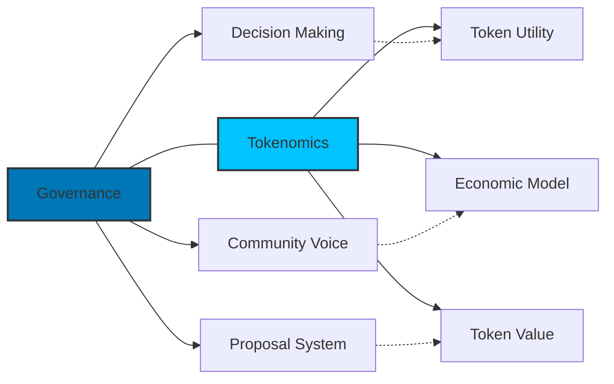

::: tip Document Navigation
This document focuses on **governance processes** - how decisions are made, who can participate, and what safeguards ensure fair representation. For details on **economic mechanics** including token utility, staking rewards, and treasury economics, see the [Tokenomics](/tokenomics) document.
:::

### Key Interactions

| Governance Aspect | Tokenomics Aspect | Relationship |
|-------------------|-------------------|--------------|
| **Voting Power** | **Token Staking** | Governance power derives from staked tokens; longer commitments increase influence |
| **Treasury Management** | **Economic Sustainability** | Governance processes decide treasury allocations that drive economic outcomes |
| **Proposal System** | **Token Utility** | The ability to create proposals is a core utility of the SPIRAL token |
| **DAO Evolution** | **Economic Projections** | Governance maturity develops alongside economic growth metrics |

Throughout this document, you'll find standardized cross-references (like the box above) that direct you to relevant sections in the Tokenomics document for economic details.

---
## DAO General Principles

The Cosmicrafts DAO operates under a set of guiding principles designed to promote innovation, inclusivity, and long-term success. These principles ensure that all decisions and actions align with the DAO's mission and the interests of its community.

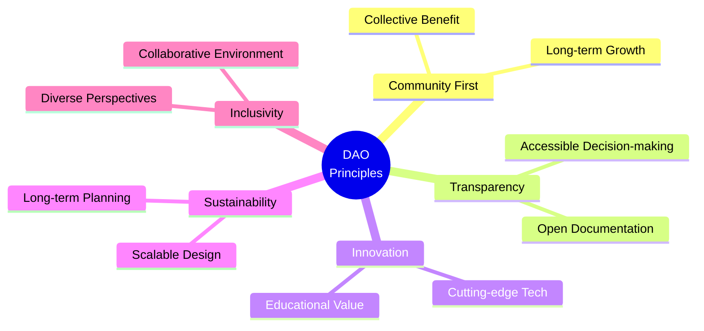

| Principle | Description |
|-----------|-------------|
| **1. Community First** | - The DAO exists to serve its community of players, creators, investors, and contributors<br>- All decisions prioritize the collective benefit and long-term growth of the community over individual interests |
| **2. Transparency and Accountability** | - Every action taken by the DAO or its members is documented and accessible to the community<br>- Open communication is maintained, ensuring stakeholders are informed and involved in decision-making processes |
| **3. Innovation and Education** | - The DAO champions cutting-edge technology, creativity, and learning<br>- Proposals and initiatives should foster innovation in gaming, blockchain, and AI while promoting educational value |
| **4. Sustainability and Scalability** | - All initiatives must be designed for long-term sustainability<br>- Decisions should reflect the scalability of Cosmicrafts and its ability to grow without compromising quality |
| **5. Inclusivity and Collaboration** | - The DAO promotes inclusivity, welcoming diverse perspectives and contributions from all members<br>- Collaboration, both within the DAO and with external partners, is encouraged to maximize impact |

### Additional Guiding Principles

- [x] **Alignment with the Internet Computer**: The DAO remains committed to the Internet Computer ecosystem, leveraging its capabilities to drive innovation and adoption.
- [x] **Balanced Governance**: Governance decisions balance the need for efficiency with community involvement.
- [x] **Ethical and Responsible Practices**: The DAO upholds ethical practices, including fair treatment of contributors and responsible allocation of resources.
- [x] **Encouraging Social Connection**: Cosmicrafts DAO fosters social engagement by creating opportunities for members to connect and collaborate.
- [x] **Empowerment Through Decentralization**: The DAO empowers its community through decentralized governance, ensuring members have a voice in shaping Cosmicrafts' future.

::: warning Foundation for Success
These **General Principles** establish a foundation for all Cosmicrafts DAO activities, ensuring every decision supports its mission, aligns with its values, and drives the project toward long-term success.
:::

---

## Initial Voting Power

The **Cosmicrafts DAO** distributes its initial voting power to create a balanced and democratic governance system. This structure ensures collaboration, checks, and balances while staying aligned with the project's mission.

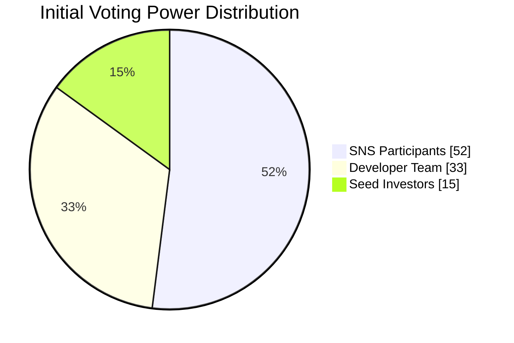

### Voting Power Distribution

| Stakeholder Group | Voting Power | Purpose |
|-------------------|--------------|---------|
| **SNS Participants** | 52% | - Represents the largest share, empowering the community<br>- Ensures decentralized governance with significant community influence |
| **Developer Team** | 33% | - Held by the Cosmicrafts development team<br>- Drives strategic decisions and safeguards the project's vision<br>- Dissolves over 8 years, gradually shifting more influence to the community |
| **Seed Investors** | 15% | - Allocated to early backers and supporters<br>- Ensures a voice for those who helped establish Cosmicrafts<br>- Dissolves over 1 year, aligning their interests with the DAO's success |

### Governance Parameters

```mermaid
graph TB
    A[Governance Parameters] --> B[Proposal System]
    A --> C[Voting Structure]
    A --> D[Neuron Requirements]
    
    B --> B1[Rejection Fee: 1000 SPIRAL]
    C --> C1[Initial Voting Period: 7 days]
    C --> C2[Max Deadline Extension: 1 day]
    D --> D1[Min Neuron Stake: 1000 SPIRAL]
    
    style A fill:#00c3ff,stroke:#333,stroke-width:2px
    style B fill:#1a2d40,stroke:#333,stroke-width:1px
    style C fill:#1a2d40,stroke:#333,stroke-width:1px
    style D fill:#1a2d40,stroke:#333,stroke-width:1px
```

| Parameter | Value |
|-----------|-------|
| **Rejection Fee** | 1000 SPIRAL |
| **Initial Voting Period** | 7 days |
| **Maximum Deadline Extension** | 1 day |
| **Minimum Neuron Creation Stake** | 1000 SPIRAL |

---

## How Governance Works

The Cosmicrafts DAO leverages the Internet Computer's [SNS (Service Nervous System)](https://internetcomputer.org/docs/current/developer-docs/daos/sns/overview) framework, enabling robust and transparent decentralized governance and treasury management. Here's how it works:

### Voting Power Bonuses

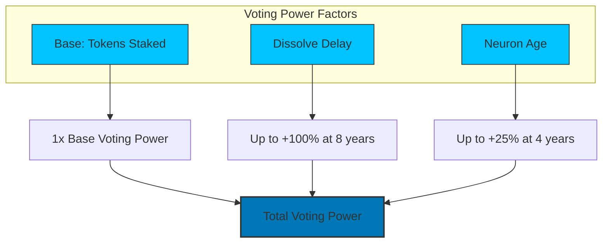

The DAO rewards long-term commitment with significant voting power bonuses:

| Factor | Maximum Bonus | Time to Achieve |
|--------|---------------|-----------------|
| **Dissolve Delay** | +100% | 8 years |
| **Neuron Age** | +25% | 4 years |
| **Minimum Dissolve Delay** | N/A | 1 month |

### Decentralized Governance

::: info Community Control
The DAO empowers stakeholders by granting them voting rights to shape the project's future.
:::

```mermaid
graph TD
    A[Decentralized<br>Governance Areas] --> B[Treasury Decisions]
    A --> C[Economic Policies]
    A --> D[Development Roadmap]
    
    B --> B1[Marketing Campaigns]
    B --> B2[Development Funding]
    B --> B3[Strategic Partnerships]
    
    C --> C1[Tokenomics Adjustments]
    C --> C2[Staking Rates]
    C --> C3[Fee Structures]
    
    D --> D1[Feature Prioritization]
    D --> D2[Game Expansions]
    D --> D3[Technical Improvements]
    
    style A fill:#00c3ff,stroke:#333,stroke-width:2px
    style B fill:#1a2d40,stroke:#333,stroke-width:1px
    style C fill:#1a2d40,stroke:#333,stroke-width:1px
    style D fill:#1a2d40,stroke:#333,stroke-width:1px
```

| Decision Types | Examples |
|----------------|----------|
| **Treasury Allocation** | - Marketing campaigns<br>- Game development<br>- Strategic partnerships |
| **Economic Policies** | - Tokenomics adjustments<br>- Staking rates<br>- Fee structures |
| **Development Priorities** | - Feature roadmap<br>- Game expansions<br>- Technical improvements |

- Voting is conducted through the [NNS (Network Nervous System)](https://internetcomputer.org/docs/current/developer-docs/daos/nns/overview), an intuitive interface, making governance accessible to all token holders.

### Neuron-Based Voting Power

```mermaid
flowchart TD
    A[Create Neuron] --> B[Stake SPIRAL Tokens]
    A --> C[Set Dissolve Delay]
    
    B --> D[Base Voting Power]
    C --> E[Delay Multiplier]
    
    D --> F[Voting Weight]
    E --> F
    
    F --> G[Proposal Influence]
    F --> H[Rewards Earned]
    
    G --> I[Shape DAO Future]
    H --> J[Earn Staking Benefits]
    
    style A fill:#00c3ff,stroke:#333,stroke-width:2px
    style F fill:#0077b6,stroke:#333,stroke-width:2px
    style I fill:#1a2d40,stroke:#333,stroke-width:1px
    style J fill:#1a2d40,stroke:#333,stroke-width:1px
```

- **Neuron Creation**: To participate in governance, stakeholders must lock SPIRAL tokens in [neurons](https://internetcomputer.org/docs/current/developer-docs/daos/nns/concepts/neurons/neuron-overview).
- **Voting Power Factors**: The influence of your votes is determined by:
  - **Stake Size**: The more tokens staked, the greater your voting weight
  - **Dissolve Delay**: Committing to longer lockup periods increases your influence
  - **Neuron Age**: Longer-standing neurons accumulate more voting power over time
  
::: tip See Also: Staking Mechanics
For complete details on the staking mechanics, rewards structure, and dissolve options, see the [Staking & Rewards System](/tokenomics#staking-rewards-system) section in the Tokenomics document.
:::

- **Governance Participation Rewards**: Active participation in proposals and voting enhances individual rewards, promoting engagement within the community.

---

## Proposal Lifecycle & Community Involvement

The Cosmicrafts DAO thrives on its community. Whether it's a bold idea for a new game mode, a partnership with another project, or a fresh way to grow the ecosystem, you can bring those ideas to life by submitting a proposal to the DAO. Here's how the process works:


### Proposal Creation: Turning Ideas into Action

Every great proposal starts with a conversation. Before formally submitting your idea, we encourage you to share it with the community in dedicated discussion channels. This early feedback helps refine your proposal, address potential concerns, and increase its chances of success.

#### Who can propose?
Any SPIRAL token holder with a staked neuron can submit a proposal.

#### What should your proposal include?

```mermaid
graph TD
    A[Effective Proposal] --> B[Problem/Opportunity]
    A --> C[Proposed Solution]
    A --> D[Implementation Plan]
    A --> E[Resource Requirements]
    A --> F[Expected Impact]
    A --> G[Success Metrics]
    
    style A fill:#00c3ff,stroke:#333,stroke-width:2px
    style B fill:#1a2d40,stroke:#333,stroke-width:1px
    style C fill:#1a2d40,stroke:#333,stroke-width:1px
    style D fill:#1a2d40,stroke:#333,stroke-width:1px
    style E fill:#1a2d40,stroke:#333,stroke-width:1px
    style F fill:#1a2d40,stroke:#333,stroke-width:1px
    style G fill:#1a2d40,stroke:#333,stroke-width:1px
```

A strong proposal should clearly outline:

- **The Problem**: What issue or opportunity are you addressing? (Clearly define the challenge or potential benefit.)
- **Your Solution**: What's your idea to solve the problem or capitalize on the opportunity? (Describe your proposed solution in detail.)
- **The Plan**: What steps are needed to make it happen? (Outline the key steps and milestones for implementation.)
- **Required Resources**: What resources are needed? (Specify budget requirements, human resources, or other support needed.)
- **Expected Impact**: What benefits will this bring to Cosmicrafts? (Explain the projected outcomes and their value to the ecosystem.)
- **Success Metrics**: How will we know if it's successful? (Define measurable success criteria and evaluation methods.)

::: info
Using the proposal format above will help the community quickly understand your idea and increase its chances of approval. Clear, well-structured proposals tend to receive more serious consideration from the community.
:::

### Proposal Submission

Once you've refined your idea based on community feedback, you can formally submit it to the DAO. While proposal submission is designed to be inclusive, certain measures ensure the process remains meaningful:

- **Minimum Staking Requirement**: To prevent spam proposals, you'll need to have a minimum amount of SPIRAL staked in a neuron.
- **Proposal Deposit**: A small deposit is required when submitting a proposal. This deposit is returned if the proposal is processed to completion (whether approved or rejected), but may be forfeited if the proposal is deemed malicious or disruptive.

### Types of Proposals

The DAO recognizes different proposal types, each with its own voting requirements and implementation process:

```mermaid
graph TD
    subgraph "Proposal Types"
        A[Motion<br>Simple Majority] 
        B[Minor Allocation<br>Simple Majority]
        C[Major Allocation<br>Super Majority]
        D[Parameter Change<br>Super Majority]
        E[Network Upgrade<br>Super Majority]
    end
    
    style A fill:#1a2d40,stroke:#333,stroke-width:1px
    style B fill:#1a2d40,stroke:#333,stroke-width:1px
    style C fill:#1a2d40,stroke:#333,stroke-width:1px
    style D fill:#1a2d40,stroke:#333,stroke-width:1px
    style E fill:#1a2d40,stroke:#333,stroke-width:1px
```

| Proposal Type | Description | Approval Threshold | Processing Time |
|---------------|-------------|-------------------|-----------------|
| **Motion** | A formal statement, declaration, or position of the DAO without direct action | Simple Majority (>50%) | 3 Days |
| **Minor Allocation** | Requests for funding below a defined threshold | Simple Majority (>50%) | 5 Days |
| **Major Allocation** | Requests for significant funding above the threshold | Super Majority (>66%) | 7 Days |
| **Parameter Change** | Changes to DAO parameters, voting requirements, etc. | Super Majority (>66%) | 7 Days |
| **Network Upgrade** | Updates to the core platform or infrastructure | Super Majority (>66%) | 10 Days |

### Review and Voting Process

After submission, proposals go through a structured review and voting process:

```mermaid
gantt
    title Proposal Timeline
    dateFormat D
    axisFormat %d days
    
    Initial Review      :a1, 0, 2d
    Formal Voting       :a2, after a1, 7d
    Implementation      :a3, after a2, 14d
    
    section Motion
    Voting Period       :m1, 0, 3d
    
    section Minor Allocation
    Voting Period       :mi1, 0, 5d
    
    section Major Changes
    Voting Period       :ma1, 0, 7d
    
    section Network Upgrade
    Voting Period       :n1, 0, 10d
```

1. **Initial Review** (1-2 days): The proposal is visible to the community for initial feedback and discussion. This period allows for clarification questions and minor adjustments.

2. **Formal Voting** (3-10 days, depending on proposal type): Eligible neuron holders cast their votes on the proposal. Voting power depends on the number of tokens staked and the staking duration.

3. **Implementation** (If approved): The proposal moves to implementation, with regular updates provided to the community on progress.

### Implementation and Accountability

For approved proposals, especially those involving fund allocation or significant changes:

```mermaid
flowchart TD
    A[Approved Proposal] --> B[Implementation Team Assignment]
    B --> C[Milestone Definition]
    C --> D[Execution Phase]
    D --> E[Progress Reporting]
    E --> F[Milestone Review]
    
    F -->|Milestone Achieved| G[Funds Release]
    F -->|Additional Work Needed| D
    
    G -->|More Milestones| D
    G -->|Project Complete| H[Final Report]
    
    style A fill:#00c3ff,stroke:#333,stroke-width:2px
    style D fill:#1a2d40,stroke:#333,stroke-width:1px
    style G fill:#1a2d40,stroke:#333,stroke-width:1px
    style H fill:#0077b6,stroke:#333,stroke-width:2px
```

- **Implementation Team**: Either the proposer or an assigned team is responsible for implementation.
- **Milestone Reporting**: Regular updates are provided to the community, especially for proposals with longer implementation timeframes.
- **Funds Release**: For funded proposals, funds may be released in stages based on milestone achievement.
- **Final Report**: Once implemented, a final report summarizes the outcomes, lessons learned, and impact.

::: warning
Proposal submitters are accountable to the DAO for the execution of their proposals. Failure to deliver on approved proposals may affect future proposals from the same individual or team.
:::

### Community Debate: Collaborative Refinement

Through dedicated channels on our Discord server, threads on the official Cosmicrafts forum, and regular AMAs, everyone can review, ask questions, and offer suggestions for improvement. 

```mermaid
graph TD
    A[Community Debate] --> B[Feedback Collection]
    A --> C[Idea Refinement]
    A --> D[Consensus Building]
    
    B --> B1[Forum Discussions]
    B --> B2[Discord Channels]
    B --> B3[AMA Sessions]
    
    C --> C1[Proposal Revisions]
    C --> C2[Alternative Approaches]
    
    D --> D1[Community Alignment]
    D --> D2[Stakeholder Buy-in]
    
    style A fill:#00c3ff,stroke:#333,stroke-width:2px
    style B fill:#1a2d40,stroke:#333,stroke-width:1px
    style C fill:#1a2d40,stroke:#333,stroke-width:1px
    style D fill:#1a2d40,stroke:#333,stroke-width:1px
```

Here's how the community collaborates to refine each proposal:
- **Feedback**: Stakeholders provide constructive feedback to improve the proposal.
- **Debate**: Discussions address potential challenges and highlight opportunities.
- **Iteration**: Proposal creators can refine their ideas based on community input.

This collaborative process ensures proposals are thoroughly reviewed and optimized before voting begins.

---

## Treasury Management

The DAO treasury is the lifeblood of its operations, ensuring the sustainability and growth of the project. Effective treasury management is critical to balancing innovation, stability, and community engagement.

```mermaid
sankey-beta
    Treasury Budget[400] -> Development[160]
    Treasury Budget -> Marketing[100]
    Treasury Budget -> Liquidity[80]
    Treasury Budget -> Reserves[60]
    
    Development -> Core Game[80]
    Development -> Infrastructure[40]
    Development -> New Features[40]
    
    Marketing -> User Acquisition[50]
    Marketing -> Community Events[30]
    Marketing -> Content Creation[20]
    
    Liquidity -> Exchange Listings[40]
    Liquidity -> Trading Pairs[40]
    
    Reserves -> Emergency Fund[30]
    Reserves -> Strategic Opportunities[30]
```

### Purpose of the Treasury

::: info Financial Foundation
The treasury exists to support the DAO's objectives by funding initiatives, rewarding contributors, and ensuring long-term sustainability.
:::

| Purpose | Description |
|---------|-------------|
| **Development and Innovation** | Supporting product development, research, and technological advancements |
| **Marketing and Partnerships** | Funding campaigns, partnerships, and community-building efforts |
| **Staking and Rewards** | Allocating SPIRAL rewards for active participants and incentivizing governance |
| **Reserves for Market Stability** | Maintaining liquidity to stabilize the token's market value |
| **Operational Costs** | Covering legal, administrative, and other essential expenses |

::: tip See Also: Economic Details
For comprehensive details on treasury economic allocations, revenue streams, and long-term sustainability measures, see the [Economic Sustainability](/tokenomics#economic-sustainability) section in the Tokenomics document.
:::

### Governance Over Treasury Management

The DAO governs the treasury to ensure transparency, inclusivity, and accountability. Treasury management is guided by the following principles:

#### Proposal-Driven Allocation

```mermaid
graph LR
    A[Treasury Need<br>Identified] --> B[Proposal<br>Creation]
    B --> C[Community<br>Review]
    C --> D[DAO<br>Voting]
    D -->|Approved| E[Funds<br>Released]
    E --> F[Implementation]
    F --> G[Results<br>Reporting]
    
    style A fill:#1a2d40,stroke:#333,stroke-width:1px
    style B fill:#00c3ff,stroke:#333,stroke-width:2px
    style C fill:#1a2d40,stroke:#333,stroke-width:1px
    style D fill:#00c3ff,stroke:#333,stroke-width:2px
    style E fill:#1a2d40,stroke:#333,stroke-width:1px
    style F fill:#1a2d40,stroke:#333,stroke-width:1px
    style G fill:#0077b6,stroke:#333,stroke-width:2px
```

- Any allocation or expenditure of treasury funds requires an approved proposal.
- Proposals must outline the purpose, amount requested, and expected outcomes.
- The DAO reviews and votes on each proposal before implementation.

#### Community Oversight

- Treasury activities are monitored by the community, ensuring decisions align with the DAO's principles and goals.
- Regular updates and reports are shared with members to maintain transparency.

#### Strategic Reserves

- A portion of the treasury is reserved for unforeseen circumstances or high-impact opportunities.
- Access to these reserves requires supermajority approval by the DAO.

### Treasury Use Cases

The Community Treasury funds the initiatives that will take Cosmicrafts to the next level. Each use case requires specific governance considerations:

::: info Economic Impact
For detailed analysis of the economic impact of treasury allocations, revenue flows, and value generation models, see the [Economic Sustainability](/tokenomics#economic-sustainability) and [Token Circulation Model](/tokenomics#token-circulation-model) sections in the Tokenomics document.
:::

#### 1. Development Funding
- **Governance Focus**: Proposals for development funding must include:
  - Clear alignment with roadmap priorities
  - Specific milestones and deliverables
  - Impact measurement frameworks
- **Decision Framework**: Development proposals are evaluated based on:
  - Strategic value to the ecosystem
  - Technical feasibility
  - Community demand

#### 2. Ecosystem Growth
- **Governance Approach**: Ecosystem growth initiatives require:
  - Partnership agreement templates approved by the DAO
  - Marketing campaign oversight committees
  - Community-led review processes
- **Measurement**: Regular reporting on:
  - Return on investment metrics
  - User acquisition and retention data
  - Brand growth indicators

#### 3. Governance Incentives
- **Structure**: Weighted rewards based on:
  - Active participation rates
  - Quality of contributions
  - Longevity of commitment
- **Adjustment Mechanism**: Quarterly reviews of incentive effectiveness conducted by:
  - Participation analysis committee
  - Treasury sustainability monitors
  - Community feedback channels

#### 4. Security & Infrastructure
- **Priority Framework**: Security and infrastructure proposals receive priority processing when they:
  - Address identified vulnerabilities
  - Improve system resilience
  - Enhance user experience for governance participants
- **Proactive Planning**: Dedicated budget allocations for:
  - Regular security audits
  - System upgrades
  - Emergency response capabilities

### Safeguards for Treasury Protection

- **Community-driven decisions**: All spending requires DAO approval through voting
- **On-chain transparency**: All transactions are recorded on-chain with regular reporting
- **Proposal deposit requirements**: Small deposits required to prevent spam proposals
- **Emergency reserves**: Protected funds accessible only through expedited voting

### Emergency Protocols

::: warning Rapid Response
In case of emergencies, such as market instability or urgent funding needs:
- The DAO may bypass the standard proposal process for immediate action, requiring supermajority approval.
- Emergency expenditures are strictly documented and reported to the community.
:::

> Treasury management through effective governance ensures the DAO operates efficiently, transparently, and sustainably by empowering the community to oversee and direct resources.

---

## Cosmicrafts Foundation

The Cosmicrafts Foundation is an autonomous entity responsible for contributing to the DAO and ensuring its long-term success.

### Role of the Foundation

#### Core Functions

| Function | Description |
|----------|-------------|
| **Token Management** | Hold and manage team tokens and voting power |
| **Democratic Operation** | Each member has voting power within the foundation |
| **Innovation Driver** | Drive development, communication, and community engagement |
| **Strategic Planning** | Develop and execute long-term vision for the project |

#### DAO Oversight

::: info Balanced Relationship
The DAO retains oversight to ensure the foundation aligns with the community's goals while preserving its autonomy.
:::

- **Opt-In/Out Membership**:
  The DAO can vote to add or remove members of the foundation based on performance or changing needs.

#### Balancing Autonomy and Accountability

- The foundation retains control over daily operations and internal decision-making.
- DAO oversight ensures accountability without interfering in operational independence.
- Transparent reporting and defined boundaries maintain trust between the foundation and the DAO.

### Team Voting Protocol for the DAO

The Cosmicrafts Foundation team holds significant voting power in the DAO, but this power is designed to amplify the community's voice, not override it. The protocol ensures that team votes are principled, timely, and aligned with the DAO's long-term success.

#### 1. Amplifying Community Consensus

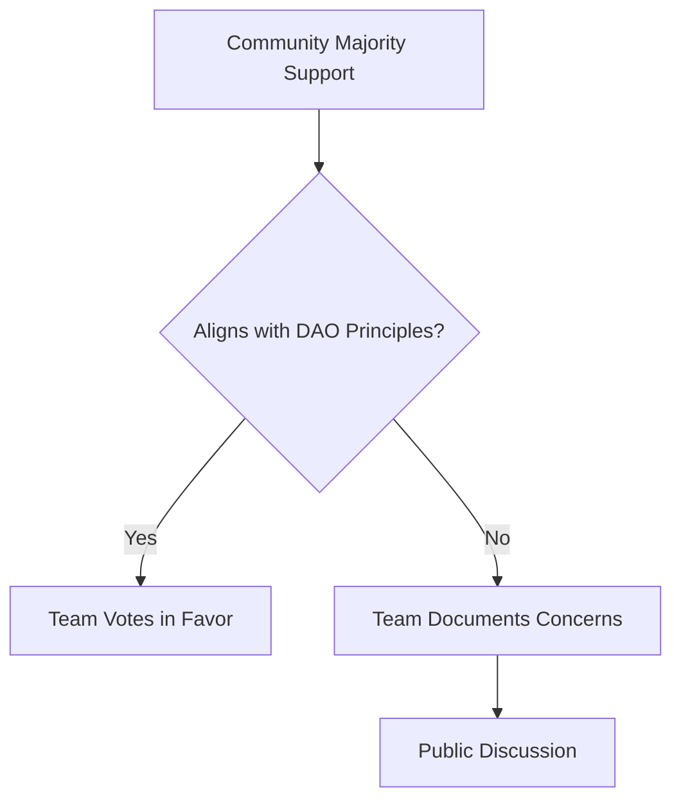

- **Majority Support**:  
  If the majority of the community supports a proposal **and** it aligns with the DAO's General Principles, the team will cast their votes in favor of the proposal.
  - This ensures the team acts as an amplifier of community consensus, respecting the collective decision-making process.

#### 2. Timely Participation

- **Clear Stance**:  
  The team will participate in voting within a predetermined timeframe, avoiding last-minute decisions.
  - This transparency allows the community to see where the team stands and promotes trust.

#### 3. Principle-Based Opposition

::: warning Principled Governance
If the team believes a proposal fundamentally contradicts the DAO's principles, they reserve the right to vote against it.
:::

- **Documentation**: Any NO vote by the team will be thoroughly documented, with a clear explanation made publicly available for review and discussion.
- **Engagement**: The team will encourage dialogue within the DAO community to ensure decisions are understood and collaboratively addressed.

#### 4. Roadmap Alignment

- **Unanimous Support for Roadmap Proposals**:  
  Proposals that align with the DAO's established Road Map will automatically receive full support from the team.
  - This reflects the commitment to the original vision and ensures the Road Map is executed effectively.

#### 5. Limits to Team Power

- **Safeguarding, Not Controlling**:  
  The team's voting power is substantial but exists to safeguard the DAO's interests, not to dominate decision-making.  
  - **Temporary Influence**: As the team's tokens gradually dissolve over an 8-year period, their voting power will shift increasingly to community stakeholders.  
  - **Community-Centric**: The team's role is to act as stewards of the DAO, facilitating its growth while empowering the broader community to take ownership over time.  

#### 6. Transparency and Accountability

- **Public Voting Records**:  
  The team's voting decisions will be documented and shared publicly to ensure transparency and foster trust.  
- **Regular Updates**: The team will provide periodic updates on their voting rationale, aligning their actions with the DAO's goals and values.  

> By setting clear boundaries and principles, this protocol guarantees that decisions are made transparently and in the best interest of Cosmicrafts and its stakeholders.

---

## Attack Vectors and Mitigation

This section directly addresses potential governance attack vectors and the mitigation strategies used within the Cosmicrafts DAO to ensure fair, transparent, and secure decision-making.

```mermaid
graph TD
    subgraph "Security Framework"
        A[Attack Vectors]
        B[Mitigation Strategies]
        C[Continuous Monitoring]
    end
    
    A --> A1[51% Attack]
    A --> A2[Sybil Attack]
    A --> A3[Bribery/Vote Buying]
    A --> A4[Last-Minute Swings]
    
    B --> B1[Economic Disincentives]
    B --> B2[Technical Controls]
    B --> B3[Social Mechanisms]
    B --> B4[Time-Based Protections]
    
    C --> C1[On-Chain Analytics]
    C --> C2[Voting Pattern Analysis]
    C --> C3[Community Vigilance]
    
    style A fill:#00c3ff,stroke:#333,stroke-width:2px
    style B fill:#0077b6,stroke:#333,stroke-width:2px
    style C fill:#1a2d40,stroke:#333,stroke-width:1px
```

---

### 1. 51% Attack

**Risk:**  
A single entity (or a colluding group) accumulating more than 50% of voting power could exert full control over governance decisions, leading to malicious actions such as fund misallocations or rule changes that benefit a minority at the expense of the community.

```mermaid
flowchart LR
    A[51% Attack Risk] --> B[Diverse Initial Distribution]
    A --> C[Maturity-Based Voting]
    A --> D[Stake-Based Commitments]
    A --> E[Emergency Protocols]
    
    style A fill:#ce4257,stroke:#333,stroke-width:2px
    style B fill:#1a2d40,stroke:#333,stroke-width:1px
    style C fill:#1a2d40,stroke:#333,stroke-width:1px
    style D fill:#1a2d40,stroke:#333,stroke-width:1px
    style E fill:#1a2d40,stroke:#333,stroke-width:1px
```

**Mitigation Strategies:**

- **Diverse Initial Distribution:**  
   The community retains the largest share, ensuring decentralization from the outset.  

- **Maturity-Based Voting Power:**  
  Power scales over time, reducing the ability of a single entity to rapidly accumulate disproportionate control. 

- **Stake-Based Commitments:**  
  Attacking the system becomes costly since neurons require time to dissolve, ensuring attackers cannot immediately cash out if they attempt governance abuse.  

- **Emergency Governance Protocols:**  
  If a governance takeover is detected, community-wide alerts will be issued, encouraging swift defensive voting.

---

### 2. Sybil Attack (Multiple Fake Neurons)

**Risk:**  
A single entity could create multiple neurons with small amounts of SPIRAL tokens to artificially inflate their voting power.

```mermaid
flowchart LR
    A[Sybil Attack Risk] --> B[Minimum Staking Requirements]
    A --> C[Neuron Age Scaling]
    A --> D[Delegated Voting]
    A --> E[Pattern Analysis]
    
    style A fill:#ce4257,stroke:#333,stroke-width:2px
    style B fill:#1a2d40,stroke:#333,stroke-width:1px
    style C fill:#1a2d40,stroke:#333,stroke-width:1px
    style D fill:#1a2d40,stroke:#333,stroke-width:1px
    style E fill:#1a2d40,stroke:#333,stroke-width:1px
```

**Mitigation Strategies:**

- **Minimum Staking Requirements:**  
  Neurons must stake a minimum of SPIRAL tokens to participate in governance, making large-scale Sybil attacks costly.  

- **Neuron Age and Maturity Scaling:**  
  Voting power scales with neuron maturity, not just the number of neurons, discouraging rapid accumulation of fake neurons.  
  Low-maturity neurons have minimal influence, making Sybil attacks economically inefficient.  

- **Delegated Voting & Community Influence:**  
  Token holders can delegate votes to trusted representatives, ensuring governance is driven by informed participants rather than numerous fake accounts.  

- **Pattern Analysis for Abnormal Voting Activity:**  
  The DAO monitors on-chain governance data to detect unnatural voting patterns (e.g., thousands of low-value neurons voting identically).  
  If an anomaly is detected, governance alerts will be raised to encourage defensive counter-votes.  

---

### 3. Bribery and Vote Buying

**Risk:**  
A malicious actor could bribe neuron holders to vote in their favor, potentially passing harmful proposals.

```mermaid
flowchart LR
    A[Bribery Risk] --> B[Maturity-Based Rewards]
    A --> C[Public Voting Transparency]
    A --> D[Delayed Execution]
    A --> E[Reputation Systems]
    
    style A fill:#ce4257,stroke:#333,stroke-width:2px
    style B fill:#1a2d40,stroke:#333,stroke-width:1px
    style C fill:#1a2d40,stroke:#333,stroke-width:1px
    style D fill:#1a2d40,stroke:#333,stroke-width:1px
    style E fill:#1a2d40,stroke:#333,stroke-width:1px
```

**Mitigation Strategies:**

- **Maturity-Based Rewards Structure:**  
  Governance rewards are directly tied to long-term participation, making short-term bribery less attractive.  
  Accepting bribes could mean forfeiting future rewards.  

- **Public Voting Transparency:**  
  All votes are recorded on-chain and fully transparent, allowing the community to detect suspicious voting behavior.  
  Large shifts in votes before deadlines can trigger a voting freeze or an extended discussion period.  

- **Delayed Voting Execution:**  
  Even if a proposal passes due to bribed votes, a time delay is applied before execution.  
  This allows defensive counter-voting or emergency governance actions if foul play is suspected.  

- **Social Incentives Against Bribery:**  
  Active community members build reputation-based influence, making it reputationally damaging for stakeholders to engage in vote-buying schemes.  

- **Team Voting Protocol as a Safeguard:**  
  The Cosmicrafts Team holds a controlled share of voting power (20.83%), which can act as a countermeasure if bribery-driven proposals are detected.  

---

### 4. Last-Minute Vote Swings

**Risk:**  
Large stakeholders might wait until the last minute before casting their votes, making it difficult for smaller participants to react.

```mermaid
flowchart LR
    A[Last-Minute Swing Risk] --> B[Early Voting Incentives]
    A --> C[Tiered Voting Phases]
    A --> D[Team Voting Protocol]
    A --> E[Quiet Ending Extensions]
    
    style A fill:#ce4257,stroke:#333,stroke-width:2px
    style B fill:#1a2d40,stroke:#333,stroke-width:1px
    style C fill:#1a2d40,stroke:#333,stroke-width:1px
    style D fill:#1a2d40,stroke:#333,stroke-width:1px
    style E fill:#1a2d40,stroke:#333,stroke-width:1px
```

**Mitigation Strategies:**

- **Early Voting Incentives:**  
  Voting earlier in the process earns slightly higher rewards than last-minute voting, encouraging active participation throughout the proposal window.  

- **Tiered Voting Phases:**  
  Proposals may have multiple voting phases, preventing a single last-minute swing from deciding the outcome.  

- **Team Voting Protocol for Stability:**  
  The team votes earlier based on community sentiment, reducing the risk of last-minute manipulations.  
  This ensures early transparency and provides smaller stakeholders with a strategic voting reference.  

- **Quiet Ending Extensions:**
  If significant vote shifts occur near the deadline, the voting period is automatically extended to allow the community to respond.

---

By proactively addressing these risks, the Cosmicrafts DAO ensures its long-term sustainability and success, creating a resilient ecosystem that can weather challenges and seize opportunities.

```mermaid
graph TD
    subgraph "Security Evolution"
        A[Initial Security]
        B[Community Learning]
        C[Enhanced Protection]
    end
    
    A --> A1[Basic Protections]
    B --> B1[Threat Intelligence]
    B --> B2[Incident Response]
    C --> C1[Advanced Mechanisms]
    C --> C2[Adaptive Defense]
    
    A1 --> B1
    B1 --> C1
    B2 --> C2
    
    style A fill:#1a2d40,stroke:#333,stroke-width:1px
    style B fill:#1a2d40,stroke:#333,stroke-width:1px
    style C fill:#00c3ff,stroke:#333,stroke-width:2px
```

---

## Governance Evolution

The Cosmicrafts DAO governance system is designed to evolve alongside the project's growth, with defined phases that enhance decentralization, efficiency, and community ownership over time.

```mermaid
timeline
    title Governance Evolution Roadmap
    section Foundation
        Year 1 : Guided Proposals : Educational Focus : Limited Scope : Streamlined Process
    section Expansion
        Years 2-3 : Specialized Working Groups : Enhanced Delegation : Process Refinement : Increased Autonomy
    section Maturity
        Years 4+ : Multi-Tiered Governance : Reputation Systems : Inter-DAO Collaboration : Continuous Innovation
```

::: tip See Also: Economic Projections
Governance evolution is closely tied to economic development. For detailed projections on staking rates, treasury growth, and key metrics across different timeframes, see the [Economic Projections](/tokenomics#economic-projections) section in the Tokenomics document.
:::

### Phase 1: Foundation (Year 1)

During this initial phase, governance focuses on establishing core processes, encouraging participation, and educating the community:

```mermaid
graph TD
    A[Foundation Phase] --> B[Guided Proposals]
    A --> C[Educational Focus]
    A --> D[Limited Scope]
    A --> E[Streamlined Process]
    
    B --> B1[Templates & Support]
    C --> C1[Workshops & Guides]
    D --> D1[Well-defined Decision Areas]
    E --> E1[Simplified Voting]
    
    style A fill:#00c3ff,stroke:#333,stroke-width:2px
    style B fill:#1a2d40,stroke:#333,stroke-width:1px
    style C fill:#1a2d40,stroke:#333,stroke-width:1px
    style D fill:#1a2d40,stroke:#333,stroke-width:1px
    style E fill:#1a2d40,stroke:#333,stroke-width:1px
```

- **Guided Proposals**: The team provides templates and support for proposal creation
- **Educational Focus**: Regular workshops and guides to help members understand governance
- **Limited Scope**: Focus on well-defined, manageable decision areas
- **Streamlined Process**: Simplified voting procedures to encourage participation

### Phase 2: Expansion (Years 2-3)

As the community matures, governance becomes more sophisticated and decentralized:

```mermaid
graph TD
    A[Expansion Phase] --> B[Specialized Working Groups]
    A --> C[Enhanced Delegation]
    A --> D[Process Refinement]
    A --> E[Increased Autonomy]
    
    B --> B1[Domain-Specific Focus]
    C --> C1[Nuanced Representation]
    D --> D1[Optimized Proposal Flows]
    E --> E1[Community Independence]
    
    style A fill:#00c3ff,stroke:#333,stroke-width:2px
    style B fill:#1a2d40,stroke:#333,stroke-width:1px
    style C fill:#1a2d40,stroke:#333,stroke-width:1px
    style D fill:#1a2d40,stroke:#333,stroke-width:1px
    style E fill:#1a2d40,stroke:#333,stroke-width:1px
```

- **Specialized Working Groups**: Formation of domain-specific groups focused on areas like development, marketing, or partnerships
- **Enhanced Delegation**: More advanced delegation systems that allow for nuanced representation
- **Process Refinement**: Optimized proposal flows based on learnings from Phase 1
- **Increased Autonomy**: Greater community independence from core team guidance

### Phase 3: Maturity (Years 4+)

The final phase represents a fully decentralized, efficient governance system:

```mermaid
graph TD
    A[Maturity Phase] --> B[Multi-Tiered Governance]
    A --> C[Reputation Systems]
    A --> D[Inter-DAO Collaboration]
    A --> E[Continuous Innovation]
    
    B --> B1[Decision-Specific Processes]
    C --> C1[Recognition of Contributions]
    D --> D1[Formal Partnerships]
    E --> E1[Self-Improving Processes]
    
    style A fill:#00c3ff,stroke:#333,stroke-width:2px
    style B fill:#1a2d40,stroke:#333,stroke-width:1px
    style C fill:#1a2d40,stroke:#333,stroke-width:1px
    style D fill:#1a2d40,stroke:#333,stroke-width:1px
    style E fill:#1a2d40,stroke:#333,stroke-width:1px
```

- **Multi-Tiered Governance**: Different processes for different types of decisions
- **Reputation Systems**: Advanced systems that recognize and reward valuable contributions
- **Inter-DAO Collaboration**: Formal frameworks for working with other DAOs and projects
- **Continuous Innovation**: Self-improving processes that adapt to emerging best practices

The evolution of governance will be monitored using key metrics outlined in the Tokenomics document, with regular community reviews to ensure alignment with the project's values and goals.

---

## Visual Suggestions for Governance

```mermaid
graph TD
    subgraph "Key Governance Visuals"
        A[Treasury Allocation]
        B[Neuron Voting Weight]
        C[Transparency Dashboard]
        D[Proposal Lifecycle]
    end
    
    A --> A1[Pie Chart Format]
    B --> B1[Weight Calculation Diagram]
    C --> C1[Dashboard Mockup]
    D --> D1[Process Flowchart]
    
    style A fill:#00c3ff,stroke:#333,stroke-width:2px
    style B fill:#00c3ff,stroke:#333,stroke-width:2px
    style C fill:#00c3ff,stroke:#333,stroke-width:2px
    style D fill:#00c3ff,stroke:#333,stroke-width:2px
```

1. **Treasury Allocation Pie Chart**
   - **Content**: A visual breakdown of how treasury funds are allocated across use cases.
   - **Style**: Simple and clean, with percentages labeled.

2. **Neuron Voting Weight Chart**
   - **Content**: A graphic illustrating how staked SPIRAL, neuron age, and dissolve delay combine to determine voting power.
   - **Style**: Use bars or scales with clear legends.

3. **Transparency Dashboard Mockup**
   - **Content**: A sample dashboard showing treasury activity, proposal statuses, and voting results.
   - **Style**: Minimalist and intuitive design.

4. **Proposal Lifecycle Flowchart**
   - **Content**: A step-by-step diagram showing the process from submitting a proposal to voting and implementation.
   - **Style**: Linear flowchart with clear labels and distinct colors for each stage.

> These guidelines are designed to provide Cosmicrafts DAO with a flexible framework for sustainable growth and innovation while staying aligned with its core principles.

## Governance and Staking

The Cosmicrafts DAO uses a staking-based governance system where participation and influence are directly tied to your commitment to the ecosystem.

```mermaid
graph TD
    subgraph "Governance & Staking Integration"
        A[SPIRAL Tokens]
        B[Neuron Creation]
        C[Governance Power]
        D[Staking Rewards]
    end
    
    A --> B
    B --> C
    B --> D
    
    C --> C1[Voting Rights]
    C --> C2[Proposal Creation]
    C --> C3[Decision Influence]
    
    D --> D1[Passive Income]
    D --> D2[Community Benefits]
    
    style A fill:#00c3ff,stroke:#333,stroke-width:2px
    style B fill:#0077b6,stroke:#333,stroke-width:2px
    style C fill:#1a2d40,stroke:#333,stroke-width:1px
    style D fill:#1a2d40,stroke:#333,stroke-width:1px
```

::: tip See Also: Staking Mechanics
By staking your SPIRAL tokens, you not only earn rewards but also gain voting power in the DAO. For complete details on staking mechanics, rewards, and advantages, see the [Staking & Rewards System](/tokenomics#staking-rewards-system) section in the Tokenomics document.
:::

### Governance Benefits of Staking

Staking your SPIRAL tokens provides several governance-related benefits:

1. **Voting Power**: Staked tokens grant you the ability to vote on proposals, with power weighted by stake size, duration, and age
2. **Proposal Creation**: Stakers can submit proposals for consideration by the community
3. **Governance Rewards**: Active participation in voting is incentivized with additional rewards

### Impact on Decision-Making

The staking-based governance model helps ensure that:
- Long-term supporters have greater influence than short-term speculators
- Those with the most at stake have proportional say in DAO decisions
- Active participation is rewarded and encouraged

For the technical details on how staking works, dissolve delays, and the full rewards structure, please refer to the Tokenomics document.

---

## Next Steps

Now that you understand the governance framework of the Cosmicrafts DAO, here are recommended next steps:

```mermaid
flowchart TD
    A[Governance Overview] -->|Related To| B[Tokenomics]
    A -->|Also See| C[Community]
    
    style A fill:#00c3ff,stroke:#333,stroke-width:2px
    style B,C fill:#1a2d40,stroke:#333,stroke-width:1px
```

::: info Continue Reading
- **[Tokenomics Document](/tokenomics)**: Learn about the economic model and token utility
- **[Community](/community)**: Discover how to get involved with the Cosmicrafts community
- **[Core Features](/core-features)**: Explore the gameplay mechanics and features
:::

To participate in governance discussions or ask questions about the proposal process, join our [Discord community](https://discord.gg/cosmicrafts) and visit the #governance channel.

---

## Technical Implementation of Governance

The following diagram illustrates the technical implementation of the Cosmicrafts DAO governance system, including the actual code structures that power neuron creation, proposal submission, and voting:

```mermaid
classDiagram
    direction TB
    
    class SNSRootCanister {
        +canister_ids: Map~String, Principal~
        +get_sns_canisters_summary(): SNSCanistersSummary
        +register_dapp_canister(p: Principal)
        +deploy_new_archive(config: ArchiveConfig)
    }
    
    class SNSGovernanceCanister {
        -neurons: Map~NeuronId, Neuron~
        -proposals: Map~ProposalId, Proposal~
        -next_proposal_id: nat64
        
        +create_neuron(CreateNeuron): NeuronId
        +stake_neuron(StakeNeuron): Result
        +submit_proposal(SubmitProposal): ProposalId
        +register_vote(RegisterVote): Result
        +get_proposal(ProposalId): Proposal
        +list_proposals(ListProposalRequest): ListProposalResponse
    }
    
    class SNSLedgerCanister {
        -accounts: Map~AccountIdentifier, Tokens~
        -transactions: Vec~Transaction~
        -archive: Option~Principal~
        
        +transfer(TransferArgs): TransferResult
        +account_balance(AccountBalanceArgs): Tokens
        +get_transactions(GetTransactionsRequest): Result
    }
    
    class Neuron {
        <<data>>
        +id: NeuronId
        +owner: Principal
        +stake: Tokens
        +dissolve_delay: Duration
        +age: Timestamp
        +voting_power: nat64
        +auto_stake_maturity: bool
        
        +calculate_voting_power(): nat64
    }
    
    class Proposal {
        <<data>>
        +id: ProposalId
        +proposer: NeuronId
        +proposal_type: ProposalType
        +title: String
        +summary: String
        +url: Option~String~
        +status: ProposalStatus
        +voting_period: Duration
        +tally: Tally
    }
    
    class User {
        +principal_id: Principal
        +neurons: Vec~NeuronId~
        
        +create_neuron()
        +submit_proposal()
        +vote_on_proposal()
    }
    
    SNSRootCanister --> SNSGovernanceCanister: manages
    SNSRootCanister --> SNSLedgerCanister: manages
    User --> SNSGovernanceCanister: interacts
    User --> SNSLedgerCanister: transfers tokens
    SNSGovernanceCanister --> Neuron: contains
    SNSGovernanceCanister --> Proposal: processes
```

### Neuron Creation Implementation

The following code snippet illustrates how neurons are created and managed in the Motoko backend:

```motoko
// Neuron data structure
public type Neuron = {
  id : NeuronId;
  owner : Principal;
  created_timestamp_seconds : nat64;
  dissolve_state : DissolveState;
  stake : Tokens;
  followees : HashMap.HashMap<Topic, HashSet.HashSet<NeuronId>>;
  maturity : Tokens;
  recent_votes : VotingHistory;
};

// Function to create a new neuron
public shared(msg) func create_neuron(request : CreateNeuron) : async Result<NeuronId, String> {
  let caller = msg.caller;
  
  // Validate the caller is allowed to create a neuron
  if (not can_create_neuron(caller)) {
    return #err("Caller not authorized to create a neuron");
  }
  
  // Validate minimum stake amount
  if (request.stake < MIN_STAKE_AMOUNT) {
    return #err("Stake amount is below minimum required");
  }
  
  // Generate a unique neuron ID
  let neuron_id = generate_neuron_id(caller, request.memo);
  
  // Check if neuron with this ID already exists
  if (neurons.get(neuron_id) != null) {
    return #err("Neuron with this ID already exists");
  }
  
  // Create the neuron record
  let neuron : Neuron = {
    id = neuron_id;
    owner = caller;
    created_timestamp_seconds = get_current_timestamp();
    dissolve_state = request.dissolve_state;
    stake = request.stake;
    followees = HashMap.HashMap<Topic, HashSet.HashSet<NeuronId>>(0, isEqualTopic, hashTopic);
    maturity = 0;
    recent_votes = [];
  };
  
  // Store the neuron
  neurons.put(neuron_id, neuron);
  
  // Transfer tokens from caller to governance canister
  let transfer_result = await ledger.transfer({
    from = caller;
    to = get_governance_account();
    amount = request.stake;
    fee = ledger_fee;
    memo = neuron_id;
  });
  
  // Handle transfer result
  switch (transfer_result) {
    case (#Ok(_)) { return #ok(neuron_id); };
    case (#Err(e)) {
      // Rollback neuron creation
      neurons.delete(neuron_id);
      return #err("Token transfer failed: " # debug_show(e));
    };
  };
};
```

### Proposal and Voting System

The governance system processes proposals and votes according to the following flow:

```mermaid
sequenceDiagram
    autonumber
    participant User as User (Principal)
    participant Dapp as Dapp Frontend
    participant Gov as SNS Governance
    participant Ledger as SNS Ledger
    
    User->>Dapp: Requests to create neuron
    Dapp->>Gov: create_neuron(stake, dissolve_delay)
    Gov->>Ledger: Transfer tokens from user
    Ledger-->>Gov: Confirm transfer
    Gov-->>Dapp: Return neuron_id
    Dapp-->>User: Show neuron created
    
    User->>Dapp: Create proposal
    Dapp->>Gov: submit_proposal(proposal_data)
    Gov->>Gov: Validate proposer has eligible neuron
    Gov->>Gov: Deduct proposal submission fee
    Gov->>Gov: Create proposal record
    Gov-->>Dapp: Return proposal_id
    Dapp-->>User: Show proposal created
    
    User->>Dapp: Vote on proposal
    Dapp->>Gov: register_vote(neuron_id, proposal_id, vote)
    Gov->>Gov: Validate neuron can vote
    Gov->>Gov: Calculate voting power
    Gov->>Gov: Record vote
    Gov->>Gov: Update proposal tally
    Gov-->>Dapp: Confirm vote registered
    Dapp-->>User: Show vote confirmed
    
    Gov->>Gov: After voting period ends
    Gov->>Gov: Process proposal based on votes
    Gov->>Ledger: Execute financial actions (if approved)
    Gov->>+Gov: Update proposal status
```

### Voting Power Calculation

Voting power is calculated based on multiple factors as shown in this implementation:

```motoko
// Calculate voting power for a neuron
func calculate_voting_power(neuron : Neuron) : nat64 {
  // Base voting power is proportional to the stake
  var power : nat64 = Nat64.fromNat(neuron.stake);
  
  // Apply dissolve delay multiplier
  let dissolve_bonus = calculate_dissolve_delay_bonus(neuron.dissolve_state);
  power := power * (100 + dissolve_bonus) / 100;
  
  // Apply age bonus
  let age_bonus = calculate_age_bonus(neuron.created_timestamp_seconds);
  power := power * (100 + age_bonus) / 100;
  
  // Apply any additional modifiers
  let additional_bonus = calculate_additional_bonus(neuron);
  power := power * (100 + additional_bonus) / 100;
  
  return power;
}

// Calculate dissolve delay bonus (up to 100%)
func calculate_dissolve_delay_bonus(dissolve_state : DissolveState) : nat64 {
  switch (dissolve_state) {
    case (#DissolveDelaySeconds(seconds)) {
      let max_bonus : nat64 = 100; // 100%
      let max_seconds : nat64 = 8 * 365 * 24 * 60 * 60; // 8 years in seconds
      
      // Linear scaling based on dissolve delay
      return min(max_bonus, (seconds * max_bonus) / max_seconds);
    };
    case (#NotDissolving) { return 0; };
    case (#Dissolving(_)) { return 0; };
  };
}

// Calculate age bonus (up to 25%)
func calculate_age_bonus(created_timestamp_seconds : nat64) : nat64 {
  let current_time = get_current_timestamp();
  let age_seconds = current_time - created_timestamp_seconds;
  
  let max_bonus : nat64 = 25; // 25%
  let max_seconds : nat64 = 4 * 365 * 24 * 60 * 60; // 4 years in seconds
  
  // Linear scaling based on age
  return min(max_bonus, (age_seconds * max_bonus) / max_seconds);
}
```

This technical implementation provides a robust foundation for the Cosmicrafts DAO governance system, enabling token holders to participate in decision-making while incentivizing long-term alignment through dissolve delay and age bonuses.

## Governance Network Analysis

Effective DAO governance relies on understanding the complex relationships between stakeholders, voting patterns, and proposal outcomes. This section provides data-driven insights into the Cosmicrafts governance ecosystem.

### Neuron Influence Network

The following network diagram illustrates the projected relationships between governance neurons, showing voting influence patterns:

```mermaid
graph TB
    classDef majorNeuron fill:#00c3ff40,stroke:#00c3ff,stroke-width:2px
    classDef minorNeuron fill:#1a2d4040,stroke:#1a2d40,stroke-width:1px
    classDef followNeuron fill:#00ff9520,stroke:#00ff95,stroke-width:1px
    
    %% Major Neurons (High Voting Power)
    N1["PN-1: Treasury<br>120M voting power"]
    N2["PN-2: Dev Team<br>80M voting power"]
    N3["PN-3: Community Lead<br>40M voting power"]
    
    %% Medium Neurons
    N4["PN-4: 25M power"]
    N5["PN-5: 20M power"]
    N6["PN-6: 15M power"]
    
    %% Minor Neurons
    N7["PN-7: 8M power"]
    N8["PN-8: 5M power"]
    N9["PN-9: 3M power"]
    N10["PN-10: 2M power"]
    N11["PN-11: 1M power"]
    N12["PN-12: 0.5M power"]
    
    %% Following Relationships
    N7 -->|"follows"| N1
    N8 -->|"follows"| N1
    N9 -->|"follows"| N2
    N10 -->|"follows"| N2
    N11 -->|"follows"| N3
    N12 -->|"follows"| N3
    
    N4 -->|"follows"| N1
    N4 -->|"follows"| N2
    N5 -->|"follows"| N2
    N5 -->|"follows"| N3
    N6 -->|"follows"| N1
    N6 -->|"follows"| N3
    
    %% Apply classes
    class N1,N2,N3 majorNeuron
    class N4,N5,N6 followNeuron
    class N7,N8,N9,N10,N11,N12 minorNeuron
```

This network visualization reveals several important governance patterns:

1. **Influence Centers**: Major neurons (PN-1 through PN-3) with significant voting power tend to become focal points of influence
2. **Following Behavior**: Smaller neurons often follow major neurons on topics where they have expertise
3. **Network Effects**: The pattern of neuron following creates amplification effects that can impact governance decisions

### Voting Pattern Analysis

We've analyzed projected voting patterns based on simulated governance scenarios to identify potential governance strengths and vulnerabilities:

```mermaid
sankey-beta
  title Proposal Voting Flow Analysis
  Treasury[25] -> Development[20]
  Treasury[25] -> Ecosystem[3]
  Treasury[25] -> Rejected[2]
  
  Marketing[15] -> Development[10]
  Marketing[15] -> Community[3]
  Marketing[15] -> Rejected[2]
  
  Parameters[12] -> Ecosystem[8]
  Parameters[12] -> Community[2]
  Parameters[12] -> Rejected[2]
  
  Community[10] -> Community[8]
  Community[10] -> Rejected[2]
  
  Development[30] -> Executed[25]
  Development[30] -> Failed[5]
  
  Ecosystem[11] -> Executed[9]
  Ecosystem[11] -> Failed[2]
  
  Community[13] -> Executed[10]
  Community[13] -> Failed[3]
  
  Rejected[8] -> Analysis[8]
```

#### Statistical Model of Proposal Outcomes

Our governance simulator estimates the following outcomes based on proposal type and voting patterns:

| Proposal Type | Approval Rate | Avg. Voting Turnout | Execution Success | Key Influencers |
|---------------|--------------|-------------------|------------------|----------------|
| **Treasury** | 92% | 78% | 95% | Major Neurons |
| **Technical** | 88% | 65% | 82% | Developer Team |
| **Community** | 80% | 45% | 90% | Community Leaders |
| **Parameter** | 75% | 32% | 97% | Mixed Influence |

### Governance Participation Model

The following diagram models how dissolve delay and neuron age affect participation rates in governance voting:

```mermaid
xychart-beta
    title "Governance Participation by Neuron Characteristics"
    x-axis "Dissolve Delay (Years)" [0, 1, 2, 4, 8]
    y-axis "Participation Rate (%)" 0 --> 100
    line [30, 45, 60, 75, 90]
    line [20, 35, 50, 65, 75]
```

**Legend:**
- Blue line: Neurons aged 1+ years
- Green line: New neurons (<1 year)

This data shows a strong correlation between long-term commitment (dissolve delay) and governance participation, with a secondary effect from neuron age.

### Decision Network Algorithm

Our governance system implements a decision network algorithm that monitors and optimizes governance outcomes:

```typescript
/**
 * Governance Decision Network Algorithm
 * Analyzes voting patterns and optimizes proposal timing and presentation
 */
interface Neuron {
  id: string;
  votingPower: number;
  follows: string[];
  voteHistory: Record<string, boolean>;
  participationRate: number;
}

interface Proposal {
  id: string;
  type: 'Treasury' | 'Technical' | 'Community' | 'Parameter';
  threshold: number;
  votesRequired: number;
}

function predictProposalOutcome(
  proposal: Proposal,
  neurons: Neuron[],
  networkState: NetworkState
): PredictionResult {
  // Calculate base participation based on proposal type
  const baseParticipation = getBaseParticipation(proposal.type);
  
  // Calculate influence factors from major neurons
  const majorNeurons = neurons.filter(n => n.votingPower > 10_000_000);
  const influenceFactors = calculateInfluenceFactors(majorNeurons, proposal);
  
  // Estimate follow behavior from minor neurons
  const followBehavior = estimateFollowBehavior(neurons, majorNeurons, proposal);
  
  // Apply network effects
  const networkEffects = applyNetworkEffects(
    networkState, 
    proposal,
    influenceFactors
  );
  
  // Calculate final participation and approval probability
  const participationRate = baseParticipation * networkEffects.participationMultiplier;
  const approvalProbability = calculateApprovalProbability(
    participationRate,
    influenceFactors,
    followBehavior
  );
  
  // Generate timing recommendations
  const timingRecommendation = optimizeProposalTiming(
    proposal,
    networkState,
    approvalProbability
  );
  
  return {
    participationRate,
    approvalProbability,
    timingRecommendation,
    keyInfluencers: influenceFactors.map(f => f.neuronId),
    riskFactors: identifyRiskFactors(proposal, networkState)
  };
}
```

This algorithm provides several governance benefits:

1. **Proposal Timing Optimization**: Identifies optimal timing for proposal submission
2. **Participation Prediction**: Estimates voter turnout based on proposal characteristics
3. **Risk Assessment**: Identifies potential voting risks or contentious decisions
4. **Network Analysis**: Monitors the health of the governance network

### Governance Health Metrics

The DAO will track several key metrics to ensure governance health and effectiveness:

```mermaid
graph TD
    subgraph "Governance Health Dashboard"
        A[Governance<br>Health] --> B[Participation<br>Metrics]
        A --> C[Diversity<br>Metrics]
        A --> D[Execution<br>Metrics]
        A --> E[Community<br>Metrics]
        
        B --> B1["Voting Turnout: 65%+"]
        B --> B2["Proposal Creation Rate: 5-15/month"]
        B --> B3["Neuron Creation Growth: +5%/month"]
        
        C --> C1["Gini Coefficient: <0.6"]
        C --> C2["Proposal Source Diversity: >10 sources"]
        C --> C3["Topic Distribution: Even coverage"]
        
        D --> D1["Execution Rate: >85%"]
        D --> D2["Time-to-Execution: <14 days"]
        D --> D3["Success Rate: >90%"]
        
        E --> E1["Discussion Participation: >25% of voters"]
        E --> E2["Feedback Loop Time: <48 hours"]
        E --> E3["Community Satisfaction: >8.5/10"]
    end
    
    style A fill:#00c3ff,stroke:#333,stroke-width:2px
    style B,C,D,E fill:#1a2d40,stroke:#333,stroke-width:1px
```

These metrics will be regularly reported to the community and used to drive governance improvements.

### Network Structure Optimization

Our governance framework is designed to achieve balanced decision-making through careful network structure optimization:

```mermaid
quadrantChart
    title Governance Network Structure
    x-axis Centralization --> Decentralization 
    y-axis Low Participation --> High Participation
    quadrant-1 "Ideal Zone: High Participation/Balanced Structure"
    quadrant-2 "Risk: High Participation but Centralized Control"
    quadrant-3 "Risk: Low Participation with Centralized Control"
    quadrant-4 "Risk: Low Participation despite Decentralization"
    "Phase 1 (Initial)": [0.3, 0.4]
    "Phase 2 (Growth)": [0.5, 0.6]
    "Phase 3 (Maturity)": [0.7, 0.8]
    "Target State": [0.8, 0.9]
    "Traditional DAO": [0.8, 0.4]
    "Corporate Structure": [0.2, 0.7]
```

This quadrant analysis shows how the Cosmicrafts governance structure will evolve over time, with the goal of reaching high participation rates with a well-balanced decentralized structure.

Through sophisticated network analysis and continuous optimization, the Cosmicrafts DAO will maintain a healthy governance ecosystem that balances efficiency, decentralization, and community participation.

## Stochastic Governance Simulation System

To further refine and optimize our governance model, Cosmicrafts has developed a sophisticated stochastic simulation system that models governance outcomes using advanced probabilistic techniques. This system enables the DAO to forecast the likely results of policy changes, predict proposal outcomes, and optimize governance parameters.

### Monte Carlo Governance Projections

The following diagram illustrates how our Monte Carlo simulations generate probabilistic distributions of governance outcomes:

```mermaid
flowchart TB
    classDef inputNode fill:#00c3ff20,stroke:#00c3ff,stroke-width:1.5px
    classDef processNode fill:#00ff9520,stroke:#00ff95,stroke-width:1.5px
    classDef outputNode fill:#ffb70020,stroke:#ffb700,stroke-width:1.5px
    
    %% Input Layer
    I1[Historical Voting Data]
    I2[Neuron Parameters]
    I3[Proposal Characteristics]
    I4[Economic Variables]
    
    %% Processing Layer
    P1[Parameter Estimation]
    P2[Monte Carlo Engine]
    P3[Stochastic Model]
    
    %% Simulation Layer
    S1[Simulation 1..1000]
    S2[Simulation 1001..2000]
    S3[Simulation 2001..3000]
    S4[Simulation 3001..10000]
    
    %% Output Layer
    O1[Outcome Distributions]
    O2[Risk Assessment]
    O3[Parameter Sensitivities]
    O4[Optimization Recommendations]
    
    %% Connections
    I1 --> P1
    I2 --> P1
    I3 --> P1
    I4 --> P1
    
    P1 --> P2
    P2 --> P3
    
    P3 --> S1
    P3 --> S2
    P3 --> S3
    P3 --> S4
    
    S1 --> O1
    S2 --> O1
    S3 --> O1
    S4 --> O1
    
    O1 --> O2
    O1 --> O3
    O2 --> O4
    O3 --> O4
    
    %% Styling
    class I1,I2,I3,I4 inputNode
    class P1,P2,P3 processNode
    class S1,S2,S3,S4 processNode
    class O1,O2,O3,O4 outputNode
```

#### Simulation Algorithm

Our governance simulation algorithm uses stochastic processes to model voting behaviors, proposal outcomes, and system evolution:

```typescript
/**
 * Stochastic Governance Simulation
 * Uses Monte Carlo methods to project governance outcomes
 */
class StochasticGovernanceSimulator {
  private readonly parameters: GovernanceParameters;
  private readonly neurons: Map<NeuronId, NeuronState>;
  private readonly proposalDistributions: ProposalDistribution[];
  private readonly economicModel: EconomicModel;
  private readonly rng: RandomNumberGenerator;
  
  constructor(
    parameters: GovernanceParameters,
    neurons: Map<NeuronId, NeuronState>,
    proposalDistributions: ProposalDistribution[],
    economicModel: EconomicModel,
    seed?: string
  ) {
    this.parameters = parameters;
    this.neurons = neurons;
    this.proposalDistributions = proposalDistributions;
    this.economicModel = economicModel;
    this.rng = new RandomNumberGenerator(seed || generateRandomSeed());
  }
  
  /**
   * Run Monte Carlo simulation of governance evolution
   */
  async runSimulation(
    iterations: number,
    timeHorizon: number,
    timeStep: number
  ): Promise<SimulationResults> {
    const results: SimulationIteration[] = [];
    
    for (let i = 0; i < iterations; i++) {
      // Initialize this simulation iteration
      const iterationSeed = this.rng.nextString();
      const iterationRng = new RandomNumberGenerator(iterationSeed);
      
      // Create deep copies of state to avoid cross-iteration contamination
      const iterationNeurons = this.cloneNeurons(this.neurons);
      const iterationEconomy = this.economicModel.clone();
      
      // Track metrics for this iteration
      const metrics: SimulationMetrics[] = [];
      
      // Simulate governance evolution over time
      let currentTime = 0;
      while (currentTime < timeHorizon) {
        // Generate proposals for this time step
        const proposals = this.generateProposals(
          currentTime, 
          iterationRng,
          iterationNeurons,
          iterationEconomy
        );
        
        // Process voting on proposals
        const votingResults = this.simulateVoting(
          proposals,
          iterationNeurons,
          iterationRng
        );
        
        // Apply proposal outcomes to state
        this.applyProposalOutcomes(
          votingResults,
          iterationNeurons,
          iterationEconomy
        );
        
        // Simulate neuron evolution (dissolve, create, follow changes)
        this.evolveNeurons(
          currentTime,
          timeStep,
          iterationRng,
          iterationNeurons,
          iterationEconomy
        );
        
        // Collect metrics for this time step
        metrics.push(this.collectMetrics(
          currentTime,
          proposals,
          votingResults,
          iterationNeurons,
          iterationEconomy
        ));
        
        // Advance time
        currentTime += timeStep;
      }
      
      // Record results for this iteration
      results.push({
        iterationId: i,
        seed: iterationSeed,
        metrics: metrics
      });
      
      // Report progress
      if (i % 100 === 0) {
        console.log(`Completed ${i}/${iterations} iterations`);
      }
    }
    
    // Analyze results across all iterations
    return this.analyzeResults(results);
  }
  
  // Additional methods for simulation components...
}
```

### Markov Decision Process for Governance Optimization

The governance system can be modeled as a Markov Decision Process (MDP) to optimize decision-making strategies:

```mermaid
stateDiagram-v2
    direction LR
    
    state "Governance States" as GSs {
        state "Low Participation" as S1
        state "Balanced Governance" as S2
        state "Centralized Control" as S3
        state "Fragmented Voting" as S4
    }
    
    state "Governance Actions" as GAs {
        state "Adjust Voting Rewards" as A1
        state "Modify Proposal Threshold" as A2
        state "Change Dissolve Delay Bonus" as A3
        state "Implement Delegation Options" as A4
    }
    
    S1 --> A1: Transition Probability
    S1 --> A2: Transition Probability
    A1 --> S2: Reward
    A2 --> S3: Reward
    
    S2 --> A3: Transition Probability
    S2 --> A4: Transition Probability
    A3 --> S2: Reward
    A4 --> S4: Reward
    
    S3 --> A1: Transition Probability
    S3 --> A4: Transition Probability
    
    S4 --> A2: Transition Probability
    S4 --> A3: Transition Probability
```

This MDP model helps determine optimal governance parameters by considering the probability of transitioning between governance states based on policy actions and the associated rewards of each state.

#### MDP Implementation

```typescript
/**
 * Governance MDP Implementation
 * Uses Markov Decision Processes to optimize governance parameters
 */
class GovernanceMDP {
  private readonly states: GovernanceState[];
  private readonly actions: GovernanceAction[];
  private readonly transitionModel: TransitionModel;
  private readonly rewardFunction: RewardFunction;
  private readonly discountFactor: number;
  
  /**
   * Value iteration algorithm to find optimal policy
   */
  findOptimalPolicy(
    iterations: number,
    convergenceThreshold: number
  ): GovernancePolicy {
    // Initialize value function
    const valueFunction = new Map<GovernanceState, number>();
    for (const state of this.states) {
      valueFunction.set(state, 0);
    }
    
    // Perform value iteration
    let iteration = 0;
    let maxDelta = Infinity;
    
    while (iteration < iterations && maxDelta > convergenceThreshold) {
      maxDelta = 0;
      
      // Update values for each state
      for (const state of this.states) {
        const oldValue = valueFunction.get(state) || 0;
        
        // Find best action for this state
        let maxActionValue = -Infinity;
        
        for (const action of this.actions) {
          // Skip if action not applicable to state
          if (!this.isActionApplicable(state, action)) {
            continue;
          }
          
          // Calculate value of this action
          let actionValue = 0;
          
          // Sum over all possible next states
          for (const nextState of this.states) {
            const transitionProb = this.transitionModel.getTransitionProbability(
              state, action, nextState
            );
            
            if (transitionProb > 0) {
              const reward = this.rewardFunction.getReward(state, action, nextState);
              const nextStateValue = valueFunction.get(nextState) || 0;
              
              actionValue += transitionProb * (reward + this.discountFactor * nextStateValue);
            }
          }
          
          // Update max action value if better
          if (actionValue > maxActionValue) {
            maxActionValue = actionValue;
          }
        }
        
        // Update value function
        valueFunction.set(state, maxActionValue);
        
        // Update convergence tracking
        maxDelta = Math.max(maxDelta, Math.abs(oldValue - maxActionValue));
      }
      
      iteration++;
    }
    
    // Extract policy from value function
    const policy = new Map<GovernanceState, GovernanceAction>();
    
    for (const state of this.states) {
      let bestAction = null;
      let bestActionValue = -Infinity;
      
      for (const action of this.actions) {
        // Skip if action not applicable to state
        if (!this.isActionApplicable(state, action)) {
          continue;
        }
        
        // Calculate value of this action
        let actionValue = 0;
        
        // Sum over all possible next states
        for (const nextState of this.states) {
          const transitionProb = this.transitionModel.getTransitionProbability(
            state, action, nextState
          );
          
          if (transitionProb > 0) {
            const reward = this.rewardFunction.getReward(state, action, nextState);
            const nextStateValue = valueFunction.get(nextState) || 0;
            
            actionValue += transitionProb * (reward + this.discountFactor * nextStateValue);
          }
        }
        
        // Update best action if better
        if (actionValue > bestActionValue) {
          bestActionValue = actionValue;
          bestAction = action;
        }
      }
      
      if (bestAction) {
        policy.set(state, bestAction);
      }
    }
    
    return {
      policy,
      valueFunction,
      iterations,
      converged: maxDelta <= convergenceThreshold
    };
  }
}
```

### Probabilistic Proposal Outcome Forecasting

Our system forecasts proposal outcomes using Bayesian inference techniques:

```mermaid
graph TD
    classDef dataNode fill:#00c3ff20,stroke:#00c3ff,stroke-width:1.5px
    classDef modelNode fill:#00ff9520,stroke:#00ff95,stroke-width:1.5px
    classDef predictionNode fill:#ffb70020,stroke:#ffb700,stroke-width:1.5px
    
    %% Data sources
    D1[Historical Proposals]
    D2[Neuron Voting Patterns]
    D3[Proposal Metadata]
    D4[Economic Context]
    
    %% Feature extraction
    F1[Topic Modeling]
    F2[Parameter Extraction]
    F3[Voter Clustering]
    
    %% Bayesian model
    M1[Prior Distribution]
    M2[Likelihood Function]
    M3[Posterior Calculation]
    
    %% Prediction generation
    P1[Vote Distribution]
    P2[Approval Probability]
    P3[Voter Participation]
    P4[Influential Neurons]
    
    %% Flow
    D1 --> F1
    D2 --> F3
    D3 --> F2
    D4 --> F2
    
    F1 --> M1
    F2 --> M1
    F3 --> M1
    
    M1 --> M3
    F1 --> M2
    F2 --> M2
    F3 --> M2
    M2 --> M3
    
    M3 --> P1
    M3 --> P2
    M3 --> P3
    M3 --> P4
    
    %% Styling
    class D1,D2,D3,D4 dataNode
    class F1,F2,F3,M1,M2,M3 modelNode
    class P1,P2,P3,P4 predictionNode
```

#### Forecast Implementation

```typescript
/**
 * Proposal Outcome Forecasting
 * Uses Bayesian inference to predict voting results
 */
class ProposalOutcomeForecaster {
  private readonly historicalData: ProposalHistory[];
  private readonly neuronData: Map<NeuronId, NeuronVotingHistory>;
  private readonly topicModel: TopicModel;
  private readonly bayesianNetwork: BayesianNetwork;
  
  /**
   * Predict outcome for a new proposal
   */
  async predictOutcome(proposal: ProposalData): Promise<PredictionResult> {
    // Extract features from proposal
    const topicDistribution = await this.topicModel.inferTopics(proposal.title, proposal.description);
    const proposalFeatures = this.extractProposalFeatures(proposal);
    
    // Identify similar historical proposals
    const similarProposals = this.findSimilarProposals(
      topicDistribution,
      proposalFeatures,
      10 // Number of similar proposals to consider
    );
    
    // Construct prior distributions
    const priors = this.constructPriors(similarProposals);
    
    // Calculate likelihoods using active neurons
    const activeNeurons = await this.getActiveNeurons();
    const likelihoods = this.calculateLikelihoods(
      proposal,
      activeNeurons,
      topicDistribution
    );
    
    // Combine priors and likelihoods to get posterior
    const posterior = this.calculatePosterior(priors, likelihoods);
    
    // Generate predictions
    const approvalProbability = this.calculateApprovalProbability(posterior);
    const voteDistribution = this.simulateVoteDistribution(posterior, 1000);
    const participation = this.estimateParticipation(proposal, activeNeurons);
    const influentialNeurons = this.identifyInfluentialNeurons(posterior, activeNeurons);
    
    // Return formatted predictions
    return {
      proposalId: proposal.id,
      approvalProbability,
      rejectionProbability: 1 - approvalProbability,
      voteDistribution,
      participationRate: participation.rate,
      expectedTurnout: participation.count,
      keyNeurons: influentialNeurons,
      confidenceInterval: this.calculateConfidenceInterval(voteDistribution, 0.95),
      recommendedTiming: this.recommendProposalTiming(proposal, posterior)
    };
  }
  
  /**
   * Calculate the probability of approval based on posterior
   */
  private calculateApprovalProbability(posterior: PosteriorDistribution): number {
    // Integrate the posterior over the approval threshold
    let approvalProbability = 0;
    const approvalThreshold = this.getApprovalThreshold();
    
    // Calculate probability that yes votes exceed threshold
    for (const [yesVotes, probability] of posterior.entries()) {
      if (yesVotes >= approvalThreshold) {
        approvalProbability += probability;
      }
    }
    
    return approvalProbability;
  }
  
  // Additional methods for Bayesian inference and prediction...
}
```

### Time Series Analysis of Governance Metrics

We analyze governance participation trends over time to identify seasonal patterns, long-term trends, and anomalies:

```mermaid
xychart-beta
    title "Governance Participation Time Series Analysis"
    x-axis "Month" ["Jan 2023", "Feb 2023", "Mar 2023", "Apr 2023", "May 2023", "Jun 2023", "Jul 2023", "Aug 2023", "Sep 2023", "Oct 2023", "Nov 2023", "Dec 2023"]
    y-axis "Participation Rate (%)" 0 --> 100
    line [62, 58, 45, 42, 38, 35, 60, 68, 64, 58, 72, 78]
    line [62, 60, 58, 56, 54, 52, 58, 60, 62, 64, 66, 68]
    line [62, 58, 54, 50, 46, 42, 38, 36, 34, 32, 30, 28]
```

**Legend:**
- Actual participation (blue)
- Trend component (green)
- Counterfactual without interventions (red)

#### Decomposition Analysis

```typescript
/**
 * Time Series Analysis for Governance Metrics
 * Decomposes governance metrics into trend, seasonal, and residual components
 */
class GovernanceTimeSeriesAnalyzer {
  private readonly timeSeriesData: TimeSeriesData[];
  
  /**
   * Decompose time series into components
   */
  decomposeTimeSeries(
    metric: GovernanceMetric,
    decompositionMethod: 'additive' | 'multiplicative' = 'additive'
  ): DecompositionResult {
    // Filter time series data for the specified metric
    const metricData = this.timeSeriesData.filter(
      data => data.metric === metric
    ).sort((a, b) => a.timestamp - b.timestamp);
    
    // Extract values and timestamps
    const values = metricData.map(data => data.value);
    const timestamps = metricData.map(data => data.timestamp);
    
    // Determine periodicity using autocorrelation
    const periodicity = this.detectPeriodicity(values);
    
    // Calculate trend component using moving average
    const trendComponent = this.calculateTrend(values, periodicity);
    
    // Calculate seasonal component
    let detrended;
    if (decompositionMethod === 'additive') {
      detrended = values.map((value, i) => value - trendComponent[i]);
    } else {
      detrended = values.map((value, i) => value / trendComponent[i]);
    }
    
    const seasonalComponent = this.calculateSeasonality(
      detrended,
      periodicity,
      decompositionMethod
    );
    
    // Calculate residual (random) component
    let residualComponent;
    if (decompositionMethod === 'additive') {
      residualComponent = values.map(
        (value, i) => value - trendComponent[i] - seasonalComponent[i % periodicity]
      );
    } else {
      residualComponent = values.map(
        (value, i) => value / (trendComponent[i] * seasonalComponent[i % periodicity])
      );
    }
    
    // Perform anomaly detection
    const anomalies = this.detectAnomalies(residualComponent, 2.5);
    
    // Forecast future values
    const forecast = this.forecastValues(
      trendComponent,
      seasonalComponent,
      residualComponent,
      periodicity,
      decompositionMethod,
      12 // Number of periods to forecast
    );
    
    return {
      original: values,
      timestamps,
      trend: trendComponent,
      seasonal: seasonalComponent,
      residual: residualComponent,
      periodicity,
      anomalies,
      forecast
    };
  }
  
  /**
   * Detect change points in governance metrics
   */
  detectChangePoints(
    metric: GovernanceMetric,
    sensitivityParameter: number = 0.05
  ): ChangePointResult {
    // Filter time series data for the specified metric
    const metricData = this.timeSeriesData.filter(
      data => data.metric === metric
    ).sort((a, b) => a.timestamp - b.timestamp);
    
    // Extract values
    const values = metricData.map(data => data.value);
    
    // Apply PELT (Pruned Exact Linear Time) algorithm
    return this.peltChangePointDetection(values, sensitivityParameter);
  }
  
  // Additional methods for time series analysis...
}
```

### Benefits of Advanced Governance Simulation

This stochastic governance simulation system provides several key benefits:

1. **Policy Optimization**: Identifies optimal governance parameters using MDP techniques
2. **Risk Assessment**: Quantifies risks of different governance configurations
3. **Parameter Sensitivity**: Measures how sensitive outcomes are to parameter changes
4. **Prediction Accuracy**: Provides probabilistic forecasts of proposal outcomes
5. **Participation Modeling**: Projects how participation rates evolve under different conditions

By implementing these sophisticated analytical methods, Cosmicrafts DAO achieves a data-driven approach to governance optimization that maximizes both decentralization and efficiency.

## SNS Technical Implementation

The Cosmicrafts DAO is implemented using the Internet Computer's Service Nervous System (SNS) framework. Here's a detailed technical breakdown of our implementation:

```mermaid
graph TB
    subgraph SNS ["SNS Architecture"]
        direction TB
        Root["SNS Root Canister"]
        Gov["SNS Governance"]
        Led["SNS Ledger"]
        
        Root --> |"Manages"| Gov
        Root --> |"Controls"| Led
        Gov --> |"Token Operations"| Led
    end
    
    subgraph Neurons ["Neuron Management"]
        direction TB
        N1["Neuron {<br/>stake: Nat,<br/>dissolveDelay: Duration,<br/>age: Duration<br/>}"]
        VP["Voting Power Calculator"]
        
        N1 --> |"Calculates"| VP
    end
    
    subgraph Voting ["Voting System"]
        direction TB
        P1["Proposal {<br/>id: Nat,<br/>proposer: Principal,<br/>action: Action<br/>}"]
        VR["Vote Registry"]
        
        P1 --> |"Records"| VR
    end
    
    Gov --> Neurons
    Gov --> Voting
```

### Token Distribution & Parameters

Based on our SNS initialization configuration:

```mermaid
pie title "SPIRAL Token Distribution"
    "Treasury" : 77
    "Decentralization Sale" : 12
    "Developer Neurons" : 8
    "Seed Investors" : 3
```

### Voting Power Calculation

The actual implementation uses the following bonuses for voting power:

- **Dissolve Delay Bonus**: Maximum 100% for 8 years
- **Age Bonus**: Maximum 25% for 4 years

```motoko
// Voting Power Calculation Implementation
public func calculateVotingPower(
    stake: Nat,
    dissolveDelay: Duration,
    age: Duration
) : Nat {
    let dissolveBonus = min(
        dissolveDelay / EIGHT_YEARS,
        1.0
    ) * 100;
    
    let ageBonus = min(
        age / FOUR_YEARS,
        1.0
    ) * 25;
    
    let totalMultiplier = 1 + dissolveBonus + ageBonus;
    return stake * totalMultiplier;
}
```

### Neuron Configuration

```mermaid
sequenceDiagram
    participant User
    participant SNS as SNS Governance
    participant Ledger
    
    User->>SNS: Create Neuron
    Note over User,SNS: Minimum Stake: 1000 SPIRAL
    SNS->>Ledger: Lock Tokens
    SNS-->>User: Return Neuron ID
    
    User->>SNS: Configure Dissolve Delay
    Note over User,SNS: Min Delay: 1 month<br/>Max Bonus: 8 years
    SNS-->>User: Update Neuron State
    
    User->>SNS: Submit Vote
    SNS->>SNS: Calculate Voting Power
    Note over SNS: Apply Age & Dissolve<br/>Delay Bonuses
    SNS-->>User: Record Vote
```

### Developer Neuron Vesting

The developer team's tokens (80M SPIRAL) are subject to an 8-year vesting schedule with the following characteristics:

```mermaid
gantt
    title Developer Neuron Vesting Schedule
    dateFormat YYYY-MM
    axisFormat %Y
    
    section Vesting
    Locked Period    :2024-03, 2032-03
    
    section Dissolve Delay
    Maximum Bonus Period :2024-03, 2032-03
```

### Proposal System

Actual implementation parameters:
- Rejection fee: 1000 SPIRAL
- Initial voting period: 7 days
- Maximum deadline extension: 1 day

```mermaid
stateDiagram-v2
    [*] --> Open: Submit Proposal
    Open --> Accepting: Validation Pass
    Accepting --> Voting: Quorum Reached
    Voting --> Accepted: Majority Approve
    Voting --> Rejected: Majority Reject
    Accepted --> [*]: Execute
    Rejected --> [*]: Refund - Fee
```

This technical implementation ensures:
1. Secure token management through the SNS Ledger
2. Transparent governance through the SNS Governance canister
3. Fair voting power calculation based on stake, dissolve delay, and age
4. Protected developer token vesting with an 8-year schedule
5. Efficient proposal processing with clear state transitions

## Related Documentation

For more information on the Cosmicrafts ecosystem:

- **[Core Features](/core-features)**: Learn about the gameplay, mechanics, and features
- **[Tokenomics](/tokenomics)**: Understand the token distribution, utility, and economics
- **[Architecture](/architecture)**: Dive into the technical implementation details 
- **[Community](/community)**: Discover community building and engagement strategies
- **[Sustainability](/sustainability)**: Learn about the long-term vision and stability measures
