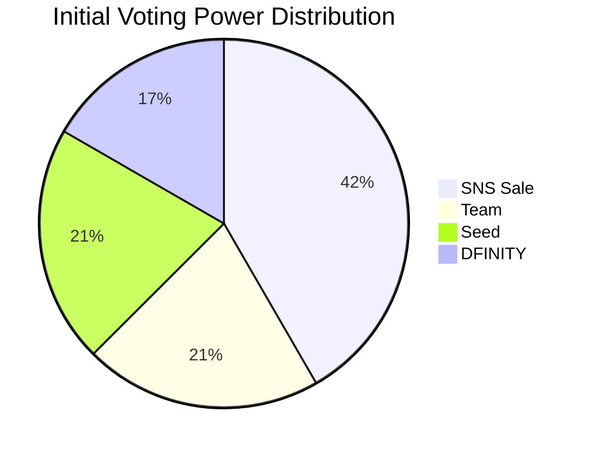
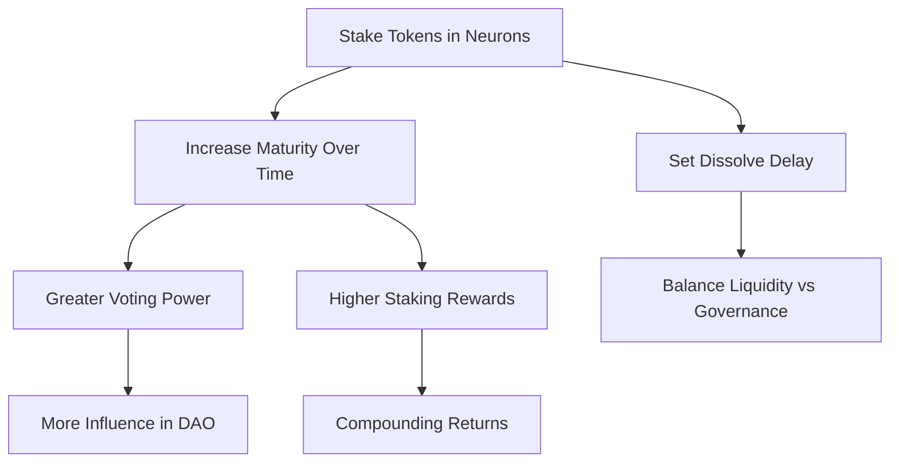
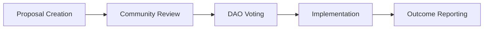
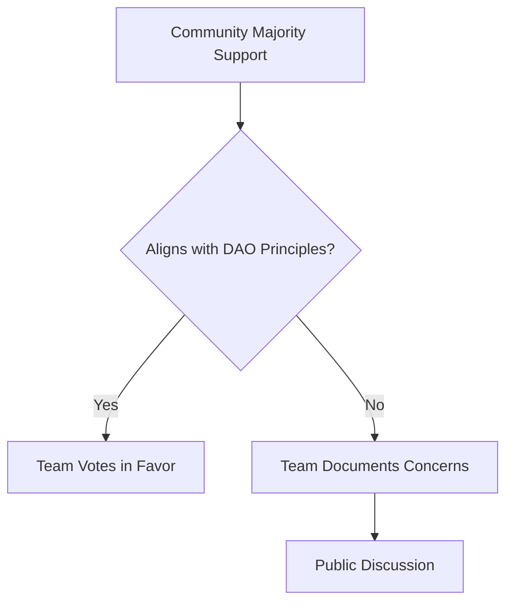

# Governance

[[toc]]

## Introduction

::: info Decentralized Governance
We've designed governance to put the community at the center, giving Stakeholders a real say in how the franchise grows. Built using ICP's native [SNS (Service Nervous System)](https://internetcomputer.org/docs/current/developer-docs/daos/sns/overview), maintained by the [DFINITY Foundation](https://dfinity.org/), the DAO uses fairness, transparency, and community-driven decision-making to ensure Cosmicrafts stays true to its vision.
:::

---
## DAO General Principles

The Cosmicrafts DAO operates under a set of guiding principles designed to promote innovation, inclusivity, and long-term success. These principles ensure that all decisions and actions align with the DAO's mission and the interests of its community.

| Principle | Description |
|-----------|-------------|
| **1. Community First** | - The DAO exists to serve its community of players, creators, investors, and contributors - All decisions prioritize the collective benefit and long-term growth of the community over individual interests |
| **2. Transparency and Accountability** | - Every action taken by the DAO or its members is documented and accessible to the community - Open communication is maintained, ensuring stakeholders are informed and involved in decision-making processes |
| **3. Innovation and Education** | - The DAO champions cutting-edge technology, creativity, and learning - Proposals and initiatives should foster innovation in gaming, blockchain, and AI while promoting educational value |
| **4. Sustainability and Scalability** | - All initiatives must be designed for long-term sustainability - Decisions should reflect the scalability of Cosmicrafts and its ability to grow without compromising quality |
| **5. Inclusivity and Collaboration** | - The DAO promotes inclusivity, welcoming diverse perspectives and contributions from all members - Collaboration, both within the DAO and with external partners, is encouraged to maximize impact |

### Additional Guiding Principles

- [x] **Alignment with the Internet Computer**: The DAO remains committed to the Internet Computer ecosystem, leveraging its capabilities to drive innovation and adoption.
- [x] **Balanced Governance**: Governance decisions balance the need for efficiency with community involvement.
- [x] **Ethical and Responsible Practices**: The DAO upholds ethical practices, including fair treatment of contributors and responsible allocation of resources.
- [x] **Encouraging Social Connection**: Cosmicrafts DAO fosters social engagement by creating opportunities for members to connect and collaborate.
- [x] **Empowerment Through Decentralization**: The DAO empowers its community through decentralized governance, ensuring members have a voice in shaping Cosmicrafts' future.

::: warning Foundation for Success
These **General Principles** establish a foundation for all Cosmicrafts DAO activities, ensuring every decision supports its mission, aligns with its values, and drives the project toward long-term success.
:::

---

## Initial Voting Power

The **Cosmicrafts DAO** distributes its initial voting power across four key categories to create a balanced and democratic governance system. This structure ensures collaboration, checks, and balances while staying aligned with the project's mission.

### Voting Power Distribution

| Stakeholder Group | Voting Power | Purpose |
|-------------------|--------------|---------|
| **SNS Sale** | 41.67% | - Represents the largest share, empowering **SNS participants** - Ensures decentralized governance with significant community influence |
| **Team** | 20.83% | - Held by the Cosmicrafts Foundation - Drives strategic decisions and safeguards the project's vision - Gradually dissolves over time, shifting more influence to the community |
| **Seed** | 20.83% | - Allocated to early backers and supporters - Ensures a voice for those who helped establish Cosmicrafts - Aligns their long-term commitment with the DAO's success |
| **DFINITY** | 16.67% | - Recognizes DFINITY's foundational role and ongoing guidance - Ensures alignment with the **Internet Computer ecosystem** |

### Strategic Balancing

::: info Collaborative Governance
The voting power distribution is designed to encourage collaboration and prevent dominance by any single group:
:::

- **SNS Participants as the Decentralizing Force**:  
   With the largest share, the SNS Sale allocation ensures the DAO is decentralized, enabling community-driven governance.  
- **Team and Seed as Stewards of Vision**:  
   These allocations ensure that decisions remain aligned with the project's mission and long-term strategy.  
- **DFINITY as the Ecosystem Anchor**:  
   DFINITY's involvement acts as a stabilizing force, keeping Cosmicrafts aligned with the Internet Computer's goals and principles. 

---

## How Governance Works

The Cosmicrafts DAO leverages the Internet Computer's [SNS (Service Nervous System)](https://internetcomputer.org/docs/current/developer-docs/daos/sns/overview) framework, enabling robust and transparent decentralized governance and treasury management. Here's how it works:

### Decentralized Governance

::: info Community Control
The DAO empowers stakeholders by granting them voting rights to shape the project's future.
:::

| Decision Types | Examples |
|----------------|----------|
| **Treasury Allocation** | - Marketing campaigns - Game development - Strategic partnerships |
| **Economic Policies** | - Tokenomics adjustments - Staking rates - Fee structures |
| **Development Priorities** | - Feature roadmap - Game expansions - Technical improvements |

- Voting is conducted through the [NNS (Network Nervous System)](https://internetcomputer.org/docs/current/developer-docs/daos/nns/overview), an intuitive interface, making governance accessible to all token holders.

### Maturity-Based Staking

- **Neuron Staking**: Stakeholders lock tokens in [neurons](https://internetcomputer.org/docs/current/developer-docs/daos/nns/concepts/neurons/neuron-overview) to participate in governance and earn rewards.
  - The longer tokens are staked, the greater the maturity of the neuron, directly impacting:
    - **Voting Power**: Higher maturity grants greater influence in governance decisions.
    - **Rewards**: Maturity-based staking provides [compounding returns](https://internetcomputer.org/docs/current/developer-docs/daos/nns/concepts/neurons/staking-voting-rewards), incentivizing long-term commitment.
  - Neuron holders can [dissolve neurons to unlock tokens](https://internetcomputer.org/docs/current/developer-docs/daos/nns/concepts/neurons/neuron-management), with dissolving durations adjustable to balance liquidity and governance participation.
- **Governance Participation Rewards**: Active participation in proposals and voting enhances individual rewards, promoting engagement within the community.

### Proposal Submission

Got an idea for a new feature, partnership, or treasury adjustment? Here's how to turn your idea into action within the Cosmicrafts DAO.

#### 1. Public Discussion

::: info Community Feedback
We encourage stakeholders to start with a **public discussion** about their proposal. This step helps refine ideas, gather community feedback, and increase the chances of success.
:::

- Use our dedicated **forum** to present your concept, share details, and receive constructive input from the community.  
- For **critical decisions** that require immediate review, proposals can bypass this step but must clearly justify the urgency.  

#### 2. Submitting Your Proposal

Once your idea has been validated through community discussion, it's time to submit your proposal.

| Requirement | Details |
|-------------|---------|
| **Clear Description** | Concise explanation of what you're proposing |
| **Rationale** | Why this proposal benefits Cosmicrafts |
| **Expected Outcomes** | Specific benefits to the DAO and community |
| **Implementation Plan** | How and when the proposal will be executed |

- **Team Assistance**:  
   If your proposal has been validated but you face challenges submitting it, the team can help elaborate and submit it on your behalf, covering the proposal fee.

#### 3. Community Voting

Once live, Spiral holders vote on your proposal.

- **Neuron Voting Power**:  
  The weight of each vote is determined by the staked Spiral tokens in the voter's neuron.
- **Engagement Incentives**:  
  If your proposal passes, it's automatically implemented by the SNS, and you may earn Spiral rewards as recognition for your contribution to the DAO.

## Treasury Management

The DAO treasury is the lifeblood of its operations, ensuring the sustainability and growth of the project. Effective treasury management is critical to balancing innovation, stability, and community engagement.

### Purpose of the Treasury

::: info Financial Foundation
The treasury exists to support the DAO's objectives by funding initiatives, rewarding contributors, and ensuring long-term sustainability.
:::

| Purpose | Description |
|---------|-------------|
| **Development and Innovation** | Supporting product development, research, and technological advancements |
| **Marketing and Partnerships** | Funding campaigns, partnerships, and community-building efforts |
| **Staking and Rewards** | Allocating Spiral rewards for active participants and incentivizing governance |
| **Reserves for Market Stability** | Maintaining liquidity to stabilize the token's market value |
| **Operational Costs** | Covering legal, administrative, and other essential expenses |

### Governance Over Treasury Management

The DAO governs the treasury to ensure transparency, inclusivity, and accountability. Treasury management is guided by the following principles:

#### Proposal-Driven Allocation

- Any allocation or expenditure of treasury funds requires an approved proposal.
- Proposals must outline the purpose, amount requested, and expected outcomes.
- The DAO reviews and votes on each proposal before implementation.

#### Community Oversight

- Treasury activities are monitored by the community, ensuring decisions align with the DAO's principles and goals.
- Regular updates and reports are shared with members to maintain transparency.

#### Strategic Reserves

- A portion of the treasury is reserved for unforeseen circumstances or high-impact opportunities.
- Access to these reserves requires supermajority approval by the DAO.

### Voting and Decision-Making

Treasury-related proposals follow a structured process to ensure fair decision-making:

1. **Public Review**:  
   The community discusses the proposal during a public review period to refine and assess its viability.   
2. **Proposal Submission**:
   Stakeholders submit a detailed proposal, including the requested amount, justification, and benefits to the DAO. 
3. **Voting**:  
   Spiral holders vote on the proposal. The weight of each vote is determined by the staked tokens in the neuron.  
4. **Implementation**:  
   Approved proposals are executed, with funds released from the treasury to the specified initiative.

### Sustainability Measures

To ensure the long-term health of the treasury:

- [x] **Revenue Streams**: The DAO continuously generates revenue through game transactions, NFTs, marketplace fees, and staking rewards.
- [x] **Controlled Spending**: Expenditures are prioritized based on the potential return on investment and alignment with the DAO's mission.
- [x] **Periodic Audits**: Regular audits are conducted to evaluate treasury performance, ensuring funds are utilized effectively and transparently.

### Emergency Protocols

::: warning Rapid Response
In case of emergencies, such as market instability or urgent funding needs:
- The DAO may bypass the standard proposal process for immediate action, requiring supermajority approval.
- Emergency expenditures are strictly documented and reported to the community.
:::

> Treasury management ensures the DAO operates efficiently, transparently, and sustainably by empowering the community to oversee and govern the treasure.

---

## Cosmicrafts Foundation

The Cosmicrafts Foundation is an autonomous entity responsible for contributing to the DAO and ensuring its long-term success.

### Role of the Foundation

#### Core Functions

| Function | Description |
|----------|-------------|
| **Token Management** | Hold and manage team tokens and voting power |
| **Democratic Operation** | Each member has voting power within the foundation |
| **Innovation Driver** | Drive development, communication, and community engagement |
| **Strategic Planning** | Develop and execute long-term vision for the project |

#### DAO Oversight

::: info Balanced Relationship
The DAO retains oversight to ensure the foundation aligns with the community's goals while preserving its autonomy.
:::

- **Opt-In/Out Membership**:
  The DAO can vote to add or remove members of the foundation based on performance or changing needs.

#### Balancing Autonomy and Accountability

- The foundation retains control over daily operations and internal decision-making.
- DAO oversight ensures accountability without interfering in operational independence.
- Transparent reporting and defined boundaries maintain trust between the foundation and the DAO.

### Team Voting Protocol for the DAO

The Cosmicrafts Foundation team holds significant voting power in the DAO, but this power is designed to amplify the community's voice, not override it. The protocol ensures that team votes are principled, timely, and aligned with the DAO's long-term success.

#### 1. Amplifying Community Consensus

- **Majority Support**:  
  If the majority of the community supports a proposal **and** it aligns with the DAO's General Principles, the team will cast their votes in favor of the proposal.
  - This ensures the team acts as an amplifier of community consensus, respecting the collective decision-making process.

#### 2. Timely Participation

- **Clear Stance**:  
  The team will participate in voting within a predetermined timeframe, avoiding last-minute decisions.
  - This transparency allows the community to see where the team stands and promotes trust.

#### 3. Principle-Based Opposition

::: warning Principled Governance
If the team believes a proposal fundamentally contradicts the DAO's principles, they reserve the right to vote against it.
:::

- **Documentation**: Any NO vote by the team will be thoroughly documented, with a clear explanation made publicly available for review and discussion.
- **Engagement**: The team will encourage dialogue within the DAO community to ensure decisions are understood and collaboratively addressed.

#### 4. Roadmap Alignment

- **Unanimous Support for Roadmap Proposals**:  
  Proposals that align with the DAO's established Road Map will automatically receive full support from the team.
  - This reflects the commitment to the original vision and ensures the Road Map is executed effectively.

#### 5. Limits to Team Power

- **Safeguarding, Not Controlling**:  
  The team's voting power is substantial but exists to safeguard the DAO's interests, not to dominate decision-making.  
  - **Temporary Influence**: As 2% of the team's tokens gradually dissolve over an 8-year period, their voting power will shift increasingly to community stakeholders.  
  - **Community-Centric**: The team's role is to act as stewards of the DAO, facilitating its growth while empowering the broader community to take ownership over time.  

#### 6. Transparency and Accountability

- **Public Voting Records**:  
  The team's voting decisions will be documented and shared publicly to ensure transparency and foster trust.  
- **Regular Updates**: The team will provide periodic updates on their voting rationale, aligning their actions with the DAO's goals and values.  

> By setting clear boundaries and principles, this protocol guarantees that decisions are made transparently and in the best interest of Cosmicrafts and its stakeholders.

---
## Attack Vectors and Mitigation

This section will directly address potential governance attack vectors and the mitigation strategies used within the Cosmicrafts DAO to ensure fair, transparent, and secure decision-making.

---

### 1. 51% Attack

**Risk:**  
A single entity (or a colluding group) accumulating more than 50% of voting power could exert full control over governance decisions, leading to malicious actions such as fund misallocations or rule changes that benefit a minority at the expense of the community.

**Mitigation Strategies:**

- **Diverse Initial Distribution:**  
   The community retains the largest share, ensuring decentralization from the outset.  

- **Maturity-Based Voting Power:**  
  Power scales over time, reducing the ability of a single entity to rapidly accumulate disproportionate control. 

- **Stake-Based Commitments:**  
  Attacking the system becomes costly since neurons require time to dissolve, ensuring attackers cannot immediately cash out if they attempt governance abuse.  

- **Emergency Governance Protocols:**  
  If a governance takeover is detected, community-wide alerts will be issued, encouraging swift defensive voting.

---

### 2. Sybil Attack (Multiple Fake Neurons)

**Risk:**  
A single entity could create multiple neurons with small amounts of Spiral tokens to artificially inflate their voting power.

**Mitigation Strategies:**

- **Minimum Staking Requirements:**  
  Neurons must stake a minimum of Spiral tokens to participate in governance, making large-scale Sybil attacks costly.  

- **Neuron Age and Maturity Scaling:**  
  Voting power scales with neuron maturity, not just the number of neurons, discouraging rapid accumulation of fake neurons.  
  Low-maturity neurons have minimal influence, making Sybil attacks economically inefficient.  

- **Delegated Voting & Community Influence:**  
  Token holders can delegate votes to trusted representatives, ensuring governance is driven by informed participants rather than numerous fake accounts.  

- **Pattern Analysis for Abnormal Voting Activity:**  
  The DAO monitors on-chain governance data to detect unnatural voting patterns (e.g., thousands of low-value neurons voting identically).  
  If an anomaly is detected, governance alerts will be raised to encourage defensive counter-votes.  

---

### 3. Bribery and Vote Buying

**Risk:**  
A malicious actor could bribe neuron holders to vote in their favor, potentially passing harmful proposals.

**Mitigation Strategies:**

- **Maturity-Based Rewards Structure:**  
  Governance rewards are directly tied to long-term participation, making short-term bribery less attractive.  
  Accepting bribes could mean forfeiting future rewards.  

- **Public Voting Transparency:**  
  All votes are recorded on-chain and fully transparent, allowing the community to detect suspicious voting behavior.  
  Large shifts in votes before deadlines can trigger a voting freeze or an extended discussion period.  

- **Delayed Voting Execution:**  
  Even if a proposal passes due to bribed votes, a time delay is applied before execution.  
  This allows defensive counter-voting or emergency governance actions if foul play is suspected.  

- **Social Incentives Against Bribery:**  
  Active community members build reputation-based influence, making it reputationally damaging for stakeholders to engage in vote-buying schemes.  

- **Team Voting Protocol as a Safeguard:**  
  The Cosmicrafts Team holds a controlled share of voting power (20.83%), which can act as a countermeasure if bribery-driven proposals are detected.  

---

### 4. Last-Minute Vote Swings

**Risk:**  
Large stakeholders might wait until the last minute before casting their votes, making it difficult for smaller participants to react.

**Mitigation Strategies:**

- **Early Voting Incentives:**  
  Voting earlier in the process earns slightly higher rewards than last-minute voting, encouraging active participation throughout the proposal window.  

- **Tiered Voting Phases:**  
  Proposals may have multiple voting phases, preventing a single last-minute swing from deciding the outcome.  

- **Team Voting Protocol for Stability:**  
  The team votes earlier based on community sentiment, reducing the risk of last-minute manipulations.  
  This ensures early transparency and provides smaller stakeholders with a strategic voting reference.  

- **Extended Time Lock for Large Votes:**  
  If a proposal suddenly shifts due to large last-minute votes, an automatic extension may be triggered, giving the community time to respond.  

- **Cooldown Before Execution:**  
  A grace period between vote closure and execution allows further review.  
  If foul play is detected, the community can propose an emergency counteraction.  

---

###  Conclusion

Governance security is a critical part of Cosmicrafts DAO, ensuring fair, transparent, and resilient decision-making. Through a combination of token-based safeguards, neuron mechanics, and strategic voting protocols, the DAO actively mitigates risks associated with 51% attacks, Sybil attacks, bribery, and last-minute vote swings.

---

> These guidelines are designed to provide Cosmicrafts DAO with a flexible framework for sustainable growth and innovation while staying aligned with its core principles.

## Proposal Lifecycle & Community Involvement

The Cosmicrafts DAO thrives on its community. Whether it's a bold idea for a new game mode, a partnership with another project, or a fresh way to grow the ecosystem, you can bring those ideas to life by submitting a proposal to the DAO. Here's how the process works:

### Proposal Creation: Turning Ideas into Action

Every great proposal starts with a conversation. Before formally submitting your idea, we encourage you to share it with the community in dedicated discussion channels. This early feedback helps refine your proposal, address potential concerns, and increase its chances of success.

#### Who can propose?
Any Spiral token holder with a staked neuron can submit a proposal.

#### What should your proposal include?

A strong proposal should clearly outline:

- **The Problem**: What issue or opportunity are you addressing? (Clearly define the challenge or potential benefit.)
- **Your Solution**: What's your idea to solve the problem or capitalize on the opportunity? (Describe your proposed solution in detail.)
- **The Plan**: What steps are needed to make it happen? (Outline the key steps and milestones for implementation.)
- **Timeline**: How long will it take? (Provide a realistic timeframe for each stage of the project.)
- **Budget (if applicable)**: How much funding is required, and how will it be used? (Provide a detailed breakdown of expenses.)
- **Team (if applicable)**: Who will be responsible for carrying out the proposal? (List the individuals or teams involved and their roles.)

> **Tip:** Present your information clearly and concisely to ensure the community can easily understand and evaluate your proposal.

### Community Debate: Collaborative Refinement

Once submitted, your proposal enters a community debate phase. During this time:

- **Community members can ask questions, provide feedback, and suggest improvements.**
- **You can refine your proposal based on community input.**
- **The community can gauge support for the proposal before it goes to a formal vote.**

This collaborative process ensures that proposals are thoroughly vetted and improved before they're put to a vote, increasing their chances of success and implementation.

### Voting: Democratic Decision-Making

After the debate phase, eligible proposals move to a formal vote. The voting process is designed to be fair, transparent, and accessible to all stakeholders:

- **Voting Power**: Your voting power is determined by the amount of Spiral tokens you have staked in neurons and the dissolve delay you've chosen.
- **Voting Period**: Most proposals have a standard voting period of 7 days, giving all stakeholders ample time to participate.
- **Approval Threshold**: Different types of proposals require different approval thresholds, ranging from simple majority to supermajority, depending on their impact.

### Implementation: Bringing Ideas to Life

Approved proposals move to the implementation phase, where the real work begins:

- **Execution Team**: The team responsible for implementing the proposal (as specified in the proposal itself) gets to work.
- **Progress Updates**: Regular updates are provided to the community, ensuring transparency and accountability.
- **Milestone Reviews**: For larger projects, milestone reviews may be conducted to ensure the project is on track and meeting its objectives.

---

## Staking & Rewards: Building Value Together

By staking your Spiral tokens, you become a vital part of the Cosmicrafts ecosystem, contributing to its long-term success and earning rewards along the way. Staking isn't just about rewards—it's about securing the DAO, driving its growth, and unlocking unique benefits for your commitment.

### Why Stake Spiral Tokens?

Staking Spiral tokens is your gateway to deeper involvement in the DAO and a way to earn meaningful rewards. Here's why staking matters:

- **Earn Rewards**: Stake Spiral and earn rewards for your contribution to the DAO.
- **Boost Voting Power**: Locking your Spiral in neurons boosts your voting power, giving you a bigger say in how the DAO is run.
- **Support the Ecosystem**: Staking strengthens the treasury, stabilizes the Spiral token, and fuels the development of new projects.
- **Unlock Exclusive Perks**: As a staker, you'll unlock perks like early access to new games and content, special NFT drops, and more.

### Staking Your Spiral and Earning Rewards

Staking your Spiral is simple and rewarding. Here's how it works:

#### Staking Your Spiral

Using the DAO's governance interface, you can lock your Spiral tokens into a neuron. You'll also choose a "dissolve delay"—the length of time you commit to locking your tokens. The longer the delay, the greater your rewards and voting power.

#### How Your Neuron Grows

Over time, your neuron accumulates voting power based on three key factors:
- **Dissolve Delay**: The longer you commit to locking your tokens, the more voting power you receive.
- **Age**: The longer your neuron has been staked, the more voting power it accumulates.
- **Stake Size**: The more Spiral tokens you stake, the greater your voting power.

---

## Community Building & Ecosystem Growth

The heart of Cosmicrafts is its **community**. Through engagement, events, and gamified rewards, we're creating interactive ways for you to **connect, collaborate, and thrive**.

### Gamified Participation
Participation in the DAO should be rewarding and fun. We'll integrate **quests, achievements, and leaderboards** to gamify your contributions to the ecosystem:

- **The Civic Duty Quest**: Earn rewards for voting on a set number of proposals.
- **The Forum Master Achievement**: Unlock perks for consistently contributing helpful insights to discussions.
- **Leaderboards**: Compete with others for top contributor spots, showcasing achievements like voting participation, forum engagement, and in-game milestones.

**Rewards**: Exclusive NFTs with unique in-game utility or cosmetic value, early access to upcoming content, exclusive in-game items, and prestigious community recognition badges displayed on your profile.

### In-Game Events & Tournaments

Regular in-game events and tournaments will bring the community together, fostering friendly competition and collaboration:

- **Weekly Challenges**: Complete specific in-game objectives for rewards and leaderboard points.
- **Monthly Tournaments**: Compete in structured tournaments with significant prizes and recognition.
- **Seasonal Championships**: Participate in major seasonal events with the highest stakes and most prestigious rewards.

These events will be designed to appeal to players of all skill levels, ensuring everyone can participate and enjoy the community experience.

---

## Risk Management and Sustainability

Every great journey comes with risks. For the Cosmicrafts DAO, proactively managing those risks is key to ensuring the community's trust and long-term success. By identifying potential challenges early and implementing safeguards, we can build a resilient ecosystem that grows stronger over time.

### Types of Risks

Here are the key risks the DAO faces, categorized for clarity, with examples specific to Cosmicrafts:

#### 1. **Governance Risks**

- **Voter Apathy**: Low voter turnout could hinder decision-making and slow down progress.
- **Whale Dominance**: Large stakeholders might exert disproportionate control, reducing fairness.
- **Proposal Overload**: A flood of low-quality proposals could make it hard to focus on the best ideas.

#### 2. **Economic Risks**

- **Token Volatility**: Fluctuations in Spiral's value could affect the stability of the ecosystem.
- **Unsustainable Rewards**: Overly generous rewards might deplete the treasury too quickly.
- **Insufficient Treasury Growth**: If the treasury doesn't grow sufficiently, we might not have the resources to fund all the exciting projects we want to pursue.

#### 3. **Security Risks**

- **Smart Contract Vulnerabilities**: Exploitable bugs in governance or staking mechanisms could undermine the DAO's stability.
- **Fraudulent Proposals**: Bad actors might exploit the governance process to push harmful agendas.

#### 4. **Ecosystem Risks**

- **Inadequate Community Engagement**: Declining participation in governance or staking could weaken the DAO's effectiveness.

### Mitigation Strategies

To address these risks, the DAO has implemented several key strategies:

#### 1. **Governance Safeguards**

- **Graduated Voting Power**: Voting power increases with stake size, dissolve delay, and neuron age, rewarding long-term commitment.
- **Proposal Guidelines**: Clear guidelines and templates help ensure proposals are well-structured and address key considerations.
- **Discussion Phase**: All proposals undergo a community discussion phase before voting, allowing for refinement and early feedback.

#### 2. **Economic Stability Measures**

- **Treasury Diversification**: The DAO maintains a diversified treasury to reduce exposure to market volatility.
- **Sustainable Reward Models**: Reward mechanisms are designed to be sustainable over the long term, with regular reviews and adjustments.
- **Revenue Streams**: Multiple revenue streams ensure the treasury continues to grow, supporting ongoing development and community initiatives.

#### 3. **Security Protocols**

- **Regular Audits**: Smart contracts and governance mechanisms undergo regular security audits by independent experts.
- **Gradual Implementation**: Major changes are implemented gradually, allowing time to identify and address potential issues.
- **Emergency Response Plan**: A clear plan is in place to respond quickly to security incidents or vulnerabilities.

#### 4. **Community Engagement Initiatives**

- **Gamified Participation**: Quests, achievements, and rewards make participation fun and engaging.
- **Education Programs**: Resources and guides help community members understand governance and make informed decisions.
- **Regular Events**: Community events, AMAs, and town halls keep members engaged and informed.

By proactively addressing these risks, the Cosmicrafts DAO ensures its long-term sustainability and success, creating a resilient ecosystem that can weather challenges and seize opportunities.
