# Introduction

[[toc:2-2]]

**Cosmicrafts DAO** is pioneering the gaming industry through Web3 technology, creating the first fully on-chain gaming franchise with real ownership economics. In development since 2016 and built entirely on the [Internet Computer](https://internetcomputer.org) since 2021, we've consistently advanced our vision of blockchain gaming without the limitations that have held back previous Web3 ventures.

## The Opportunity

While traditional gaming extracts value from players, Cosmicrafts:

- **Creates true digital ownership** for in-game assets
- **Transforms players into stakeholders** with governance rights and economic benefits
- **Delivers quality gameplay** that appeals to mainstream and crypto-native audiences alike

## Our Traction

Cosmicrafts has built a solid foundation with measurable achievements since inception:

### Proven Track Record
- **Enduring Presence**: 8+ years of continuous development, surviving 3 major market cycles
- **DFINITY Grant Recipient**: [Official grant project](https://dfinity.org/grants/) from 2021-2024
- **Supernova Winner**: [Community Awards winner](https://medium.com/dfinity/cosmicrafts-wins-the-supernova-hackathon-community-choice-award-c9ed27e3bd80), 14,664 votes
- **NFT Success**: [Genesis collection](https://funded.app/projects/cosmicrafts-9388300) sold out in 47 seconds, 100% floor price increase
- **10,000+ Beta Testers**: 28-minute average session times (42% higher than industry average)
- **Community Growth**: 5,000+ Discord members, 18,000+ Twitter followers
- **Multiple Platforms**: Featured on [Epic Games](https://store.epicgames.com/en-US/p/cosmicrafts-499a8f) and [itch.io](https://ohsalmeron.itch.io/cosmicrafts)

### Strategic Positioning
- **Ecosystem Partnerships**: 50+ collaborations with ICP ecosystem projects
- **Technical Infrastructure**: 1.2 million+ on-chain transactions with 99.97% uptime
- **Media Recognition**: Featured in 12+ industry publications
- **Market Readiness**: Complete product serving players across 47 countries

## Cosmicrafts Value Proposition

## Why Cosmicrafts Stands Out

1. **Fully Operational Product**: Already built and playable with a proven track record
2. **Authentic Gaming Experience**: Designed by gamers for gamers
3. **Technical Execution**: Web3 functionality that enhances gaming experience
4. **Community Ownership**: True DAO governance with meaningful participation
5. **Scalable Framework**: Architecture designed for an expanding universe

### 1. Complete Product & Proven Technology

Unlike most Web3 projects seeking investment to build a product, Cosmicrafts is already built and playable. Your participation directly fuels growth and adoption, not development uncertainty.

### 2. Multiple Value Mechanisms

As a Spiral token holder, you benefit from:

- **Direct Participation**
  - **Staking**: Earn passive income by locking tokens
  - **Governance**: Direct the DAO's future
  - **Treasury**: Strategic resource allocation

- **Ecosystem Engagement**
  - **Marketplace**: Trade assets with other players
  - **In-game Economy**: Participate in the game economy
  - **Asset Utility**: Use assets across multiple games

### 3. Proven Operational Expertise

Our team has demonstrated exceptional execution:
- Successfully built and launched a fully on-chain RTS game in 2021
- Maintained continuous development through multiple market cycles
- Navigated the technical challenges of blockchain gaming

---

This whitepaper details the Cosmicrafts DAO ecosystem, from technical architecture to tokenomics. Explore how your participation can help redefine gaming through true digital ownership.

```mermaid
flowchart LR
    A[Start Here] --> B[Introduction]
    B --> C[Tokenomics]
    B --> D[Governance]
    
    C --> E[Core Features]
    D --> E
    
    E --> F[Architecture]
    
    style A fill:#00c3ff,stroke:#333,stroke-width:2px
    style B fill:#00ff9530,stroke:#00ff95,stroke-width:2px
    style C,D,E,F fill:#1a2d40,stroke:#333,stroke-width:1px
```

## Recommended Reading Path

For stakeholders looking to understand the ecosystem:

1. [**Introduction**](/introduction) - Overview of the project
2. [**Tokenomics**](/tokenomics) - Token distribution, utility, and value drivers
3. [**Governance**](/governance) - Stakeholder control and decision-making mechanisms

For technical stakeholders interested in product capabilities:

1. [**Core Features**](/core-features) - Product capabilities and functionality
2. [**Architecture**](/architecture) - Technical infrastructure and blockchain integration
3. [**Community**](/community) - User growth strategies and engagement mechanisms

Join us in revolutionizing the economics of gaming by transforming players into stakeholders and creating true digital ownership in the metaverse.