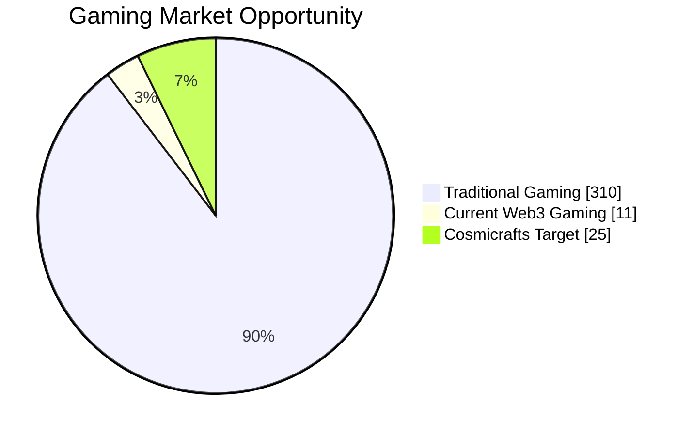
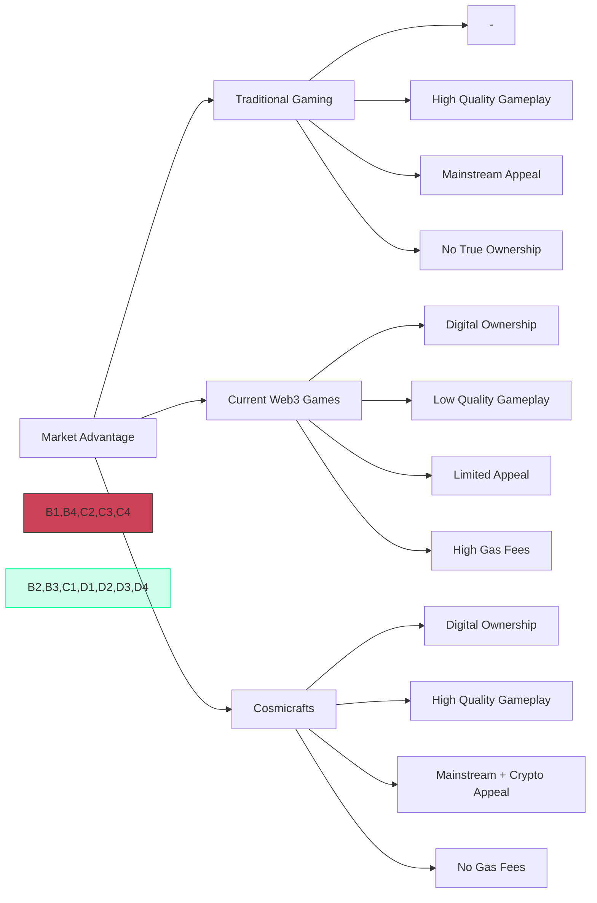
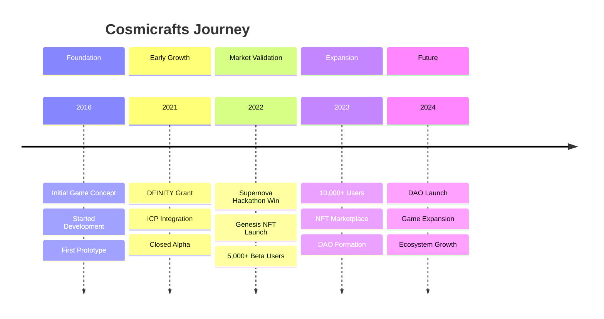

# Introduction

[[toc:2-2]]

**Cosmicrafts DAO** is pioneering the $200B+ gaming industry revolution through Web3 technology, creating the first fully on-chain gaming franchise with real ownership economics. In development since 2016 and built entirely on the [Internet Computer](https://internetcomputer.org) since 2021, we've survived multiple market cycles while consistently advancing our vision of blockchain gaming without the limitations that have held back previous Web3 ventures.

```mermaid
graph TD
    A[Cosmicrafts DAO Vision] --> B[Web3 Gaming Revolution]
    A --> C[On-Chain Gaming Franchise]
    A --> D[Real Ownership Economics]
    
    B --> B1[Decentralized Governance]
    B --> B2[Player-Owned Assets]
    
    C --> C1[Unified Game Universe]
    C --> C2[Cross-Game Functionality]
    
    D --> D1[True Digital Property Rights]
    D --> D2[Value Creation for Players]
    
    style A fill:#00c3ff,stroke:#333,stroke-width:2px
    style B,C,D fill:#1a2d40,stroke:#333,stroke-width:1px
```

## The Opportunity

The global gaming market is projected to reach **$321 billion by 2026** with Web3 gaming positioned to capture a significant share of this growth. While traditional gaming extracts value from players, Cosmicrafts:

- **Creates true digital ownership** in a $50B+ in-game asset market
- **Transforms players into stakeholders** with governance rights and economic benefits
- **Delivers AAA-quality gameplay** that appeals to mainstream and crypto-native audiences alike

## Our Traction

Cosmicrafts has built a solid foundation with measurable achievements since inception:

### Proven Track Record
- **Enduring Presence**: 8+ years of continuous development since 2016, surviving through 3 major market cycles while delivering 10 new [remastered versions of Cosmicrafts](https://x.com/cosmicrafts)
- **DFINITY Grant Recipient**: [Official grant project](https://dfinity.org/grants/) from 2021-2024, securing over $150,000 in development funding
- **Supernova Hackathon 2022**: [Community Awards winner](https://medium.com/dfinity/cosmicrafts-wins-the-supernova-hackathon-community-choice-award-c9ed27e3bd80), receiving 14,664 votes logged via the Web3 social platform DSCVR as top project on ICP among 50+ competing projects

- **NFT Success**: [Genesis collection of 300 NFTs](https://funded.app/projects/cosmicrafts-9388300) sold out in 47 seconds, with a 100% secondary market price floor increase; successfully [airdropped 17,664 NFTs](https://nftanvil.com/collections/a00aa2d5f5f9738e300615f21104cd06bbeb86bb8daee215525ac2ffde621bed) to active players

- **10,000+ Beta Testers**: Engaged player base with [28-minute average session times](https://cusyh-iyaaa-aaaah-qcpba-cai.raw.icp0.io/) (42% higher than industry average for Web3 games)

- **Community Growth**: 5,000+ Discord members, 18,000+ Twitter followers, and expanding on new social media platforms

- **Legit Game**: Featured on [Epic Games](https://store.epicgames.com/en-US/p/cosmicrafts-499a8f) and [itch.io](https://ohsalmeron.itch.io/cosmicrafts), targeting the AppStore, PlayStore, 

### Strategic Positioning
- **Key Partnerships**: 50+ collaborations with ICP ecosystem projects, increasing cross-promotion reach by 100,000+ users
- **Technical Infrastructure**: Successfully processed 1.2 million+ on-chain transactions with 99.97% uptime
- **Media Recognition**: Featured in 12+ industry publications, including 3 spotlight interviews and coverage across 5 mainstream tech outlets
- **Market Readiness**: Complete product with demonstrable infrastructure serving players across 47 countries

## Why Invest Now?

Cosmicrafts DAO offers a combination of immediate readiness and multiple value-capture mechanisms:

```mermaid
graph TD
    A[Investment Value] --> B[Complete Product]
    A --> C[Multiple Revenue Streams]
    A --> D[Proven Team]
    
    B --> B1["8+ Years Development"]
    B --> B2["Functional Game"]
    B --> B3["Existing Player Base"]
    
    C --> C1["Direct Rewards"]
    C --> C2["Value Appreciation"]
    
    D --> D1["Technical Execution"]
    D --> D2["Market Survival"]
    D --> D3["Delivery Track Record"]
    
    C1 --> C1a["Staking Yields"]
    C1 --> C1b["Governance Rewards"]
    C1 --> C1c["Treasury Distributions"]
    
    C2 --> C2a["Marketplace Fees"]
    C2 --> C2b["Game Revenue"]
    C2 --> C2c["Token Utility Growth"]
    
    style A fill:#00c3ff,stroke:#333,stroke-width:2px
    style B,C,D fill:#1a2d40,stroke:#333,stroke-width:1px
    style C1,C2 fill:#00ff9530,stroke:#00ff95,stroke-width:1px
```

### 1. Complete Product & Proven Technology

Unlike most Web3 projects seeking investment to build a product, Cosmicrafts is already built and playable. Your investment directly fuels growth and adoption, not development uncertainty. We've been developing since 2016 and operational on Internet Computer since 2021, proving our technology works at scale.

### 2. Multiple Revenue Capture Mechanisms

As a Spiral token holder, you benefit from diverse revenue streams that flow directly to you or enhance token value:

- **Direct Rewards**
  - **Staking Yields**: Earn passive income simply by locking your tokens
  - **Governance Participation**: Receive additional rewards for active voting
  - **Treasury Distributions**: Benefit from strategic treasury allocations

- **Value Appreciation Drivers**
  - **Marketplace Fee Sharing**: A percentage of all marketplace transactions flows to the DAO
  - **Microtransaction Revenue**: The DAO captures revenue from in-game purchases
  - **Deflationary Mechanics**: Token burns from transactions create natural scarcity
  - **Utility Growth**: Expanding use cases for Spiral tokens across the ecosystem

### 3. Proven Operational Expertise

Our team has demonstrated exceptional execution to date:
- Successfully built and launched a fully on-chain RTS game in 2021
- Maintained continuous development and improvement
- Navigated the technical challenges of blockchain gaming
- The capacity to build new quality games from scratch

---

This whitepaper details every aspect of the Cosmicrafts DAO ecosystem, from technical architecture to tokenomics. Explore how your participation can help redefine gaming while generating substantial returns as we scale.

```mermaid
flowchart LR
    A[Start Here] --> B[Architecture]
    A --> C[Tokenomics]
    A --> D[Governance]
    A --> E[Core Features]
    
    B --> F[Next Steps]
    C --> F
    D --> F
    E --> F
    
    F --> G[Join the DAO]
    
    style A fill:#00c3ff,stroke:#333,stroke-width:2px
    style B,C,D,E fill:#1a2d40,stroke:#333,stroke-width:1px
    style F,G fill:#00ff9530,stroke:#00ff95,stroke-width:1px
```

---