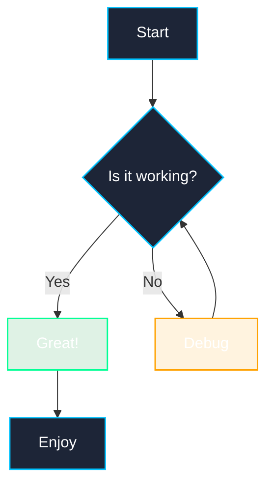

# Mermaid Test

This file contains a test mermaid diagram to verify the built-in zoom and pan functionality.

## Basic Flowchart

## Using Mermaid's Built-in Zoom and Pan

Mermaid diagrams now have built-in zoom and pan functionality:

1. **Mouse wheel** - Zoom in and out
2. **Click and drag** - Pan around the diagram
3. **Double-click** - Reset the view

Try it on any of the diagrams on this page!