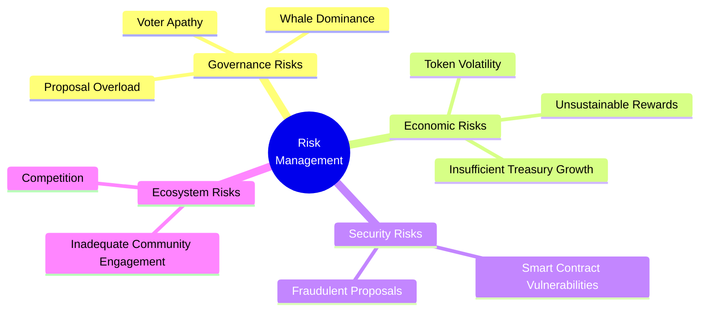
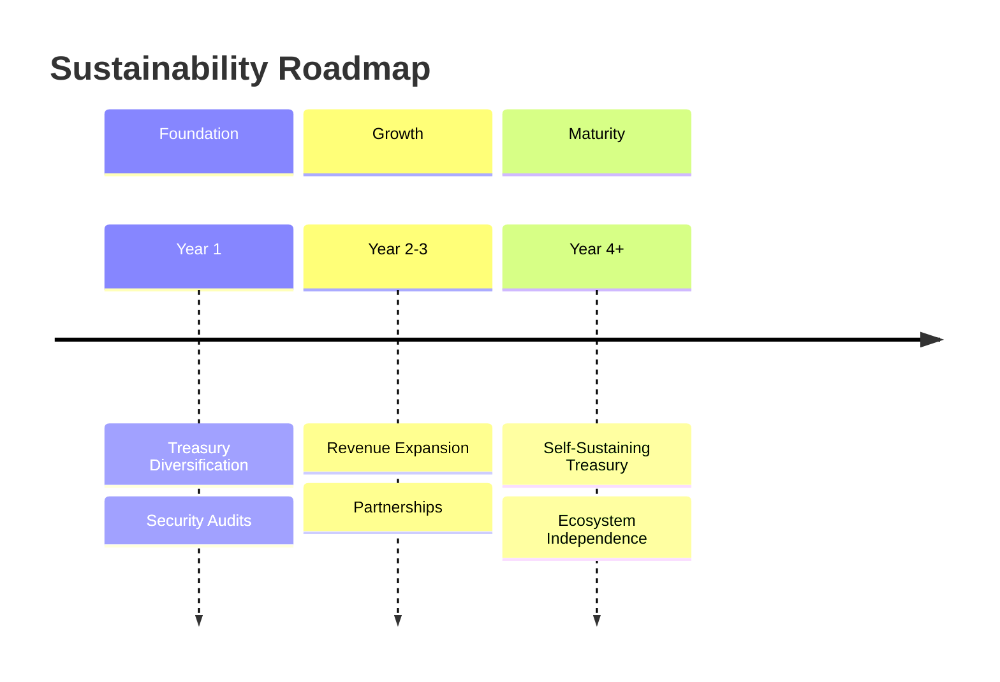
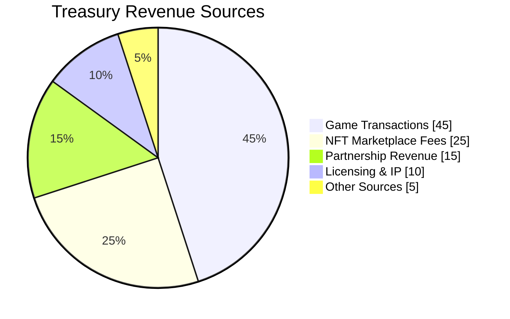
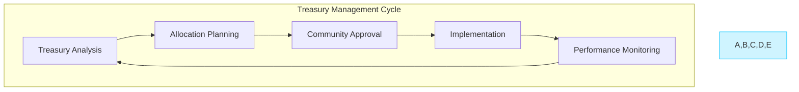

# Sustainability

[[toc:2-2]]

## Risk Management

Proactive risk management is key to ensuring community trust and long-term success. By identifying challenges early and implementing safeguards, we build a resilient ecosystem.

## Risk Mitigation Strategy

1. **Governance Safeguards**: Neuron-based voting with dissolve delay prevents attacks
2. **Economic Stability**: Transaction fee burn mechanism creates deflationary pressure
3. **Technical Security**: Regular security audits of critical components
4. **Ecosystem Resilience**: Diversified revenue streams and treasury management
5. **Regulatory Compliance**: Proactive monitoring of regulatory developments

## Key Risk Categories

### 1. **Governance Risks**
- **Voter Apathy**: Low voter turnout hindering decision-making
- **Whale Dominance**: Large stakeholders exerting disproportionate control
- **Proposal Overload**: Excessive proposals diluting quality focus

### 2. **Economic Risks**
- **Token Volatility**: Value fluctuations affecting ecosystem stability
- **Unsustainable Rewards**: Potential treasury depletion
- **Insufficient Treasury Growth**: Limited resources for development

### 3. **Security Risks**
- **Smart Contract Vulnerabilities**: Exploitable system weaknesses
- **Fraudulent Proposals**: Governance abuse by bad actors

---

## Mitigation Strategies

```mermaid
graph TD
    A[Risk Mitigation] --> B[Governance Safeguards]
    A --> C[Economic Safeguards]
    A --> D[Security Measures]
    A --> E[Ecosystem Support]
    
    B --> B1[Weighted Voting]
    B --> B2[Proposal Deposit]
    
    C --> C1[Treasury Diversification]
    C --> C2[Sustainable Rewards]
    
    D --> D1[Security Audits]
    D --> D2[Fraud Detection]
    
    E --> E1[Community Engagement]
    E --> E2[Strategic Partnerships]
    
    style A fill:#00c3ff,stroke:#333,stroke-width:2px
    style B,C,D,E fill:#1a2d40,stroke:#333,stroke-width:1px
```

### 1. **Governance Safeguards**
- **Weighted Voting**: Neuron mechanics ensuring balanced influence
- **Proposal Deposit**: Requiring stake to discourage spam

### 2. **Economic Safeguards**
- **Deflationary Design**: Partial fee burning to reduce supply
- **Dynamic Rewards**: Adjustments based on treasury health

### 3. **Security Measures**
- **Regular Audits**: Third-party security reviews
- **Fraud Detection**: On-chain monitoring of suspicious patterns

---

## Long-Term Sustainability Plan

Our long-term strategy addresses both preventative measures and growth opportunities.

### 1. **Diversified Revenue Streams**

### 2. **Adaptive Treasury Management**

- **Regular Assessment**: Quarterly treasury review
- **Strategic Diversification**: Balanced asset allocation
- **Community-Driven**: Major decisions requiring DAO approval

### 3. **Continuous Improvement**

- **Data-Driven Decisions**: Analytics-informed strategy
- **Regular Governance Reviews**: Process evaluation and refinement
- **Structured Feedback**: Mechanisms for incorporating community input

## Building for the Long Run

The sustainability of Cosmicrafts DAO depends on balancing risk management with growth opportunities. Our commitment to transparency, adaptability, and community-driven governance creates a foundation for lasting success in the evolving Web3 gaming landscape.
