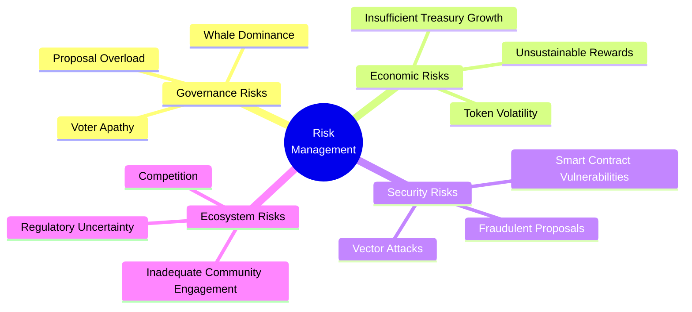
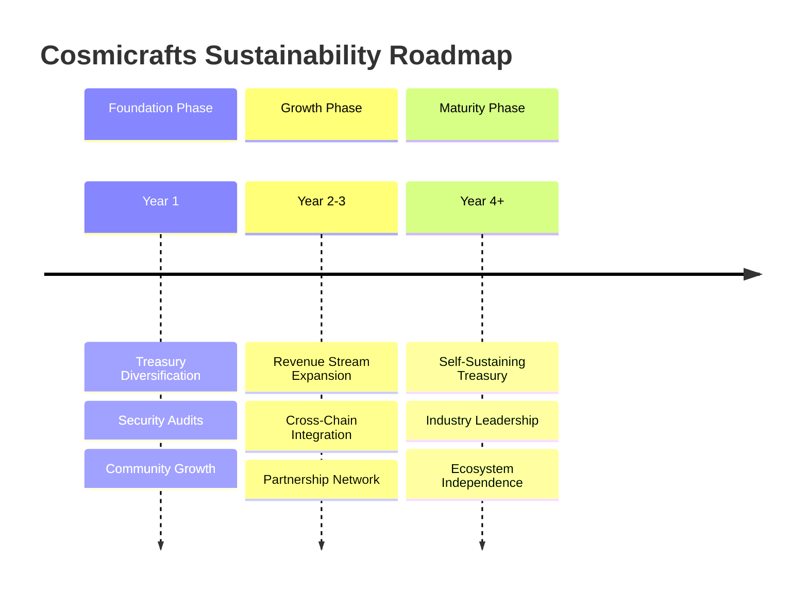
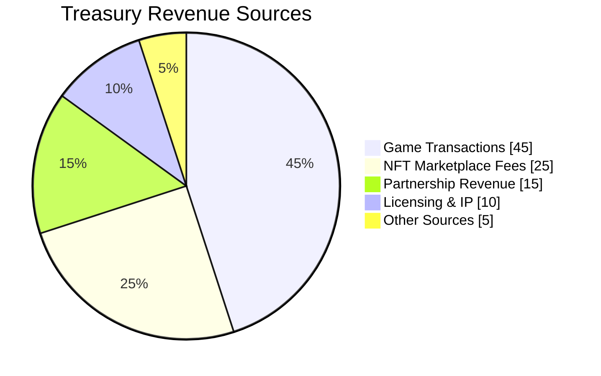
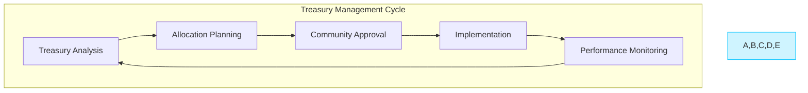
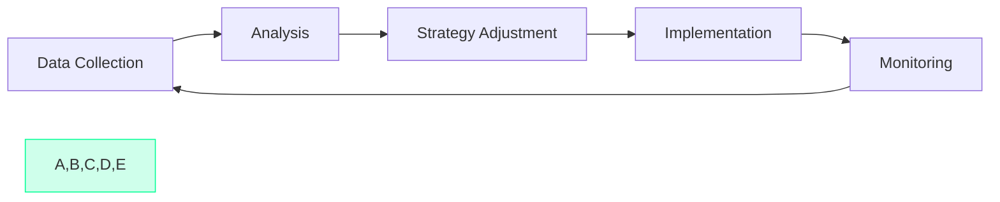

# Sustainability

[[toc:2-2]]

## Risk Management: Securing the Future of Cosmicrafts

Every great journey comes with risks. For the Cosmicrafts DAO, proactively managing those risks is key to ensuring the community's trust and long-term success. By identifying potential challenges early and implementing safeguards, we can build a resilient ecosystem that grows stronger over time.

## Types of Risks

Here are the key risks the DAO faces, categorized for clarity, with examples specific to Cosmicrafts:

### 1. **Governance Risks**

- **Voter Apathy**: Low voter turnout could hinder decision-making and slow down progress.
- **Whale Dominance**: Large stakeholders might exert disproportionate control, reducing fairness.
- **Proposal Overload**: A flood of low-quality proposals could make it hard to focus on the best ideas.

### 2. **Economic Risks**

- **Token Volatility**: Fluctuations in Spiral's value could affect the stability of the ecosystem.
- **Unsustainable Rewards**: Overly generous rewards might deplete the treasury too quickly.
- **Insufficient Treasury Growth**: If the treasury doesn't grow sufficiently, we might not have the resources to fund all the exciting projects we want to pursue.

### 3. **Security Risks**

- **Smart Contract Vulnerabilities**: Exploitable bugs in governance or staking mechanisms could undermine the DAO's stability.
- **Fraudulent Proposals**: Bad actors might exploit the governance process to push harmful agendas.

### 4. **Ecosystem Risks**

- **Inadequate Community Engagement**: Declining participation in governance or staking could weaken the DAO's effectiveness.
- **Competition**: Other projects competing for attention and users in the Web3 gaming space.

---

## Risk Mitigation Strategies

```mermaid
graph TD
    A[Risk Mitigation Strategies] --> B[Governance Safeguards]
    A --> C[Economic Safeguards]
    A --> D[Security Measures]
    A --> E[Ecosystem Support]
    
    B --> B1[Weighted Voting Power]
    B --> B2[Proposal Deposit]
    B --> B3[Community Moderation]
    
    C --> C1[Treasury Diversification]
    C --> C2[Sustainable Reward Structure]
    C --> C3[Regular Financial Audits]
    
    D --> D1[Smart Contract Audits]
    D --> D2[Multi-Signature Security]
    D --> D3[Bug Bounty Program]
    
    E --> E1[Community Incentives]
    E --> E2[Strategic Partnerships]
    E --> E3[Regular Analytics Review]
    
    style A fill:#00c3ff,stroke:#333,stroke-width:2px
    style B,C,D,E fill:#1a2d40,stroke:#333,stroke-width:1px
```

### 1. **Governance Safeguards**

- **Weighted Voting Power**: The neuron mechanics (Staked Spiral, Neuron Age, Dissolve Delay) ensure balanced influence across stakeholders.
- **Proposal Deposit**: A small Spiral deposit is required for submitting proposals, discouraging spam and frivolous ideas.
- **Community Moderation**: Dedicated community moderators will help keep discussions focused and highlight the most promising proposals.

### 2. **Economic Safeguards**

- **Deflationary Design**: A portion of Spiral used for transactions and staking is burned, reducing the circulating supply over time.
- **Treasury Monitoring**: Periodic reports will track treasury health, including inflows, outflows, and spending thresholds.
- **Dynamic Rewards**: Staking rewards are adjusted based on treasury health and Spiral supply-demand dynamics, using a transparent and publicly available formula.

### 3. **Security Measures**

- **Smart Contract Audits**: Regular third-party audits will identify and fix vulnerabilities before they can be exploited.
- **Fraud Detection**: On-chain monitoring will flag suspicious voting patterns or irregular proposals, such as sudden spikes in votes from newly created neurons.

### 4. **Ecosystem Safeguards**

- **Community Engagement Initiatives**: Regular AMAs, Discord events, and gamified participation incentives will keep the community engaged and motivated.
- **Strategic Partnerships**: Collaborations with other Web3 projects will strengthen the Cosmicrafts ecosystem.
- **Decentralization Roadmap**: A gradual decentralization roadmap will transfer more control to the community over time, reducing reliance on the core team.

---

## Long-Term Sustainability Plan

Building a lasting ecosystem requires planning beyond immediate risks. Our long-term sustainability strategy addresses both preventative measures and growth opportunities.

### 1. **Diversified Revenue Streams**

- **In-Game Economy**: A percentage of all in-game purchases flows directly to the treasury.
- **NFT Marketplace**: Transaction fees from the NFT marketplace provide steady revenue.
- **Licensing & Partnerships**: Strategic collaborations with other projects and brands.
- **Development Services**: Offering specialized development services to other projects.

### 2. **Adaptive Treasury Management**

- **Regular Assessment**: Quarterly review of treasury assets and allocation.
- **Strategic Diversification**: Balancing between stable assets, growth opportunities, and operational funds.
- **Community-Driven**: Major treasury decisions require DAO approval.
- **Performance Tracking**: Regular reports on treasury performance and utilization.

### 3. **Continuous Improvement Framework**

- **Data-Driven Decisions**: Using analytics to inform strategy adaptations.
- **Regular Governance Reviews**: Evaluating and improving governance processes.
- **Ecosystem Health Metrics**: Tracking key indicators of ecosystem vitality.
- **Feedback Loops**: Structured mechanisms for incorporating community feedback.

### 4. **Community Resilience Building**

```mermaid
graph TD
    A[Community Resilience] --> B[Education & Training]
    A --> C[Incentive Alignment]
    A --> D[Participation Pathways]
    
    B --> B1[Documentation & Tutorials]
    B --> B2[Governance Workshops]
    
    C --> C1[Staking Rewards]
    C --> C2[Contribution Recognition]
    
    D --> D1[Entry-Level Engagement]
    D --> D2[Leadership Opportunities]
    
    style A fill:#00c3ff,stroke:#333,stroke-width:2px
    style B,C,D fill:#1a2d40,stroke:#333,stroke-width:1px
```

- **Education**: Comprehensive resources to help community members understand the ecosystem.
- **Incentive Alignment**: Ensuring all stakeholders benefit from the long-term success of the DAO.
- **Onboarding**: Clear pathways for new members to get involved and contribute meaningfully.
- **Leadership Development**: Identifying and nurturing community leaders to help guide the DAO.

## Conclusion: Building for the Long Run

The sustainability of Cosmicrafts DAO depends on balancing risk management with growth opportunities. By implementing these strategies, we're creating a foundation for lasting success and positioning the DAO to thrive in the evolving Web3 gaming landscape.

Our commitment is to transparency, adaptability, and community-driven governance. As the ecosystem evolves, so too will our approach to sustainability, always guided by the core principle of creating long-term value for all participants.

---

## Visual Suggestions

1. **Risk Heatmap**:
   - A visual representation categorizing risks by likelihood and severity.
   - Example: High-severity (smart contract vulnerabilities), Medium-severity (whale dominance), Low-severity (proposal overload).

2. **Treasury Health Dashboard**:
   - Real-time metrics showing:
     - Treasury balance in Spiral and USD.
     - Spending rate.
     - Treasury runway (how long the treasury can sustain current spending levels).

3. **Governance Participation Chart**:
   - Historical and real-time trends in voter turnout and proposal submissions.

4. **Decentralization Roadmap Timeline**:
   - A horizontal timeline showing the gradual transfer of decision-making power from the core team to the community.

5. **Dynamic Rewards Flowchart**:
   - A diagram illustrating how rewards are adjusted based on treasury health and staking metrics.

---

## Why This Matters

By tackling risks head-on and planning for the future, the Cosmicrafts DAO ensures that the ecosystem stays strong, secure, and ready to grow. Proactive risk management isn't just about avoiding problems—it's about building a foundation for long-term success and trust.

---

### Feedback Questions

1. Are the types of risks outlined comprehensive, or are there additional risks we should address?
2. Do the proposed safeguards feel adequate for addressing these risks? Are there areas where we need stronger measures?
3. Are there specific visuals or metrics you'd like to see in this section to enhance understanding?
4. Is the balance between technical details and accessibility appropriate for this audience?
