# Tokenomics

```mermaid
graph TD
    subgraph "SPIRAL Token Ecosystem"
    A[SPIRAL Token] --> B[Governance]
    A --> C[Utility]
    A --> D[Rewards]
    A --> E[Treasury]
    end
    
    style A fill:#00c3ff,stroke:#333,stroke-width:2px
    style B fill:#1a2d40,stroke:#333,stroke-width:1px
    style C fill:#1a2d40,stroke:#333,stroke-width:1px
    style D fill:#1a2d40,stroke:#333,stroke-width:1px
    style E fill:#1a2d40,stroke:#333,stroke-width:1px
```

[[toc:2-2]]

## Document Navigation Guide

This document details the economic framework of the Cosmicrafts DAO, focusing on the Spiral token's allocation, utility, and mechanics. It complements the [Governance](/governance) document, which covers decision-making processes.

::: info Reading Guide
- **Primary Focus**: Token economics, distribution, and utility
- **Companion Document**: [Governance](/governance) for decision-making processes
- **Cross-References**: Look for tip boxes linking to relevant governance sections
:::

## Introduction

::: info Spiral Token
The **Spiral Token (SPIRAL)** is the foundation of Cosmicrafts, powering governance, gameplay, and the economic incentives of the franchise. Designed for scalability, sustainability, and engagement, Spiral integrates utility, governance, and rewards while maintaining economic equilibrium through deflationary mechanics.
:::

> This section details the token allocation, utility, and economic model that make Spiral a powerful asset.

---

## Relationship Between Tokenomics & Governance

The Tokenomics and Governance systems of Cosmicrafts DAO work in concert to create a balanced, sustainable ecosystem. Understanding their relationship helps navigate both documents more effectively.

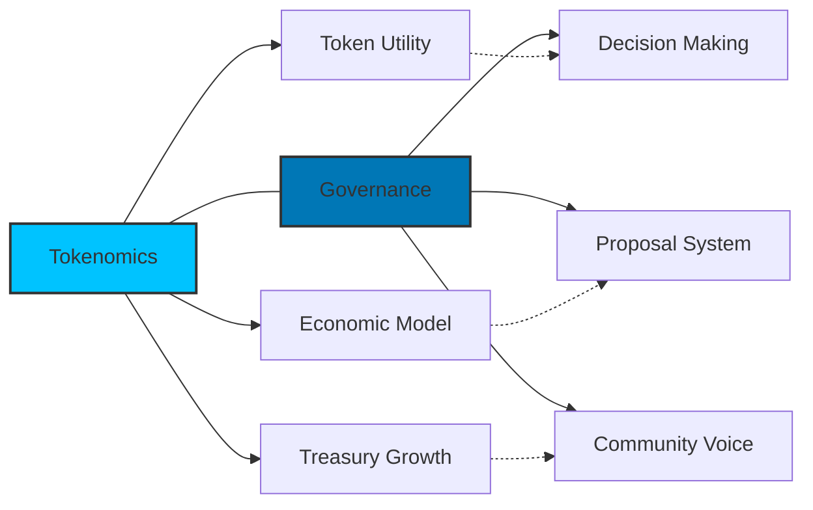

::: tip Document Navigation
This document focuses on **economic mechanics** - how the token functions, its utility, and distribution model. For details on **decision-making processes** including proposal creation, voting, and treasury management governance, see the [Governance](/governance) document.
:::

### Key Interactions

| Tokenomics Aspect | Governance Aspect | Relationship |
|-------------------|-------------------|--------------|
| **Token Staking** | **Voting Power** | Staking tokens creates neurons that grant voting power in governance |
| **Economic Sustainability** | **Treasury Management** | Economic mechanisms fund the treasury that governance processes manage |
| **Token Utility** | **Proposal System** | Token utility includes governance rights managed by the proposal system |
| **Economic Projections** | **DAO Evolution** | Economic growth metrics evolve alongside governance maturity |

Throughout this document, you'll find standardized cross-references (like the box above) that direct you to relevant sections in the Governance document for decision-making details.

---

## Initial Distribution

A total of **1 billion Spiral tokens** will be minted for a fair distribution, sustainable growth, and alignment of incentives among all contributors.

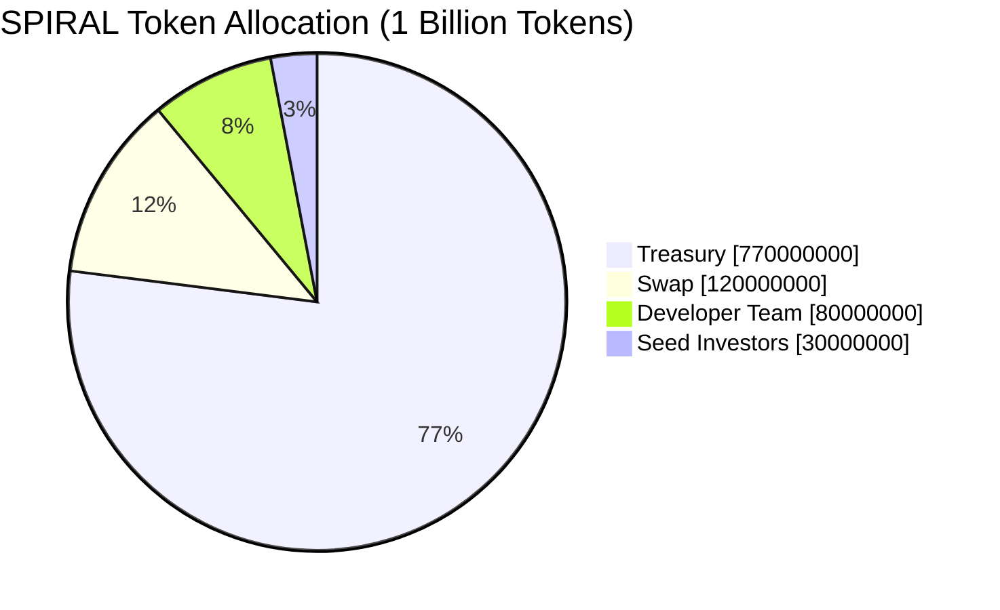

### Allocation Breakdown

| Allocation | Percentage | Amount | Purpose |
|------------|------------|--------|---------|
| **Treasury** | 77% | 770,000,000 SPIRAL | Managed by the DAO for development, marketing, partnerships, staking rewards, and other initiatives |
| **Swap** | 12% | 120,000,000 SPIRAL | Tokens allocated to the decentralization sale to encourage widespread participation and fund DAO operations |
| **Developer Team** | 8% | 80,000,000 SPIRAL | Reserved for the development team with an **8-year vesting schedule** |
| **Seed Investors** | 3% | 30,000,000 SPIRAL | Allocated to early supporters with a **1-year vesting schedule** |

### Vesting Period

To ensure long-term commitment and alignment with project goals, Spiral tokens are subject to structured vesting schedules. Below are the key details:

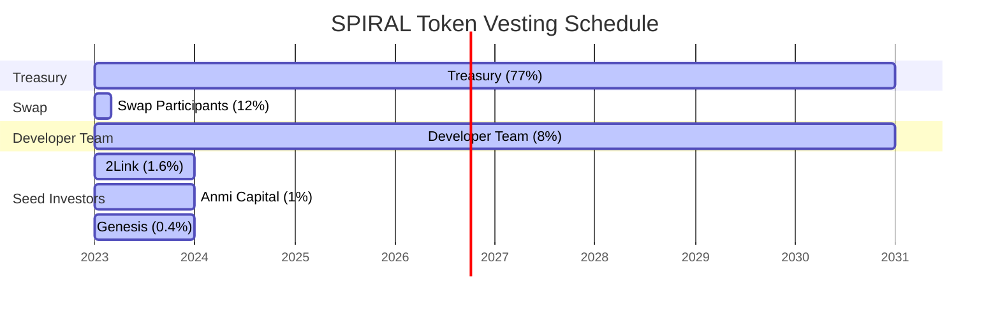

::: info Vesting Schedules
- **Developer Team**: 
  - 80,000,000 SPIRAL tokens (8% of total supply)
  - 8-year dissolve delay and 8-year vesting period
  - This long-term commitment ensures the team remains aligned with the project's success over time

- **Seed Investors**: 
  - 30,000,000 SPIRAL tokens (3% of total supply), divided among:
    - 2Link: 16,000,000 SPIRAL
    - Anmi Capital: 10,000,000 SPIRAL
    - Genesis: 4,000,000 SPIRAL
  - All seed investors have a 1-year dissolve delay and 1-year vesting period

- **SNS Swap Participants**: 
  - 120,000,000 SPIRAL tokens (12% of total supply)
  - Vesting schedule with 2 events at 1-month intervals
:::

> These figures ensure transparency and provide stakeholders with a clear understanding of token distribution.

### Swap Parameters

The decentralization sale (swap) will distribute 120,000,000 SPIRAL tokens based on the following parameters:

```mermaid
graph TB
    A[SNS Swap Parameters] --> B[Participation Requirements]
    A --> C[Funding Limits]
    A --> D[Timeline & Vesting]
    
    B --> B1[Min Participants: 10]
    B --> B2[Min Per Person: 100 ICP]
    B --> B3[Max Per Person: 100,000 ICP]
    
    C --> C1[Min Total: 100 ICP]
    C --> C2[Max Total: 1,000,000 ICP]
    
    D --> D1[Duration: 1 day]
    D --> D2[Vesting: 2 events at 1-month intervals]
    
    style A fill:#00c3ff,stroke:#333,stroke-width:2px
    style B fill:#1a2d40,stroke:#333,stroke-width:1px
    style C fill:#1a2d40,stroke:#333,stroke-width:1px
    style D fill:#1a2d40,stroke:#333,stroke-width:1px
```

| Parameter | Value |
|-----------|-------|
| **Minimum Participants** | 10 |
| **Minimum Per Participant** | 100 ICP |
| **Maximum Per Participant** | 100,000 ICP |
| **Maximum Total** | 1,000,000 ICP |
| **Duration** | 1 day |
| **Vesting** | 2 events with 1-month interval |

### Valuation Range

The Spiral token initial price will depend on the ICP raised during the decentralization sale. With 120,000,000 SPIRAL allocated to the sale:

```mermaid
graph LR
    A[Valuation Scenarios] --> B[Min: 100 ICP]
    A --> C[Mid: 500,000 ICP]
    A --> D[Max: 1,000,000 ICP]
    
    B --> B1[$0.00008 per SPIRAL]
    C --> C1[$0.04 per SPIRAL]
    D --> D1[$0.08 per SPIRAL]
    
    style A fill:#00c3ff,stroke:#333,stroke-width:2px
    style B fill:#1a2d40,stroke:#333,stroke-width:1px
    style C fill:#1a2d40,stroke:#333,stroke-width:1px
    style D fill:#1a2d40,stroke:#333,stroke-width:1px
```

| Scenario | ICP Raised | Price per SPIRAL |
|----------|------------|---------------|
| **Minimum** | 100 ICP | $0.00008 (at $10/ICP) |
| **Mid Range** | 500,000 ICP | $0.04 (at $10/ICP) |
| **Maximum** | 1,000,000 ICP | $0.08 (at $10/ICP) |

---

## Reward Rate Structure

The DAO implements a structured reward rate for neuron holders who participate in governance:

```mermaid
graph TD
    subgraph "Voting Power Bonuses"
        DD[Dissolve Delay]
        AB[Age Bonus]
        DD --> DD1[+100% at 8 years]
        AB --> AB1[+25% at 4 years]
    end
    
    subgraph "Reward Rate Structure"
        IR[Initial Rate: 0%]
        FR[Final Rate: 0%]
        TP[Transition Period: 0 years]
    end
    
    style DD fill:#00c3ff,stroke:#333,stroke-width:1px
    style AB fill:#00c3ff,stroke:#333,stroke-width:1px
    style IR fill:#1a2d40,stroke:#333,stroke-width:1px
    style FR fill:#1a2d40,stroke:#333,stroke-width:1px
    style TP fill:#1a2d40,stroke:#333,stroke-width:1px
```

| Parameter | Value |
|-----------|-------|
| **Initial Rate** | 0% |
| **Final Rate** | 0% |
| **Transition Period** | 0 years |
| **Dissolve Delay Bonus** | Up to 100% (at 8 years) |
| **Age Bonus** | Up to 25% (at 4 years) |
| **Minimum Dissolve Delay** | 1 month |

---

## Liquidity Management

To ensure market stability and safeguard Spiral's token price, the liquidity pool (LP) will be managed responsibly with allocations directly aligned to token unlock schedules and expected trading activity.

```mermaid
flowchart TD
    A[Liquidity Management] --> B[Treasury-Backed Liquidity]
    A --> C[Initial LP Allocation]
    A --> D[Quarterly Reassessments]
    
    B --> B1[Treasury provides both SPIRAL and ICP tokens]
    B --> B2[No burden on investors]
    
    C --> C1[10-25% of total ICP raised]
    C --> C2[Paired with treasury SPIRAL]
    
    D --> D1[Monitoring trading volumes]
    D --> D2[Dynamic LP adjustments]
    
    style A fill:#00c3ff,stroke:#333,stroke-width:2px
    style B fill:#1a2d40,stroke:#333,stroke-width:1px
    style C fill:#1a2d40,stroke:#333,stroke-width:1px
    style D fill:#1a2d40,stroke:#333,stroke-width:1px
```

### Main Objectives

- [x] **Stability**: The LP provides liquidity for buyers and sellers, reducing volatility and ensuring a healthy market.
- [x] **Responsibility**: Treasury-funded LPs ensure no additional burden on investors while stabilizing early trading phases.
- [x] **Growth**: A well-funded LP encourages trading activity and confidence, driving demand for the Spiral token.

### Initial LP Setup

::: warning Responsible Liquidity
A proposal for the initial LP to be funded from the treasury.
:::

| Component | Details |
|-----------|---------|
| **Treasury-Backed Liquidity** | - Both SPIRAL and ICP tokens for the LP are funded by the treasury - No additional burden is placed on investors - Treasury allocates a specific percentage of reserves to support liquidity during the first year |
| **Initial LP Allocation** | - A robust initial allocation comprising **10-25% of the total ICP raised** - Paired with SPIRAL tokens from the treasury - Ensures the LP meets projected market demand during early stages |
| **Quarterly Reassessments** | - Trading volumes and market behavior monitored each quarter - Dynamic adjustments to LP contributions - Flexibility allows treasury to respond to market conditions |

### Matching Unlocks with LP Requirements

The vesting schedule is designed to align with liquidity needs, ensuring that token unlocks are supported by adequate LP funding.

#### 1. Team Allocation

```mermaid
graph TD
    A[Team Allocation<br>8% of Total Supply] --> B[Foundational Support]
    B --> C[Governance Guidance]
    B --> D[Alignment with IC Values]
    
    style A fill:#00c3ff,stroke:#333,stroke-width:2px
    style B fill:#1a2d40,stroke:#333,stroke-width:1px
    style C fill:#1a2d40,stroke:#333,stroke-width:1px
    style D fill:#1a2d40,stroke:#333,stroke-width:1px
```

- **Foundational**: We don't expect the team to sell our tokens, though they have the discretion to do so if needed. Instead, we see this allocation as a way to provide guidance in governance, ensuring Cosmicrafts stays aligned with the foundational values of the Internet Computer.

#### 2. Seed Investors

```mermaid
graph TD
    A[Seed Investors<br>3% of Total Supply] --> B[Long-Term Partners]
    B --> C[Strategic Investment]
    B --> D[Technical/Industry Expertise]
    
    style A fill:#00c3ff,stroke:#333,stroke-width:2px
    style B fill:#1a2d40,stroke:#333,stroke-width:1px
    style C fill:#1a2d40,stroke:#333,stroke-width:1px
    style D fill:#1a2d40,stroke:#333,stroke-width:1px
```

#### 3. SNS Sale Participants

```mermaid
graph TD
    A[Swap Participants<br>12% of Total Supply] --> B[Community Ownership]
    B --> C[Early Adopters]
    B --> D[Governance Participants]
    
    style A fill:#00c3ff,stroke:#333,stroke-width:2px
    style B fill:#1a2d40,stroke:#333,stroke-width:1px
    style C fill:#1a2d40,stroke:#333,stroke-width:1px
    style D fill:#1a2d40,stroke:#333,stroke-width:1px
```

- **Short Vesting**: A short 2-month vesting period with 2 events at 1-month intervals minimizes the impact on market prices.
- **Treasury Support**: During this initial period, the treasury provides enhanced LP support to ensure a stable market introduction and prevent price volatility.

### How Liquidity Aligns with Token Unlocks

::: info Liquidity Strategy
- **Unlock Schedule**: Spiral tokens are released quarterly based on a structured vesting plan.
- **Market Volume Estimate**: On average, 10%~25% of unlocked tokens are expected to trade each quarter.
- **Liquidity Provision**: The LP is funded to match the expected trading volume to stabilize the market.
:::

#### Example: Q1 Liquidity Pairing

| Parameter | Value |
|-----------|-------|
| **Token Price** | $0.01 |
| **Unlocked Tokens** | 25,000,000 SPIRAL |
| **Expected Trading Volume** | 5,000,000 SPIRAL (25% of unlocked tokens) |
| **LP Contribution - SPIRAL** | 5,000,000 SPIRAL from the treasury |
| **LP Contribution - ICP** | 5,000 ICP (to pair with SPIRAL at $0.01) |

---

## Spiral Token Utility

The SPIRAL token is designed with multi-dimensional utility that creates genuine value for holders within the Cosmicrafts ecosystem and beyond.

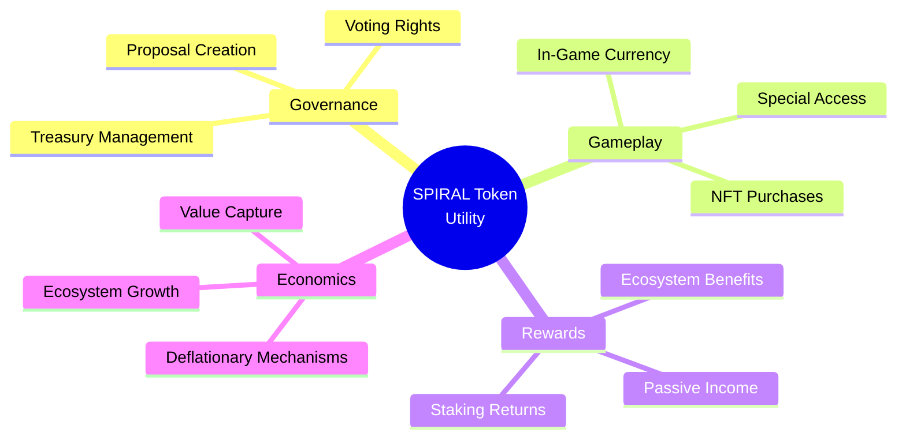

### 1. Governance Utility

SPIRAL tokens unlock participation in the DAO, allowing holders to help shape the future of Cosmicrafts. The governance utility includes:

| Governance Feature | Description | Minimum Requirement |
|-------------------|-------------|---------------------|
| **Voting Rights** | Cast votes on proposals to determine project direction | 1,000 SPIRAL staked |
| **Proposal Creation** | Submit formal proposals for consideration by the DAO | 10,000 SPIRAL staked |
| **Strategic Direction** | Influence roadmap priorities and strategic decisions | Any amount staked |
| **Parameter Adjustment** | Vote on economic parameters and policy changes | Any amount staked |

::: tip See Also: Governance Details
For comprehensive information on proposal creation, voting mechanisms, and decision-making processes, see the [Proposal System](/governance#proposal-lifecycle-community-involvement) section in the Governance document.
:::

### 2. Economic Utility

Beyond governance, SPIRAL serves as the economic backbone of the Cosmicrafts ecosystem:

```mermaid
flowchart TD
    A[Economic Utility] --> B[In-Game Currency]
    A --> C[Value Capture]
    A --> D[Franchise Support]
    
    B --> B1[Purchase Items]
    B --> B2[Access Features]
    
    C --> C1[Fee Distribution]
    C --> C2[Revenue Sharing]
    
    D --> D1[Marketing Funding]
    D --> D2[Development Resources]
    
    style A fill:#00c3ff,stroke:#333,stroke-width:2px
    style B fill:#1a2d40,stroke:#333,stroke-width:1px
    style C fill:#1a2d40,stroke:#333,stroke-width:1px
    style D fill:#1a2d40,stroke:#333,stroke-width:1px
```

| Economic Feature | Description | Benefit to Holders |
|------------------|-------------|-------------------|
| **In-Game Currency** | Primary medium of exchange within Cosmicrafts games | Creates consistent utility and demand for SPIRAL |
| **NFT Marketplace** | Used for purchases, listings, and trade fees | Captures value from the NFT economy |
| **Revenue Sharing** | Portion of revenue flows to stakers or treasury | Direct economic benefit to long-term holders |
| **Franchise Growth** | Funds development and expansion of the franchise | Increases utility and value of the token |

### 3. Staking & Rewards Utility

Staking SPIRAL tokens provides multiple benefits that encourage long-term holding and active participation:

```mermaid
graph TD
    subgraph "Staking Benefits"
        A[SPIRAL Staking] --> B[Governance Rewards]
        A --> C[Voting Power]
        A --> D[Gameplay Benefits]
        
        B --> B1[Reward Rate Based on Participation]
        C --> C1[Proportional to Stake + Age + Dissolve Delay]
        D --> D1[Special Access & Features]
    end
    
    style A fill:#00c3ff,stroke:#333,stroke-width:2px
    style B fill:#1a2d40,stroke:#333,stroke-width:1px
    style C fill:#1a2d40,stroke:#333,stroke-width:1px
    style D fill:#1a2d40,stroke:#333,stroke-width:1px
```

| Staking Feature | Description | Benefit to Holders |
|-----------------|-------------|-------------------|
| **Neuron Creation** | Lock SPIRAL tokens in neurons for voting rights | Enables governance participation and rewards |
| **Dissolve Delay** | Set time-lock period before tokens can be withdrawn | Increases voting power (up to +100% at 8 years) |
| **Age Bonus** | Bonus for neurons held for extended periods | Additional voting power (up to +25% at 4 years) |
| **Early Access** | Special access to new features and content | Exclusive benefits for staked token holders |

::: tip See Also: Governance Rewards
For full details on dissolve delays, maturity, and the reward calculation formula, see the [Neuron-Based Voting Power](/governance#neuron-based-voting-power) section in the Governance document.
:::

### 4. Deflationary Mechanisms

To maintain SPIRAL's value over time, several deflationary mechanisms are implemented:

```mermaid
graph LR
    A[Deflationary<br>Mechanisms] --> B[Transaction Fees]
    A --> C[NFT Marketplace Fees]
    A --> D[Burn Events]
    
    B --> B1[0.01 SPIRAL per transaction]
    C --> C1[Percentage of marketplace activity]
    D --> D1[Special limited-time burn events]
    
    style A fill:#00c3ff,stroke:#333,stroke-width:2px
    style B fill:#1a2d40,stroke:#333,stroke-width:1px
    style C fill:#1a2d40,stroke:#333,stroke-width:1px
    style D fill:#1a2d40,stroke:#333,stroke-width:1px
```

| Mechanism | Description | Impact |
|-----------|-------------|--------|
| **Transaction Fee** | 0.01 SPIRAL fee per transaction | Creates continuous deflationary pressure |
| **NFT Marketplace Fees** | Percentage of all NFT transactions | Captures value from the ecosystem's commerce |
| **Purchase & Burn** | Portion of revenue used to buy and burn SPIRAL | Reduces supply based on ecosystem activity |
| **Special Burn Events** | Time-limited promotional events with token burning | Creates marketing opportunities with economic benefits |

---

## Economic Sustainability

The Cosmicrafts DAO is designed for long-term economic sustainability, with multiple revenue streams, treasury management strategies, and a balanced approach to growth and stability.

```mermaid
graph TD
    A[Economic Sustainability] --> B[Revenue Sources]
    A --> C[Treasury Management]
    A --> D[Growth Mechanisms]
    
    B --> B1[In-Game Purchases]
    B --> B2[NFT Sales]
    B --> B3[Licensing & Partnerships]
    
    C --> C1[Strategic Investments]
    C --> C2[Operational Funding]
    C --> C3[Staking Rewards]
    
    D --> D1[User Acquisition]
    D --> D2[Product Development]
    D --> D3[Ecosystem Expansion]
    
    style A fill:#00c3ff,stroke:#333,stroke-width:2px
    style B fill:#1a2d40,stroke:#333,stroke-width:1px
    style C fill:#1a2d40,stroke:#333,stroke-width:1px
    style D fill:#1a2d40,stroke:#333,stroke-width:1px
```

### Revenue Streams

The DAO generates revenue from multiple sources to ensure stability and growth:

| Revenue Source | Description | Allocation |
|----------------|-------------|------------|
| **Game Transactions** | Fees from in-game purchases and activities | 70% Treasury, 30% Rewards |
| **NFT Marketplace** | Commissions on NFT sales and trades | 65% Treasury, 35% Rewards |
| **Licensing & IP** | Revenue from franchise licensing | 80% Treasury, 20% Rewards |
| **Partnerships** | Strategic partnership revenue | Based on proposal terms |

### Treasury Allocation Strategy

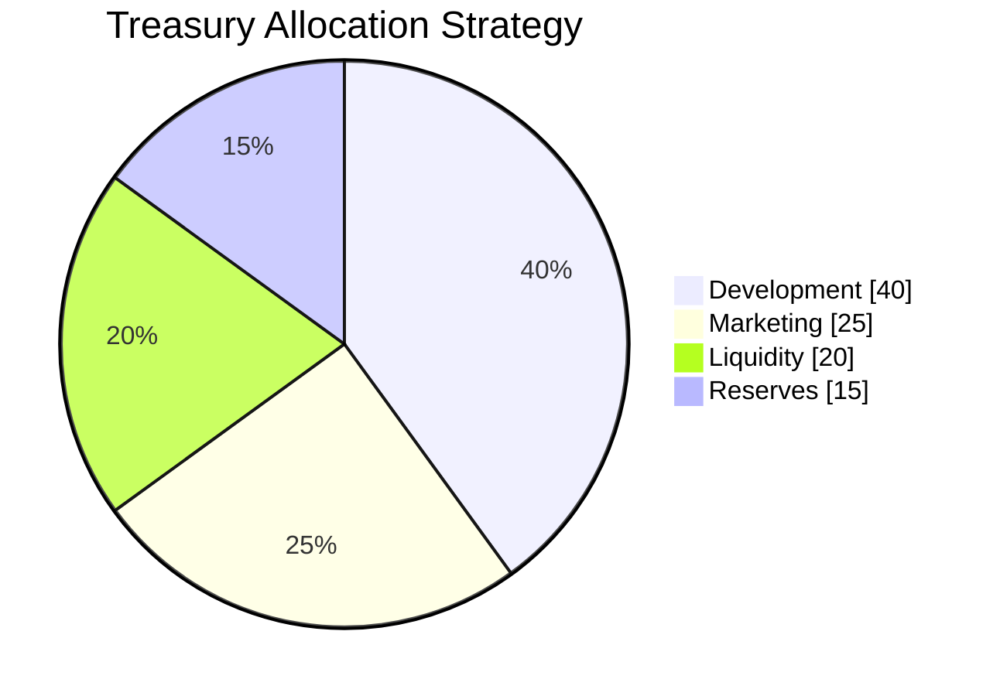

| Category | Percentage | Purpose |
|----------|------------|---------|
| **Development** | 40% | Fund ongoing development of games, features, and infrastructure |
| **Marketing** | 25% | User acquisition, brand building, and community growth |
| **Liquidity** | 20% | Ensure healthy market liquidity and stability |
| **Reserves** | 15% | Strategic opportunities and unforeseen circumstances |

::: tip See Also: Governance Control
All treasury allocations are governed by the DAO. For details on how decisions about treasury funds are made, see the [Treasury Management](/governance#treasury-management) section in the Governance document.
:::

### Economic Projections

The following projections outline expected growth metrics based on different adoption scenarios:

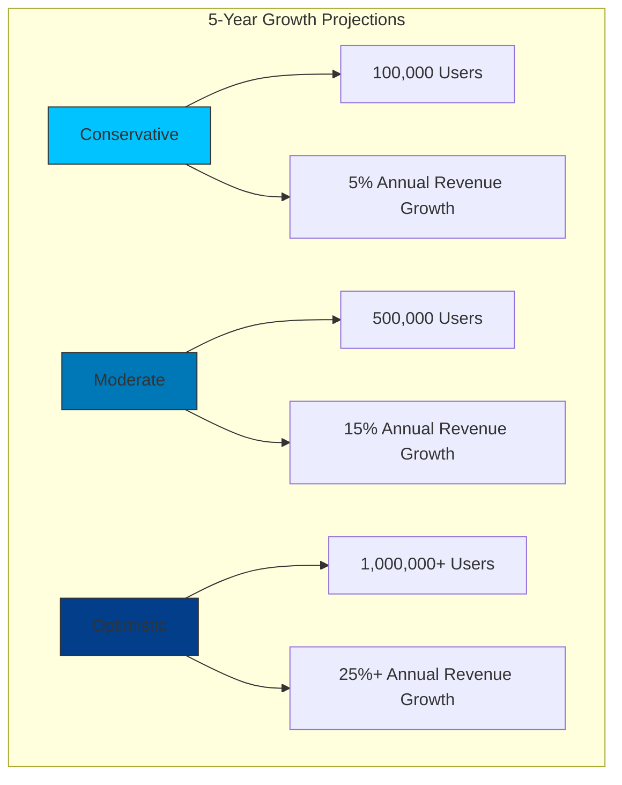

These projections are based on:
- Initial user adoption rates
- Revenue per user metrics
- Market expansion strategies
- Product development timelines

The DAO will regularly review these projections and adjust strategies as needed to ensure long-term sustainability.

---

## Next Steps

Now that you understand the economic framework of Cosmicrafts DAO, here are recommended next steps:

```mermaid
graph LR
    A[You Are Here] -->|Next| B[Governance]
    A -->|Also See| C[Core Features]
    A -->|Also See| D[Architecture]
    
    style A fill:#00c3ff,stroke:#333,stroke-width:2px
    style B fill:#1a2d40,stroke:#333,stroke-width:1px
    style C fill:#1a2d40,stroke:#333,stroke-width:1px
    style D fill:#1a2d40,stroke:#333,stroke-width:1px
```

::: info Continue Reading
- **[Governance Document](/governance)**: Learn about the decision-making framework
- **[Core Features](/core-features)**: Discover the key features of Cosmicrafts
- **[Architecture](/architecture)**: Understand the technical architecture
:::

For questions about tokenomics or to participate in economic discussions, join our [Discord community](https://discord.gg/cosmicrafts) and visit the #tokenomics channel.

---
