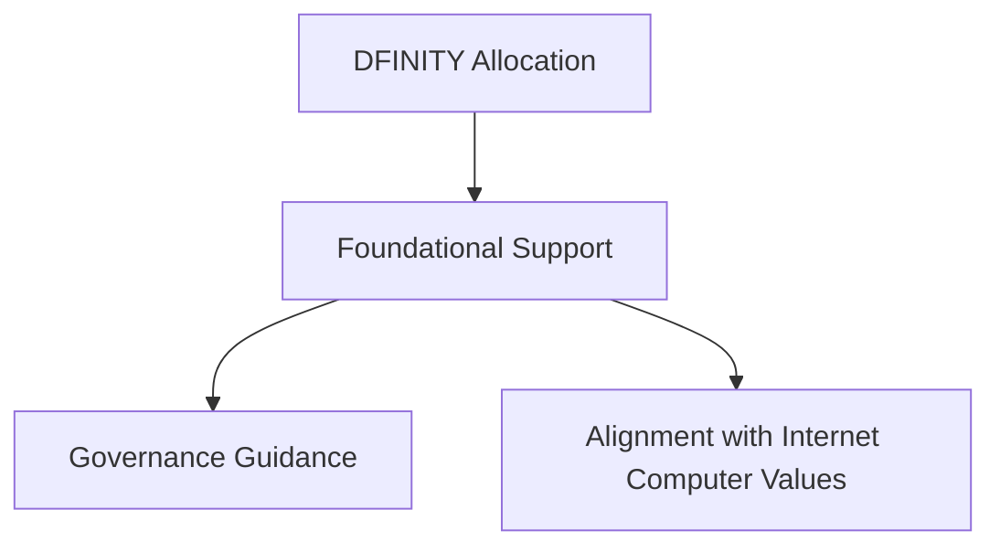
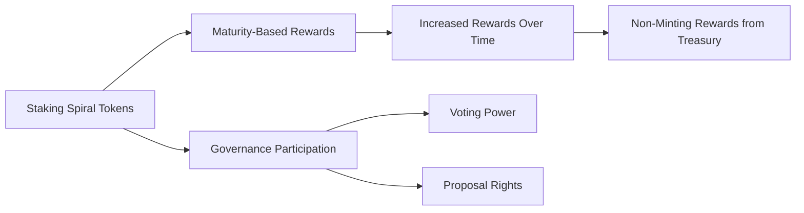

# Tokenomics

[[toc]]

## Introduction

::: info Spiral Token
The **Spiral Token (SPL)** is the foundation of Cosmicrafts, powering governance, gameplay, and the economic incentives of the franchise. Designed for scalability, sustainability, and engagement, Spiral integrates utility, governance, and rewards while maintaining economic equilibrium through deflationary mechanics.
:::

> This section details the token allocation, utility, and economic model that make Spiral a powerful asset.

---

## Initial Distribution

A total of **1 billion Spiral tokens** will be minted for a fair distribution, sustainable growth, and alignment of incentives among all contributors.

### Allocation Breakdown

| Allocation | Percentage | Purpose |
|------------|------------|---------|
| **Community Treasury** | 52% | Managed by the DAO for development, marketing, partnerships, staking rewards, and other initiatives |
| **Decentralization Sale** | 20% | Tokens sold in public sales to encourage widespread participation and fund DAO operations |
| **Team Allocation** | 10% | Reserved for team members with a **10-year vesting schedule** |
| **DFINITY Foundation** | 8% | Allocated to the DFINITY Foundation for their support and partnership |
| **Advisors** | 5% | Reserved for advisors with a **5-year vesting schedule** |
| **Early Supporters** | 5% | Allocated to early supporters with a **3-year vesting schedule** |

### Vesting Period

To ensure long-term commitment and alignment with project goals, Spiral tokens are subject to structured vesting schedules. Below are the key details:

::: info Vesting Schedules
- **DFINITY Allocation**: 
  - Tokens are locked under a **6 month cliff period**, gradually disbursed each year over the course of 8 years. 
  - Each year, 3,125,000 SPL tokens are released for DFINITY, neuron dissolving is at DFINITY's own discretion.

- **Team Allocation**: 
  - 80% Tokens are permanent locked in a 8 year non dissolving neuron. 
  - The remaining 20% of Team tokens have **1 year cliff period**, gradually disbursed each quarter. 
  - Each quarter, 625,000 SPL tokens are released, ensuring measured and responsible distribution.

- **Seed Investors**: 
  - Tokens are quarterly released in increments of **12,500,000 SPL** after an **initial 3 month cliff** period.

- **SNS Sale Participants**: 
  - Tokens allocated during the sale are released in quarters, **without cliff** starting with **25,000,000 SPL** at each disbursement period for 2 years.
:::

> These figures ensure transparency and provide stakeholders with a clear understanding of potential valuations.

### Valuation Range

The Spiral token initial price will depend on the ICP raised during the decentralization sale. With **200,000,000 SPL** allocated to the sale and an figurative price of **$10 USD per ICP**:

| Scenario | ICP Raised | Price per SPL |
|----------|------------|---------------|
| **Minimum** | 40,000 ICP | $0.01 |
| **Mid Range** | 80,000 ICP | $0.02 |
| **Maximum** | 120,000 ICP | $0.03 |

---

## Liquidity Management

To ensure market stability and safeguard Spiral's token price, the liquidity pool (LP) will be managed responsibly with allocations directly aligned to token unlock schedules and expected trading activity.

### Main Objectives

- [x] **Stability**: The LP provides liquidity for buyers and sellers, reducing volatility and ensuring a healthy market.
- [x] **Responsibility**: Treasury-funded LPs ensure no additional burden on investors while stabilizing early trading phases.
- [x] **Growth**: A well-funded LP encourages trading activity and confidence, driving demand for the Spiral token.

### Initial LP Setup

::: warning Responsible Liquidity
A proposal for the initial LP to be funded from the treasury.
:::

| Component | Details |
|-----------|---------|
| **Treasury-Backed Liquidity** | - Both SPL and ICP tokens for the LP are funded by the treasury - No additional burden is placed on investors - Treasury allocates a specific percentage of reserves to support liquidity during the first year |
| **Initial LP Allocation** | - A robust initial allocation comprising **10-25% of the total ICP raised** - Paired with SPL tokens from the treasury - Ensures the LP meets projected market demand during early stages |
| **Quarterly Reassessments** | - Trading volumes and market behavior monitored each quarter - Dynamic adjustments to LP contributions - Flexibility allows treasury to respond to market conditions |

### Matching Unlocks with LP Requirements

The vesting schedule is designed to align with liquidity needs, ensuring that token unlocks are supported by adequate LP funding.

#### 1. DFINITY Allocation

- **Foundational**: We don't expect DFINITY to sell our tokens, though they have the discretion to do so if needed. Instead, we see this allocation as a way to provide guidance in governance, ensuring Cosmicrafts stays aligned with the foundational values of the Internet Computer.

#### 2. Team Allocation

| Component | Details |
|-----------|---------|
| **Locked Neurons** | - **80% of team tokens** permanently locked in non-dissolving neurons - No market impact from this portion - Demonstrates long-term commitment |
| **Quarterly Unlocks** | - Remaining **20% of team tokens** released quarterly after a **1-year cliff** - Rate of **625,000 SPL per quarter** - Measured release matches LP growth |

#### 3. Seed Investors

- [x] **Cliff Period**: A **3-month cliff** provides an initial buffer before token unlocks begin.
- [x] **Quarterly Releases**: Tokens are unlocked in increments of **12,500,000 SPL** per quarter, spreading the impact over time.
- [x] **Treasury Support**: LP contributions from the treasury absorb sales pressure, ensuring market stability during these releases.

#### 4. SNS Sale Participants

- [x] **No Cliff**: Tokens are unlocked immediately, allowing SNS participants access to liquidity.
- [x] **Quarterly Releases**: **25,000,000 SPL** tokens are released each quarter for 2 years.
- [x] **Dynamic Matching**: Treasury LP contributions are adjusted quarterly to match trading volumes, stabilizing the market.

### How Liquidity Aligns with Token Unlocks

::: info Liquidity Strategy
- **Unlock Schedule**: Spiral tokens are released quarterly based on a structured vesting plan.
- **Market Volume Estimate**: On average, 10%~25% of unlocked tokens are expected to trade each quarter.
- **Liquidity Provision**: The LP is funded to match the expected trading volume to stabilize the market.
:::

#### Example: Q1 Liquidity Pairing

| Parameter | Value |
|-----------|-------|
| **Token Price** | $0.01 |
| **Unlocked Tokens** | 25,000,000 SPL |
| **Expected Trading Volume** | 5,000,000 SPL (25% of unlocked tokens) |
| **LP Contribution - SPL** | 5,000,000 SPL from the treasury |
| **LP Contribution - ICP** | 5,000 ICP (to pair with SPL at $0.01) |

---

## Spiral Token Utility

Spiral tokens are designed for multi-faceted utility across governance, gameplay, and DeFi, driving ecosystem growth and user engagement.

### 1. Governance: Empowering Stakeholders

Spiral enables a decentralized governance model, granting stakeholders direct control over Cosmicrafts' future.

| Feature | Description |
|---------|-------------|
| **Proposal Submission** | Stakeholders can propose updates, new game modes, expansions, or partnerships by submitting a small Spiral deposit to deter spam |
| **Voting Power** | Weighted by the amount of Spiral staked, neuron age (how long it's been staked), and dissolve delay (commitment period) |
| **Governance Rewards** | Active participation in voting earns Spiral rewards, incentivizing consistent engagement |

### 2. Gaming Economy: Enhancing Player Experience

::: info In-Game Utility
Spiral integrates seamlessly into the Cosmicrafts franchise, acting as a universal currency for in-game activities.
:::

- [x] **Discounted Purchases**: Players receive a **10% discount** on in-game items, upgrades, and skins when using Spiral.
- [x] **Battle Pass Access**: Unlock seasonal rewards, exclusive content, and limited-time events.
- [x] **Guild Upgrades**: Expand guild capabilities, unlock shared bonuses, and gain competitive advantages.
- [x] **Unified Ecosystem**: Spiral tokens function across all Cosmicrafts games, with consistent utility and interoperability.

### 3. DeFi Integration: Expanding Economic Opportunities

Spiral's integration with DeFi platforms enhances its liquidity and utility:

- **Trading and Liquidity**: Spiral will be listed on decentralized exchanges, enabling trading with ICP and other tokens.
- **Liquidity Rewards**: Stakeholders providing liquidity earn rewards and transaction fees, incentivizing ecosystem growth.
- **Cross-Project Staking**: Partner projects may accept Spiral for staking, creating additional opportunities for rewards.

---

## Tokenomics Mechanics

### 1. Deflationary Design

::: warning Supply Control
To maintain scarcity and drive long-term value, Spiral incorporates **deflationary mechanisms** designed to remove tokens from circulation sustainably. These mechanisms are tailored to the infrastructure of our games and platforms, while leveraging the capabilities of the SNS, NNS, and ICP ecosystem.
:::

#### Specific Burning Mechanisms

| Mechanism | Description | Impact |
|-----------|-------------|--------|
| **Transaction Fee Burns** | - Each Spiral transaction incurs a **fixed fee** (e.g., 0.1 Spiral) that is permanently burned - Reduces the overall supply | Regular usage of Spiral consistently contributes to token scarcity |
| **Microtransaction Burns** | - In-game microtransactions paid in Spiral include a burning mechanism - **10% of the Spiral payment** is burned - Remaining 90% sent to DAO treasury for staking rewards | Directly links token utility to deflation through in-game activities |
| **Marketplace Integration Burns** | - For Spiral-based transactions in third-party marketplaces - **10% of the fee is burned** permanently - Remaining 90% sent to DAO treasury | Ensures consistent burn rate while providing additional staking rewards |
| **Utility-Driven Token Burns** | - Burns incentivized by increasing Spiral's utility - NFT upgrades, exclusive access, premium content | Removes tokens from circulation through increased demand and engagement |
| **Event-Based Burning Campaigns** | - Special events or challenges where users spend Spiral - Seasonal upgrades or community milestones | Creates periodic burn events tied to game activities |

#### Focus on Circulating Supply

- Unlike treasury burns, which affect non-circulating supply, these mechanisms are designed to actively remove tokens **already in circulation**.
- This ensures that Spiral's deflationary design is effective in maintaining scarcity and increasing its value as usage grows.

### 2. Staking and Governance Rewards

- **Maturity-Based Rewards**:
  - Rewards increase with the length of time Spiral tokens are staked, incentivizing long-term commitment.
- **Non-Minting Rewards**:
  - Staking and governance rewards are sourced from the DAO Treasury, avoiding inflationary pressure on the total supply.

### 3. Multi-Game Integration

Spiral operates as the backbone of Cosmicrafts' interconnected gaming ecosystem:

::: info Cross-Game Economy
- **Cross-Game Currency**:
  - Players use Spiral for transactions, upgrades, and premium content across all Cosmicrafts titles.
- **Interoperable Assets**:
  - Spiral enables NFTs and other digital assets to retain utility across multiple games, enhancing their value and versatility.
:::

---

## Advantages of Spiral Tokenomics

### For Stakeholders:

| Advantage | Description |
|-----------|-------------|
| **Earn Rewards** | Stake your tokens to earn passive income and benefit from the DAO's growth |
| **Have a Voice** | Play a key role in shaping the franchise and making strategic decisions through governance |
| **Build Long-Term Value** | Deflationary mechanics and increasing use cases mean your investment grows over time |

### For Players:
- **Enhanced Gameplay**: Access exclusive content, take part in DAO governance, and enjoy premium features with Spiral.
- **Unified Economy**: Free transactions and the same great utility across the entire Internet Computer Ecosystem.

### For Developers:
- **Sustainable Growth**: With a strong treasury, there's always room for growth and new ideas.
- **Collaboration**: Player-focused decisions by the DAO keep the community thriving and adaptable.

---

## Token Utility

Spiral is designed with multiple utilities to create a robust, interconnected ecosystem:

### 1. Governance Power
- **Proposal Creation**: Staked Spiral tokens allow holders to create and vote on proposals.
- **Voting Weight**: Voting power is determined by the amount of staked tokens and the chosen dissolve delay.
- **Decision Making**: Spiral holders shape the future of Cosmicrafts through direct participation in governance.

### 2. In-Game Currency
- **Microtransactions**: Purchase in-game items, cosmetics, and upgrades.
- **Battle Passes**: Access premium content and exclusive rewards.
- **Tournament Entry**: Participate in high-stakes competitive events.

### 3. Staking Rewards
- **Passive Income**: Earn rewards for staking Spiral tokens.
- **Boosted Returns**: Longer staking periods yield higher rewards.
- **Treasury Dividends**: Share in the success of the franchise through treasury distributions.

### 4. NFT Interactions
- **NFT Purchases**: Buy exclusive NFTs with Spiral tokens.
- **NFT Upgrades**: Enhance NFT capabilities and attributes.
- **NFT Staking**: Earn rewards by staking NFTs in the ecosystem.

---

## Staking Mechanics

Staking is a core component of the Spiral token economy, providing benefits to both stakers and the ecosystem as a whole.

### Staking Process

1. **Neuron Creation**: Lock your Spiral tokens in a neuron through the governance interface.
2. **Dissolve Delay**: Choose a dissolve delay (8 days to 8 years) - the longer the delay, the greater your rewards and voting power.
3. **Voting Participation**: Participate in governance by voting on proposals to earn rewards.
4. **Reward Distribution**: Receive staking rewards based on your stake size, dissolve delay, and voting participation.

### Staking Benefits

- **Governance Rewards**: Earn Spiral tokens for participating in governance.
- **Treasury Dividends**: Receive a share of treasury distributions based on your stake.
- **Voting Power**: Gain influence in the DAO proportional to your stake and commitment.
- **Exclusive Access**: Unlock special perks, early access, and unique opportunities.

### Reward Calculation

Staking rewards are calculated based on several factors:

1. **Base Reward Rate**: A foundational reward rate set by the DAO.
2. **Dissolve Delay Multiplier**: Longer dissolve delays earn higher rewards.
   - 8 days: 1x multiplier
   - 6 months: 1.125x multiplier
   - 1 year: 1.25x multiplier
   - 2 years: 1.5x multiplier
   - 4 years: 1.75x multiplier
   - 8 years: 2x multiplier
3. **Voting Participation Bonus**: Active voters receive additional rewards.
4. **Age Bonus**: Neurons accumulate additional voting power over time.

---

## Economic Sustainability

The Spiral token economy is designed for long-term sustainability through several key mechanisms:

### 1. Deflationary Mechanisms
- **Transaction Fees**: A small percentage of each transaction is burned, reducing the total supply over time.
- **NFT Upgrades**: Spiral tokens used for NFT upgrades are partially burned.
- **Premium Features**: Tokens spent on premium features contribute to deflationary pressure.

### 2. Value Capture
- **Revenue Streams**: A portion of all revenue generated by Cosmicrafts flows back to the treasury.
- **Partnership Fees**: Collaborations and partnerships contribute to treasury growth.
- **Licensing Revenue**: Licensing the Cosmicrafts IP generates additional revenue for the treasury.

### 3. Balanced Tokenomics
- **Controlled Inflation**: Staking rewards are balanced against deflationary mechanisms.
- **Adaptive Parameters**: Economic parameters can be adjusted through governance to maintain balance.
- **Treasury Management**: Strategic treasury management ensures long-term sustainability.

---

## Token Circulation Model

The Spiral token circulation model is designed to create a healthy, balanced economy:

### 1. Token Sources (Inflows)
- **Staking Rewards**: New tokens distributed to stakers.
- **Treasury Distributions**: Tokens released from the treasury for various initiatives.
- **Unstaking**: Tokens released back into circulation when unstaked.

### 2. Token Sinks (Outflows)
- **Staking**: Tokens locked in neurons for governance and rewards.
- **Transaction Fees**: Tokens burned through transaction fees.
- **NFT Interactions**: Tokens used for NFT purchases, upgrades, and staking.
- **In-Game Purchases**: Tokens spent on in-game items and features.

### 3. Velocity Control
- **Staking Incentives**: Attractive staking rewards encourage long-term holding.
- **Dissolve Delay**: Longer dissolve delays reduce token velocity.
- **Utility Expansion**: Continuous expansion of token utility creates sustained demand.

---

## Economic Projections

Based on our economic model and projections, we anticipate the following outcomes:

### 1. Short-Term (Year 1)
- **Staking Rate**: 30-40% of circulating supply staked.
- **Transaction Volume**: Moderate, primarily driven by early adopters.
- **Treasury Growth**: Initial growth from token sales and early revenue.

### 2. Medium-Term (Years 2-3)
- **Staking Rate**: 40-60% of circulating supply staked.
- **Transaction Volume**: Significant increase as user base grows.
- **Treasury Growth**: Accelerated growth from multiple revenue streams.

### 3. Long-Term (Years 4+)
- **Staking Rate**: 60-70% of circulating supply staked.
- **Transaction Volume**: High, driven by a mature ecosystem.
- **Treasury Growth**: Substantial, supporting extensive development and community initiatives.

---

## Conclusion

The Spiral token economy is designed to create a virtuous cycle of value creation, capture, and distribution. By aligning the incentives of all stakeholders—players, developers, investors, and community members—we've created a sustainable economic model that rewards participation, encourages long-term commitment, and drives the growth of the Cosmicrafts franchise.

Through careful design, balanced mechanisms, and community governance, the Spiral token will serve as the foundation for a thriving ecosystem that benefits all participants while ensuring the long-term success of Cosmicrafts.

---
