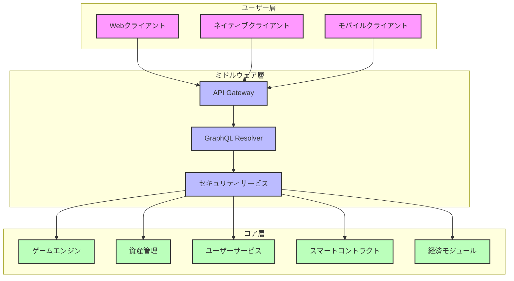
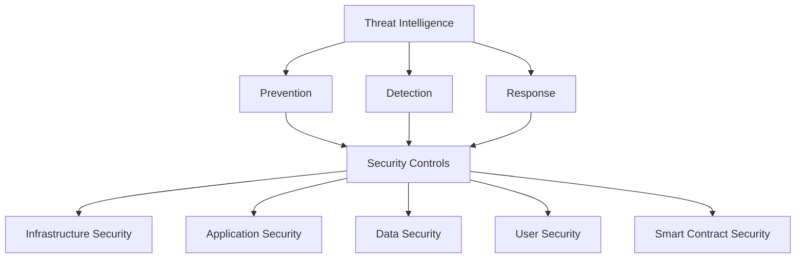

```mermaid
graph TD
    %% Core User Layer
    User(("🧑 User"))
    
    %% Frontend Layer
    subgraph "Frontend Layer"
        UI["🖥️ User Interface"]
        Client["📱 Game Client"]
    end
    
    %% Communication Layer
    subgraph " "
        WS["📡 WebSocket Gateway"]
        API["🔌 API Interface"]
    end
    
    %% Blockchain Layer
    subgraph "Blockchain Layer"
        Canister["⚡ Game Canister"]
        DAO["SNS Governance"]
    end
    
    %% Connections
    User --> UI
    User --> Client
    UI --> WS
    UI --> API
    Client --> WS
    Client --> API
    WS --> Canister
    API --> Canister
    Canister -.->|"Reports to"| DAO
    DAO -->|"Controls"| Canister
    
    %% Styles
    classDef user fill:#1a2d40,stroke:#fff,stroke-width:2px
    classDef frontend fill:#0FB9FD20,stroke:#0FB9FD,stroke-width:2px
    classDef comms fill:#FFB80020,stroke:#FFB800,stroke-width:2px
    classDef blockchain fill:#00E5A420,stroke:#00E5A4,stroke-width:2px
    
    %% Apply styles
    class User user
    class UI,Client frontend
    class WS,API comms
    class Canister,DAO blockchain
```

# アーキテクチャ

## 概要

Cosmicraftsは、Internet Computer Protocol（ICP）のスケーラビリティとセキュリティを活用しながら、必要に応じて他のブロックチェーンと統合するハイブリッドアーキテクチャを採用しています。このアプローチにより、ハイパフォーマンス、低レイテンシー、および低トランザクションコストが確保されます。

::: info サマリー
このセクションでは、Cosmicraftsプラットフォームのコア技術コンポーネント、それらの相互作用方法、およびシステム全体のアーキテクチャを形成する技術的意思決定について概説します。
:::

## 技術的堅牢性

| コンポーネント | 主な技術 | 利点 |
|-------------|-----------|---------|
| **バックエンド** | Rust, Motoko | 高性能、型安全、堅牢性 |
| **スマートコントラクト** | ICP Canisters | スケーラブルな処理、オンチェーン検証 |
| **クライアント** | Unity, WASM | クロスプラットフォーム、高パフォーマンス |
| **ストレージ** | オンチェーン、IPFS | 永続性、分散化、耐検閲性 |
| **API層** | GraphQL, REST | 柔軟なデータアクセス、効率的なクエリ |
| **インフラストラクチャ** | ICP、分散型ノード | 高可用性、耐障害性 |

## ハイブリッドデザイン

Cosmicraftsのアーキテクチャは3つの主要なコンポーネントで構成されています：

### 1. コア層

プラットフォームの中心的な機能を提供します：

- **スマートコントラクト** - ICP canistersで実装され、所有権、取引、ゲームの状態を管理
- **ゲームエンジン** - ゲームプレイのメカニクス、物理、およびインタラクションを処理
- **経済モジュール** - トークン供給、資産価値、およびインフレコントロールを管理
- **ユーザーサービス** - アカウント、認証、およびプロファイル管理を扱う
- **資産管理** - NFTの作成、交換、および進化を可能にする

### 2. ミドルウェア層

クライアントとコア機能を接続します：

- **API Gateway** - すべての受信リクエストを制御し適切なサービスにルーティング
- **GraphQL Resolver** - 効率的なデータアクセスとマニピュレーションを可能にする
- **セキュリティサービス** - リクエストの認証と承認を確保

### 3. ユーザー層

クライアントサイドのインターフェースを提供します：

- **Webクライアント** - ブラウザベースのアクセス用のWASMパワードインターフェース
- **ネイティブクライアント** - デスクトップ用の完全な機能を持つアプリケーション
- **モバイルクライアント** - iOSとAndroid向けに最適化されたアプリケーション

## ブロックチェーン統合

Cosmicraftsのブロックチェーン戦略は、以下のように機能領域に分かれています：

| 領域 | プライマリブロックチェーン | セカンダリオプション | 理由 |
|------|------------------------|-------------------|------|
| **コアロジック** | ICP | なし | スケーラビリティ、低コスト、リバースガス |
| **クロスチェーンアセット** | ICP | Ethereum, Solana | 広範なNFTエコシステムとの互換性 |
| **ガバナンス** | ICP (SNS) | DAOツール | 実証済みのDAOフレームワーク |
| **資金管理** | MultiSig on ICP | Hardware Wallet | セキュリティと透明性 |

::: info クロスチェーン戦略
私たちの長期的なビジョンには、さらなるブロックチェーン統合が含まれ、ICPをハブとしたクロスチェーンの相互運用性を実現します。これにより、より広範なブロックチェーンエコシステムへのアクセスが可能になります。
:::

## データアーキテクチャ

Cosmicraftsのデータ管理アプローチは、データタイプに基づいて階層化されています：

### データストレージ階層

1. **オンチェーンデータ**
   - 所有権レコード
   - 取引履歴
   - ガバナンス投票
   - 重要なゲーム状態

2. **分散型オフチェーン**
   - アセットメタデータ
   - ゲームアセット
   - ユーザー生成コンテンツ

3. **エッジキャッシュ**
   - 一時的な状態
   - リアルタイムのゲーム情報
   - パフォーマンス最適化データ

## セキュリティアーキテクチャ

複数の層によるセキュリティアプローチ：

| セキュリティ層 | 手法 | 目的 |
|------------|------|------|
| **インフラストラクチャ** | DDoS保護、分散型ホスティング | プラットフォームの可用性を保護 |
| **ネットワーク** | 暗号化、証明書ピニング | データ転送を保護 |
| **アプリケーション** | コード監査、依存関係スキャン | コードレベルの脆弱性を排除 |
| **認証** | Internet Identity、2FA | ユーザーアカウントの保護 |
| **データ** | 暗号化、アクセス制御 | センシティブ情報の保護 |
| **スマートコントラクト** | 形式検証、監査 | オンチェーンコントラクトの保護 |

### 統合セキュリティモデル

### トラストレスメカニズム

1. **検証可能なランダム性** - ゲームのランダム性を確保
2. **オンチェーン検証** - 重要なゲームイベントの検証と確認
3. **オープンソースコンポーネント** - 透明性とコミュニティ監査を可能に
4. **プルーフシステム** - ゲーム内のアクションの証明と検証

## スケーラビリティパス

Cosmicraftsは、フランチャイズの拡大に伴って発展する設計されたスケーラビリティパスを持っています：

1. **水平スケーリング** - パラレルcanistersとシャーディングを通じて
2. **最適化されたレイヤリング** - 様々なデータとプロセスの種類のための適切な環境
3. **段階的な統合** - 需要に基づいた新しいブロックチェーンの実装
4. **モジュラーアーキテクチャ** - 独立した機能強化を可能にする

::: info スケーリングの目標
アーキテクチャは最終的に数百万の同時ユーザーをサポートし、数十億のNFTとゲームアセットを維持することを目標としています。私たちのICPベースのアプローチは、過度のインフラストラクチャコストなしにこのスケールを実現するのに適しています。
:::

## テクニカルロードマップ

| フェーズ | 技術的焦点 | マイルストーン |
|--------|------------|-------------|
| **プロトタイプ** | コア機能、プルーフオブコンセプト | 基本ゲームプレイループ、基本的な資産管理 |
| **アルファ** | エンドツーエンドのワークフロー、早期テスト | 完全な資産ライフサイクル、限定されたゲームプレイ |
| **ベータ** | スケーリング、安定性、セキュリティ | ストレステスト、ユーザビリティ最適化 |
| **ローンチ** | 性能最適化、プラットフォームの統合 | 完全な機能セット、エコシステム接続 |
| **拡張** | 新しいゲームモード、クロスチェーン機能 | 拡張モジュール、プレイヤー作成コンテンツ |

## 性能の最適化

ユーザーエクスペリエンスを向上させるためのキー性能の最適化：

1. **レイテンシー削減**
   - エッジノードの戦略的配置
   - 効率的なデータ構造
   - クライアントサイドの予測

2. **スループット向上**
   - バッチ処理とキューイング
   - 非同期処理
   - オフチェーンコンピューティング

3. **リソース最適化**
   - 動的資産ロード
   - レベルオブディテール（LOD）
   - キャッシング戦略

## 開発者インフラストラクチャ

開発者のためのプラットフォームサポート：

| コンポーネント | 目的 | ツール |
|------------|------|------|
| **SDK** | 拡張と統合 | API、ライブラリ、テンプレート |
| **ドキュメント** | プラットフォーム知識の提供 | ガイド、リファレンス、チュートリアル |
| **テスト環境** | 検証とベンチマーク | サンドボックス、シミュレーション、ストレステスト |
| **モジュールマーケットプレイス** | 再利用可能なコンポーネント | ゲームロジック、インターフェース、ユーティリティ |

## 災害復旧と事業継続性

システムの持続可能性を確保するための対策：

1. **バックアップと冗長性**
   - 複数のデータバックアップ層
   - 地理的に分散したノード
   - フェイルセーフメカニズム

2. **災害復旧プロトコル**
   - 定義されたエスカレーションマトリックス
   - 自動および手動のリカバリープロシージャ
   - バックアップシステムへのシームレスなフェイルオーバー

3. **事業継続性計画**
   - 重要なシステムコンポーネントの優先順位付け
   - 段階的なリカバリープロセス
   - 定期的なDRの演習とテスト

## 技術的監視とアラート

システムの健全性と性能を継続的に監視：

| 監視タイプ | メトリクス | 対応 |
|-----------|----------|-------|
| **技術的パフォーマンス** | レイテンシー、スループット、エラー率 | スケーリング、最適化 |
| **ユーザーエクスペリエンス** | ロード時間、FPS、クラッシュ率 | UX改善、バグ修正 |
| **経済的健全性** | 取引量、インフレーション率、流動性 | パラメータ調整、介入 |
| **セキュリティ監視** | 異常検知、侵入試行、脆弱性スキャン | 防御強化、パッチ適用 |

## プロトコルのガバナンス

技術スタックのガバナンスアプローチ：

1. **技術的意思決定**
   - エンジニアリングカウンシル
   - オープンRFCプロセス
   - コミュニティ提案

2. **アップグレードパス**
   - 後方互換性ガイドライン
   - バージョニング戦略
   - 移行サポート

3. **緊急対応**
   - バグバウンティプログラム
   -緊急パッチの手順
   - 安全なアップグレードパス

::: info ガバナンスの融合
Cosmicraftsはコミュニティガバナンスと技術的方向性を融合させ、合意に基づいた意思決定と、重要なインフラストラクチャに対する専門家のオーバーサイトの両方を確保します。詳細な情報については、[ガバナンス](/governance)セクションを参照してください。
:::

## 将来のイノベーション

研究開発パイプラインにある技術的イノベーション：

1. **AIとML統合**
   - NPCの強化行動
   - プレイヤー体験のパーソナライズ
   - チート検知の向上

2. **VRとAR展開**
   - 没入型ゲームプレイ環境
   - 拡張現実のオーバーレイ
   - クロスリアリティアセット

3. **共作オーサリングツール**
   - プレイヤー作成コンテンツを容易にする
   - コミュニティ開発のゲームモード
   - NFTとアイテムのDIYツール

4. **量子抵抗アーキテクチャ**
   - 将来の暗号学的脅威に対する証明
   - データセキュリティの長期的な保証
   - 量子安全なランダム性

