# アーキテクチャ

[[toc:2-2]]

## 概要

Cosmicraftsは、ブロックチェーンとWebSocketを組み合わせたハイブリッドアーキテクチャを採用し、以下を実現します：

- **セキュアな資産所有権**: ブロックチェーン上での検証可能な所有権
- **高速なゲームプレイ**: 低レイテンシーのリアルタイム通信
- **透明なガバナンス**: オンチェーンでの意思決定と実行
- **スケーラブルなインフラ**: 成長に応じた拡張性

## コア技術設計

### Motoko言語

Cosmicraftsは、Internet Computer上で動作する単一キャニスターとして実装され、以下の特徴を持ちます：

- **高度なメモリ管理**
  - 効率的なガベージコレクション
  - 最適化されたヒープ使用
  - スマートなリソース割り当て

- **効率的な状態表現**
  - カスタム型システム
  - 圧縮データ構造
  - インデックス最適化

- **最適化された非同期操作**
  - 並行処理の制御
  - メッセージキューイング
  - エラー処理メカニズム

## 統一キャニスターアーキテクチャ

### 従来のマルチキャニスター vs 単一キャニスター

| 側面 | マルチキャニスター | Cosmicrafts単一キャニスター |
|------|-------------------|---------------------------|
| レイテンシー | キャニスター間通信による遅延 | 直接アクセスで最小化 |
| 複雑性 | 高（多数の依存関係） | 低（統合されたシステム） |
| 計算オーバーヘッド | 大（状態同期が必要） | 小（共有メモリ空間） |
| スケーラビリティ | 水平（但し複雑） | 垂直（シンプル） |
| メンテナンス | 困難（多数のアップグレード） | 容易（単一アップグレード） |

### パフォーマンス利点

1. **レイテンシーの最小化**
   - キャニスター間通信の排除
   - 直接メモリアクセス
   - 最適化された状態管理

2. **リソース効率**
   - 共有メモリ空間
   - 効率的なキャッシング
   - 最小化された複製

3. **簡素化された更新**
   - 単一のアップグレードプロセス
   - 一貫した状態管理
   - 低いダウンタイム

## リアルタイム通信レイヤー

### IC WebSocketゲートウェイ

安全な双方向通信を実現する主要コンポーネント：

- **メッセージ署名**
  - キャニスター署名の検証
  - 改ざん防止
  - リプレイ攻撃対策

- **SSL/TLS暗号化**
  - エンドツーエンドの暗号化
  - 証明書管理
  - プロトコルネゴシエーション

### 通信フロー

1. **接続確立**
   - WebSocket接続の初期化
   - 認証ハンドシェイク
   - セッション確立

2. **メッセージ処理**
   - バイナリプロトコル
   - 圧縮アルゴリズム
   - エラー処理

3. **状態同期**
   - 差分更新
   - コンフリクト解決
   - 再接続ロジック

## リソース管理

### ガスフリー環境

Internet Computerの特徴を活かし、以下を実現：

- **ユーザー体験**
  - ガス手数料なし
  - 即時取引
  - シームレスな操作

- **開発の簡素化**
  - 予測可能なコスト
  - 簡素化された実装
  - 効率的なリソース使用

### 運用モニタリング

| メトリクス | 監視項目 | アラート閾値 |
|------------|----------|--------------|
| CPU使用率 | 処理負荷 | 80% |
| メモリ使用量 | ヒープ状態 | 90% |
| ネットワーク | 帯域幅使用 | 75% |
| レイテンシー | 応答時間 | 100ms |

## 依存関係と外部サービス

### 現在のゲームエンジン依存関係

- Unity 2022.3 LTS
- WebGL 2.0
- カスタムレンダリングパイプライン

### フロントエンド依存関係

- React 18
- TypeScript 5
- Tailwind CSS
- Vite

### バックエンド依存関係

- Motoko 0.9
- IC CDK
- カスタムWebSocketゲートウェイ

### インフラストラクチャサービス

- Internet Computer
- CloudFlare
- AWS (バックアップ)
- GitHub

## セキュリティレビュー状態

現在の焦点：

1. **ユーザーベースの構築**
   - コミュニティ成長
   - 機能の検証
   - フィードバックの収集

2. **キャニスター機能の改善**
   - パフォーマンス最適化
   - スケーラビリティテスト
   - セキュリティ強化

将来の計画：

- 包括的なセキュリティ監査
- ペネトレーションテスト
- 形式的検証
- コミュニティバグバウンティ

```mermaid
graph TD
    %% Core User Layer
    User(("🧑 User"))
    
    %% Frontend Layer
    subgraph "Frontend Layer"
        UI["🖥️ User Interface"]
        Client["📱 Game Client"]
    end
    
    %% Communication Layer
    subgraph " "
        WS["📡 WebSocket Gateway"]
        API["🔌 API Interface"]
    end
    
    %% Blockchain Layer
    subgraph "Blockchain Layer"
        Canister["⚡ Game Canister"]
        DAO["SNS Governance"]
    end
    
    %% Connections
    User --> UI
    User --> Client
    UI --> WS
    UI --> API
    Client --> WS
    Client --> API
    WS --> Canister
    API --> Canister
    Canister -.->|"Reports to"| DAO
    DAO -->|"Controls"| Canister
    
    %% Styles
    classDef user fill:#1a2d40,stroke:#fff,stroke-width:2px
    classDef frontend fill:#0FB9FD20,stroke:#0FB9FD,stroke-width:2px
    classDef comms fill:#FFB80020,stroke:#FFB800,stroke-width:2px
    classDef blockchain fill:#00E5A420,stroke:#00E5A4,stroke-width:2px
    
    %% Apply styles
    class User user
    class UI,Client frontend
    class WS,API comms
    class Canister,DAO blockchain
```

