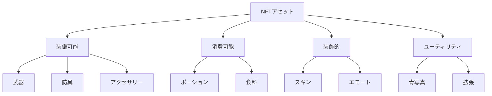
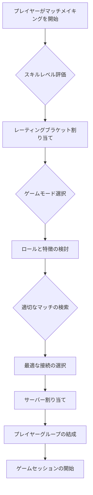

# コア機能

## はじめに

Cosmicrafts DAOプラットフォームは、カスタマイズ可能なプレイヤー、NFTアセット、動的エコノミー、およびマッチメイキングの4つの主要サブシステムで構成されています。このドキュメントでは、これらのシステム間の相互作用と各システムの重要な機能について詳しく説明します。

::: info 技術仕様
このセクションでは、ゲームプレイと機能の概要を提供します。各システムの具体的な実装と技術的詳細については、システム設計ドキュメントを参照してください。
:::

## プレイヤーシステム

プレイヤーシステムはCosmicraftsの基盤であり、ユーザーがキャラクターを作成、カスタマイズ、成長させることができます。

### プレイヤープロファイル

各プレイヤーは次の属性を持つプロファイルと関連付けられています：

| 属性 | 説明 | アップグレード可能性 |
|---------|-------------|--------------|
| **ID** | ユニークな識別子 | 不可 |
| **エネルギー** | アクションを実行する能力 | 可能 |
| **レベル** | 総合的な進捗 | 経験値による |
| **スキル** | 特定の能力のコレクション | 訓練とアイテムによる |
| **インベントリ** | 所有アイテムとNFT | 容量アップグレード可能 |
| **ウォレット** | ゲーム内通貨と資産 | トランザクションによる変動 |
| **統計** | パフォーマンス指標 | 自動的に更新 |

### プレイヤー進行

プレイヤーの進行は複数の軸に沿って測定されます：

1. **キャラクターレベル** - 全体的な進行を示す
2. **スキル熟練度** - 特定の活動における専門性
3. **資産収集** - ユニークなアイテムと資源の獲得
4. **評判** - コミュニティ内での立場

### カスタマイズオプション

プレイヤーは以下を通じてキャラクターをカスタマイズできます：

- **外観** - 視覚的特徴と装飾
- **スキル配分** - 特定の能力への投資
- **装備選択** - 装着されたアイテムとそれらの組み合わせ
- **専門性** - 特定のプレイスタイルへの焦点

## アセットシステム

アセットシステムは、ゲーム内のすべての収集可能、取引可能、または使用可能なアイテムを管理します。このシステムはNFTとトークン化された資産の両方をサポートしています。

### NFTカテゴリ

### NFT属性

各NFTは以下の特性を持っています：

| 属性 | 説明 | 例 |
|---------|-------------|-------|
| **希少度** | アイテムの入手難易度 | 一般、レア、エピック、伝説 |
| **耐久性** | 使用可能回数 | 100/100 |
| **レベル要件** | 使用に必要な最小レベル | レベル30+ |
| **統計ボーナス** | 提供される強化 | +5 強さ、+10 防御 |
| **特殊能力** | ユニークな効果 | 範囲ダメージ、回復加速 |
| **取引制限** | 取引または転送の制限 | 譲渡不可、アカウント紐付け |

### クラフティング

Cosmicraftsには広範なクラフティングシステムがあり、プレイヤーは以下の操作が可能です：

1. **素材収集** - 環境からの資源採取
2. **アイテム作成** - 素材の組み合わせによる新アイテム作成
3. **アイテム強化** - 既存アイテムの改良
4. **解体** - アイテムを構成素材に分解

## エコノミーシステム

エコノミーシステムは、ゲーム内のすべての価値交換と資源循環を管理します。

### 通貨タイプ

| 通貨 | 用途 | 入手方法 | スケール |
|---------|--------|------------|--------|
| **SPIRAL** | ガバナンス、プレミアム購入 | トレーディング、ステーキング | マクロ経済 |
| **クレジット** | 日常取引、基本アイテム | プレイによる稼得、課題 | メイン経済 |
| **名声** | 評判ベースの取引 | コミュニティ貢献 | メタゲーム |
| **素材** | クラフティング、アップグレード | 資源採取、怪物討伐 | マイクロ経済 |

### 市場メカニズム

1. **プレイヤー間取引** - 直接のアイテムと通貨交換
2. **オークションハウス** - 競争入札システム
3. **NPC商人** - 固定価格での取引
4. **リソースシンク** - 通貨の流通量を調整するメカニズム

### インフレーションコントロール

- **ダイナミックドロップレート** - 市場の飽和度に応じて調整
- **時間ベースの制限** - リソース生成の上限
- **分解インセンティブ** - 余剰アイテムの除去奨励
- **プレミアムシンク** - 非必須アイテムのための通貨消費

## マッチメイキングシステム

マッチメイキングシステムは、プレイヤーを競争的または協力的なゲームプレイのために接続します。

### マッチメイキングアルゴリズム

### ゲームモード

| モード | プレイヤー数 | 目的 | 報酬構造 |
|-------|------------|---------|--------------|
| **デュエル** | 1v1 | 競争的なプレイヤー対プレイヤー | ランキングポイント、一意のアイテム |
| **チーム戦** | 3v3, 5v5 | 協調的な戦略性の戦い | チーム報酬、提携ボーナス |
| **バトルロイヤル** | 50-100 | ラストマンスタンディング | 生存ベース、キルカウント |
| **レイド** | 10-25 | PvEチャレンジ | ボス限定ドロップ、シェア報酬 |
| **エクスプローラー** | 無制限 | オープンワールド探索 | 発見報酬、採集アイテム |

### スキルベースのマッチング

プレイヤーは以下の要素に基づいてマッチングされます：

1. **ELOスタイルのレーティング** - 勝利と敗北の履歴に基づく
2. **パフォーマンス指標** - ゲーム内能力を測定
3. **プレイスタイル互換性** - 補完的なロールを促進
4. **接続品質** - 最適なゲームプレイのための技術的要因

## NFTエボリューション

Cosmicrafts内のNFTは静的な収集品ではなく、さまざまな方法で成長可変する動的な資産です。

### 進化メカニズム

| メカニズム | 説明 | 要件 |
|-----------|-------------|------------|
| **レベルアップ** | アイテムが経験を獲得し能力が向上 | アイテムの使用、XP投資 |
| **フュージョン** | 複数のNFTを組み合わせてより強力なアイテムを作成 | 互換性のあるNFT、融合触媒 |
| **特性付与** | 新しい属性や能力の追加 | 特性ジェム、儀式の実行 |
| **転換** | アイテムカテゴリや機能の根本的な変更 | レアな素材、特殊なイベント |

### NFT歴史追跡

各NFTにはその歴史が記録され、以下を含みます：

- **作成** - 起源と作成方法
- **所有** - 過去の所有者リスト
- **業績** - アイテムで達成された重要な出来事
- **変更** - アップグレードと変更の詳細

## クロスプラットフォーム統合

Cosmicraftsは複数のプラットフォームとブロックチェーンをサポートし、シームレスな統合と相互運用性を提供します。

### サポートされるプラットフォーム

| プラットフォーム | 統合レベル | 特徴 |
|-----------|-----------------|-----------|
| **PC** | フル機能 | 完全版クライアント、すべての機能 |
| **モバイル** | 最適化 | 簡略化されたインターフェース、コアゲームプレイ |
| **ブラウザ** | 基本的 | アセット管理、取引、軽度のプレイ |
| **VR/AR** | 実験的 | 没入型探索、特殊イベント |

### ブロックチェーン互換性

| ブロックチェーン | ユースケース | 実装方法 |
|------------|-----------|--------------|
| **ICP** | コアインフラストラクチャ | ネイティブ開発 |
| **Ethereum** | レガシーNFT互換性 | ブリッジソリューション |
| **Solana** | 高スループットトランザクション | クロスチェーン接続 |
| **BNB Chain** | 追加マーケットアクセス | マルチチェーン標準 |

## 設計原則

Cosmicraftsの開発を導く中核的な原則：

1. **プレイヤーエージェンシー** - 意味のある選択と制御
2. **循環経済** - 持続可能な価値創造と流通
3. **モジュール式設計** - 適応性と拡張性
4. **相互接続システム** - すべてのゲームメカニクスの相互作用
5. **包括的アクセシビリティ** - 多様なプレイヤーベースを可能に
6. **技術革新** - 新しい可能性の継続的な探求