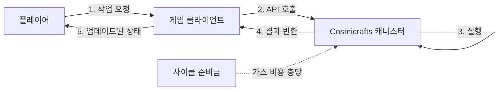
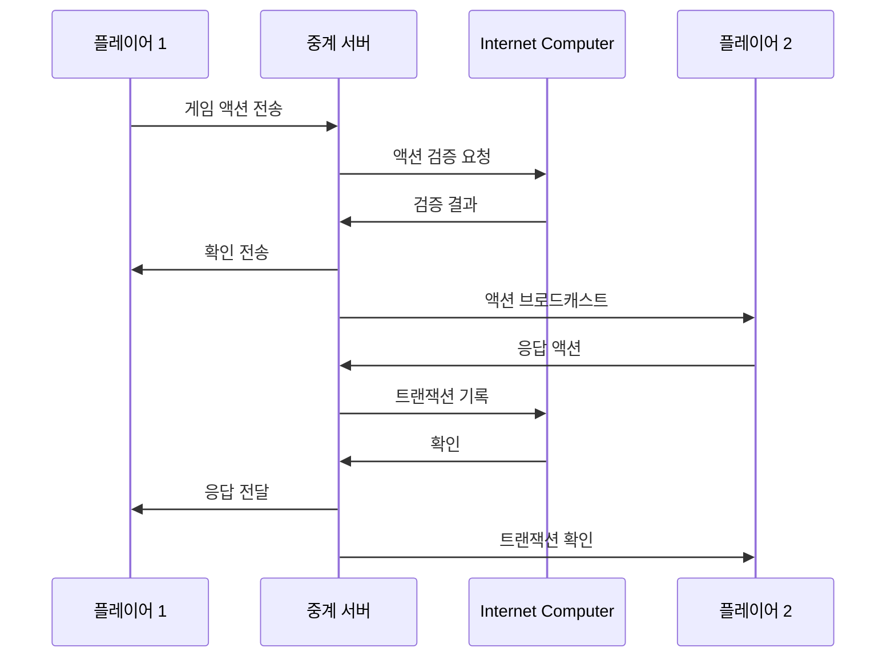

# 아키텍처

## 개요

Cosmicrafts는 플레이어에게 원활한 게임 경험을 제공하면서 블록체인 기술의 이점을 모두 활용하는 하이브리드 아키텍처를 채택했습니다. 이 문서에서는 기술 스택, 데이터 흐름, 확장성 전략을 자세히 설명합니다.

::: info 기술적 주의사항
이 문서는 개발자와 기술적으로 지식이 있는 커뮤니티 회원을 위한 참조용입니다. 일부 세부 사항은 개발이 진행됨에 따라 변경될 수 있습니다.
:::

## 핵심 기술 설계

Cosmicrafts는 Internet Computer Protocol(ICP)를 주요 블록체인 인프라로 활용하는 단일 캐니스터 패턴을 기반으로 합니다.

### 모토코 기반 개발

개발 언어로 Motoko를 선택한 이유:

1. **네이티브 ICP 호환성** - 최적의 통합 및 성능을 위해 설계됨
2. **타입 안전성** - 런타임 오류 감소 및 코드 품질 향상
3. **비동기 패턴** - 원활한 사용자 경험을 위한 효율적인 병렬 처리
4. **업그레이드 가능성** - 중단 없는 기능 업데이트 지원
5. **모듈식 설계** - 재사용 가능한 구성 요소 및 확장 지원

### 단일 캐니스터 설계

| 구성 요소 | 설명 | 이점 |
|--------|-------------|----------|
| **상태 관리** | 중앙 집중식 원장 | 트랜잭션 일관성 |
| **비즈니스 로직** | 게임 규칙 및 메커니즘 | 체인 내 검증 |
| **자산 처리** | NFT 로직 및 메타데이터 | 온체인 소유권 |
| **인터페이스** | API 호출 | 단순화된 액세스 |

### 가스 없는 사용자 경험

Cosmicrafts의 주요 장점 중 하나는 역방향 가스 모델입니다:

이 방식을 통해 플레이어는 지갑이나 가스 비용에 대한 이해 없이 게임과 상호 작용할 수 있습니다.

## 통합 아키텍처

Cosmicrafts는 프론트엔드, 백엔드, 블록체인 계층 간의 원활한 통합을 위해 다음과 같은 접근 방식을 사용합니다:

| 계층 | 구성 요소 | 기술 |
|-------|-----------|-----------|
| **프론트엔드** | 사용자 인터페이스 | Vue.js, Three.js |
| **백엔드** | 게임 로직 | Motoko, Rust |
| **블록체인** | 데이터 지속성 | ICP 캐니스터 |
| **스토리지** | 자산 및 메타데이터 | ICP 자산 캐니스터 |
| **확장 서비스** | 분석, 알림 | 하이브리드 오프체인 |

## 실시간 통신 계층

Cosmicrafts의 주요 기술적 혁신은 블록체인 기반 게임에서 실시간 상호 작용을 가능하게 하는 통신 계층입니다.

### 메시지 브로커 시스템

이 하이브리드 접근 방식은 다음을 제공합니다:
- 플레이어 작업에 대한 지연 시간이 짧음
- 중요한 트랜잭션에 대한 블록체인 확인
- 실시간 업데이트를 위한 최적화된 네트워크 트래픽

## 자원 관리

### 온체인 vs 오프체인 데이터

데이터 관리 계층화 전략:

| 데이터 종류 | 저장 위치 | 이유 |
|------------|-----------|------|
| **자산 소유권** | 온체인 | 불변성 및 검증 |
| **게임 상태** | 온체인 | 조작 방지 |
| **플레이어 진행** | 온체인 | 투명성 |
| **게임 자산** | 하이브리드 | 성능과 확장성 |
| **임시 데이터** | 오프체인 | 효율성 |
| **미디어 자산** | 분산 스토리지 | 대역폭 최적화 |

### 확장성 고려사항

플랫폼이 성장함에 따라 다음과 같은 확장 메커니즘을 구현할 계획입니다:

1. **샤딩** - 특정 게임 인스턴스 또는 지역에 대한 전용 캐니스터
2. **계층적 데이터 구조** - 자주 액세스하는 데이터의 가용성 최적화
3. **점진적 업그레이드** - 서비스 중단 없이 시스템 개선
4. **여러 서브넷 활용** - 네트워크 부하 분산

## 보안 평가

Cosmicrafts는 다음과 같은 포괄적인 보안 전략을 채택했습니다:

::: info 보안 상태
시스템은 현재 내부 테스트 중이며, 정식 출시 전에 제3자 보안 감사를 받을 예정입니다.
:::

### 주요 보안 조치

| 영역 | 조치 | 상태 |
|------|--------|--------|
| **스마트 계약** | 정형 검증 | 진행 중 |
| **공격 표면** | 위협 모델링 | 완료 |
| **ID 관리** | Internet Identity 통합 | 구현됨 |
| **액세스 제어** | 권한 기반 체계 | 구현됨 |
| **자산 보안** | 소유권 증명 | 구현됨 |
| **데이터 무결성** | 체인 내 검증 | 진행 중 |

## 기술 로드맵

Cosmicrafts의 기술 개발은 다음과 같은 단계로 계획되어 있습니다:

### 페이즈 1: 기반 (2023 Q4 - 2024 Q1)
- 핵심 게임 메커니즘 구현
- 단일 캐니스터 아키텍처 완성
- 기본 자산 관리 시스템
- 프론트엔드 인터페이스

### 페이즈 2: 확장 (2024 Q2 - Q3)
- 실시간 통신 계층 강화
- 복잡한 게임 메커니즘 추가
- NFT 거래 기능
- 사용자 확장을 위한 최적화

### 페이즈 3: 고도화 (2024 Q4 이후)
- 크로스플랫폼 지원 개선
- DAO 거버넌스 통합
- 다중 게임 인스턴스 지원
- 제3자 개발자 도구

```mermaid
graph TD
    %% Core User Layer
    User(("🧑 사용자"))
    
    %% Frontend Layer
    subgraph "프론트엔드 계층"
        UI["🖥️ 사용자 인터페이스"]
        Client["📱 게임 클라이언트"]
    end
    
    %% Communication Layer
    subgraph " "
        WS["📡 WebSocket 게이트웨이"]
        API["🔌 API 인터페이스"]
    end
    
    %% Blockchain Layer
    subgraph "블록체인 계층"
        Canister["⚡ 게임 캐니스터"]
        DAO["SNS 거버넌스"]
    end
    
    %% Connections
    User --> UI
    User --> Client
    UI --> WS
    UI --> API
    Client --> WS
    Client --> API
    WS --> Canister
    API --> Canister
    Canister -.->|"보고"| DAO
    DAO -->|"제어"| Canister
    
    %% Styles
    classDef user fill:#1a2d40,stroke:#fff,stroke-width:2px
    classDef frontend fill:#0FB9FD20,stroke:#0FB9FD,stroke-width:2px
    classDef comms fill:#FFB80020,stroke:#FFB800,stroke-width:2px
    classDef blockchain fill:#00E5A420,stroke:#00E5A4,stroke-width:2px
    
    %% Apply styles
    class User user
    class UI,Client frontend
    class WS,API comms
    class Canister,DAO blockchain
```

> For a comprehensive understanding of how these features are implemented, continue reading our [Core Features](/core-features) documentation.