# 기술 아키텍처

[[toc:2-2]]

## 개요

Cosmicrafts의 기술 아키텍처는 블록체인과 WebSocket을 결합하여 다음을 제공합니다:
- 안전하고 투명한 자산 소유권
- 빠르고 원활한 게임플레이
- 투명한 거버넌스
- 확장 가능한 인프라

## 핵심 기술 설계

### Motoko 프로그래밍 언어

Cosmicrafts는 Internet Computer를 위해 특별히 설계된 [Motoko](https://internetcomputer.org/docs/current/motoko/main/motoko)로 구축되었습니다. 이를 통해:

- 고급 메모리 관리
- 효율적인 상태 표현
- 비동기 작업 최적화
- Internet Computer와의 네이티브 통합

Our smart contracts are [open source on GitHub](https://github.com/cosmicrafts/cosmicrafts-dao) and [deployed publicly](https://dashboard.internetcomputer.org/canister/opcce-byaaa-aaaak-qcgda-cai) on the Internet Computer for full transparency.

### 통합 캐니스터 아키텍처

전통적인 다중 캐니스터 시스템과 달리, Cosmicrafts는 단일 캐니스터 설계를 사용합니다:

| 방식 | 전통적 | Cosmicrafts |
|------------|--------------|-------------|
| 지연 시간 | 높음 (다중 호출) | 낮음 (1회 호출) |
| 계산 비용 | 높음 (동기화) | 낮음 (비동기) |
| 복잡성 | 높음 (다중 실패 지점) | 낮음 (단순화) |
| 확장성 | 제한적 | 선형적 |

This architecture enables complex game operations like trading, crafting, and battling to execute immediately without the latency typically associated with blockchain applications. Players experience performance similar to traditional gaming platforms, while still benefiting from blockchain's security and ownership features.

### 실시간 통신 계층

Cosmicrafts는 안전한 양방향 통신을 위해 [IC WebSocket Gateway](https://github.com/dfinity/ic-websocket-gateway)를 사용합니다:

- **보안**
  - 메시지 서명
  - SSL/TLS 암호화
  - 사용자 인증

- **성능**
  - 낮은 지연 시간
  - 지속적 연결
  - 즉각적 상태 업데이트

| Feature | Implementation | Benefit |
|---------|----------------|----------|
| Real-time Updates | WebSocket Protocol | Sub-second latency for game actions |
| Message Security | Cryptographic Signing | Tamper-proof communication |
| Connection Management | Automatic Reconnection | Seamless gameplay experience |
| State Synchronization | Sequence Numbers | Consistent game state across clients |
| Transport Security | SSL/TLS | Protected data transmission |

## 리소스 관리

### 가스 없는 환경

Internet Computer는 가스 없는 환경을 제공하여 사용자 경험을 단순화합니다:

- 가스 비용 없음
- 암호화폐 지갑 불필요
- 기술적 장벽 없음

Unlike other blockchains where users must manage gas fees, the Internet Computer handles computation costs behind the scenes. This allows Cosmicrafts to deliver:

- **Mainstream Accessibility**: No cryptocurrency knowledge required to play
- **Micro-Transactions**: Even small in-game actions remain economically viable
- **Predictable Experience**: No surprising costs or failed transactions due to gas issues

### 운영 모니터링

| 지표 | 목표 | 모니터링 |
|----------|--------|----------|
| 가동 시간 | 99.9% | 연속 |
| 지연 시간 | <100ms | 시간별 |
| 처리량 | >1000 TPS | 일별 |
| 메모리 사용량 | <80% | 주별 |

## 의존성 및 외부 서비스

### 게임 엔진

- **현재**
  - 클라이언트용 Unity
  - 서버용 Motoko
  - 웹용 WebGL

- **계획됨**
  - Unreal Engine
  - 네이티브 모바일
  - VR/AR 지원

### 프론트엔드

- **프레임워크**
  - React
  - TypeScript
  - TailwindCSS

- **통합**
  - Internet Identity
  - Plug Wallet
  - NFID

### 백엔드

- **핵심**
  - Internet Computer
  - Motoko
  - Rust

- **서비스**
  - IC WebSocket Gateway
  - Asset Canister
  - SNS DAO

### 인프라

- **저장소**
  - Asset Canister
  - IPFS
  - Arweave

- **분석**
  - Prometheus
  - Grafana
  - ELK Stack

## 보안 평가

::: warning 감사 상태
현재 사용자 기반 구축과 캐니스터 기능 개선에 집중하고 있습니다. 포괄적인 보안 감사는 향후 계획되어 있습니다.
:::

### 보안 우선순위

1. **자산 보호**
   - 엔드투엔드 암호화
   - 다중 인증
   - 콜드 스토리지

2. **데이터 보호**
   - 저장소 암호화
   - 자동 백업
   - 접근 제어

3. **거래 보호**
   - 부정 방지
   - 이상 탐지
   - 속도 제한

## 기술 로드맵

### 1단계: 기반 (2024년 1-2분기)
- 캐니스터 최적화
- WebSocket 개선
- API 확장

### 2단계: 확장 (2024년 3-4분기)
- L2 통합
- 멀티체인 지원
- 분석 도구

### 3단계: 고도화 (2025년+)
- AI/ML 통합
- VR/AR 지원
- 규모 최적화

```mermaid
graph TD
    %% Core User Layer
    User(("🧑 사용자"))
    
    %% Frontend Layer
    subgraph "프론트엔드 계층"
        UI["🖥️ 사용자 인터페이스"]
        Client["📱 게임 클라이언트"]
    end
    
    %% Communication Layer
    subgraph " "
        WS["📡 WebSocket 게이트웨이"]
        API["🔌 API 인터페이스"]
    end
    
    %% Blockchain Layer
    subgraph "블록체인 계층"
        Canister["⚡ 게임 캐니스터"]
        DAO["SNS 거버넌스"]
    end
    
    %% Connections
    User --> UI
    User --> Client
    UI --> WS
    UI --> API
    Client --> WS
    Client --> API
    WS --> Canister
    API --> Canister
    Canister -.->|"보고"| DAO
    DAO -->|"제어"| Canister
    
    %% Styles
    classDef user fill:#1a2d40,stroke:#fff,stroke-width:2px
    classDef frontend fill:#0FB9FD20,stroke:#0FB9FD,stroke-width:2px
    classDef comms fill:#FFB80020,stroke:#FFB800,stroke-width:2px
    classDef blockchain fill:#00E5A420,stroke:#00E5A4,stroke-width:2px
    
    %% Apply styles
    class User user
    class UI,Client frontend
    class WS,API comms
    class Canister,DAO blockchain
```

> For a comprehensive understanding of how these features are implemented, continue reading our [Core Features](/core-features) documentation.