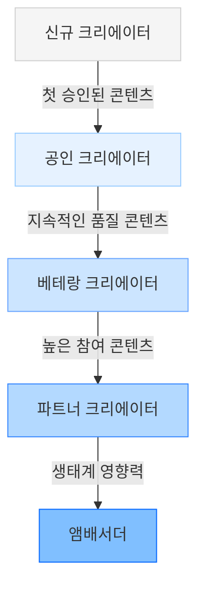
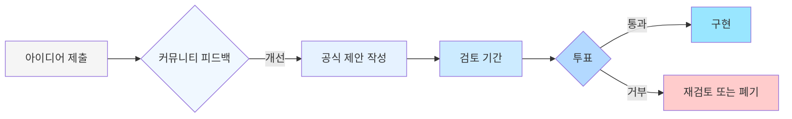

# 커뮤니티

## 개요

Cosmicrafts DAO의 커뮤니티 중심 접근 방식은 지속 가능하고 번창하는 디지털 생태계를 구축하는 데 필수적입니다. 플레이어, 크리에이터 및 투자자를 위한 명확한 보상 경로와 참여 방법을 제공합니다.

::: info 생태계 참여자
이 섹션에서는 다양한 유형의 이해관계자들이 Cosmicrafts DAO 생태계에 어떻게 기여하고 보상을 받을 수 있는지 설명합니다. 이 모델은 프로젝트 발전에 따라 DAO 거버넌스를 통해 지속적으로 조정됩니다.
:::

## 커뮤니티 재정

지속 가능한 발전을 위한 투명한 자금 관리로 커뮤니티 자산을 보호합니다.

### 자금 할당 요구사항

| 사용 사례 | 검토 수준 | 통과 기준 | 최대 자금 |
|----------|-----------|---------------|--------------|
| **운영 비용** | 월별 예산 | 51% 투표 | 월별 유동성의 5% |
| **마케팅 이니셔티브** | 개별 제안 | 55% 투표 | 분기별 유동성의 10% |
| **개발 출자금** | 기술 제안 | 60% 투표 | 분기별 유동성의 20% |
| **파트너십** | 공식 투표 | 65% 투표 | 연간 유동성의 15% |
| **생태계 확장** | 확장 제안 | 70% 투표 | 연간 유동성의 25% |

### 수익금 분배

| 소스 | 할당 방법 | 비율 |
|-------|--------------|---------|
| **게임 내 거래** | 매월 자동 | 40% 플레이어, 30% DAO, 30% 개발 |
| **NFT 로열티** | 매주 자동 | 70% 창작자, 20% DAO, 10% 개발 |
| **토큰 스테이킹** | 실시간 | 80% 스테이커, 15% DAO, 5% 개발 |
| **프리미엄 기능** | 매월 수동 | 50% DAO, 30% 개발, 20% 보상 풀 |

## 콘텐츠 크리에이터 프로그램

콘텐츠 크리에이터 생태계는 Cosmicrafts DAO 성장의 핵심입니다.

### 크리에이터 보상 프레임워크

| 활동 유형 | 보상 방법 | 평가 기준 |
|------------|---------------|------------------|
| **튜토리얼 비디오** | SPIRAL 토큰 | 품질, 길이, 참여도 |
| **스트리밍** | 후원 매칭 | 시청자, 유지율, 빈도 |
| **게임 내 콘텐츠** | 로열티 + 선지급 | 사용률, 독창성, 품질 |
| **커뮤니티 이벤트** | 이벤트 보조금 | 참가자, 참여도, 가치 |
| **개발 기여** | 개발 기금 | 코드 품질, 영향력, 복잡성 |

### 크리에이터 계층

크리에이터가 상위 계층으로 진행함에 따라 더 많은 보상, 노출 및 독점 기회를 얻게 됩니다.

## 마켓플레이스 기능

Cosmicrafts의 통합 마켓플레이스는 커뮤니티에 다음과 같은 주요 기능을 제공합니다:

### 거래 유형

| 유형 | 설명 | 수수료 구조 |
|-------|-------------|----------------|
| **직접 판매** | 고정 가격 구매 | 판매자 2%, 구매자 0% |
| **경매** | 시간 기반 입찰 | 판매자 1.5%, 구매자 1.5% |
| **오퍼** | 조건부 제안 | 판매자 1%, 구매자 2% |
| **번들** | 다중 아이템 판매 | 판매자 3%, 구매자 0% |
| **대여** | 임시 사용 | 임대인 5%, 임차인 2% |

### 보안 및 신뢰 기능

- **에스크로 시스템** - 모든 거래에 대한 안전한 결제 보호
- **평판 시스템** - 신뢰할 수 있는 거래 상대 식별
- **진위 확인** - 모든 자산의 출처와 역사 검증
- **분쟁 해결** - DAO 중재를 통한 공정한 결과
- **사기 방지** - 의심스러운 활동 탐지 및 플래그 지정

## 유동성 관리

유동성은 활발한 생태계를 유지하기 위해 전략적으로 관리됩니다.

### 유동성 인센티브

| 프로그램 | 목적 | 보상 구조 |
|----------|---------|-----------------|
| **유동성 풀 스테이킹** | 거래 깊이 확보 | 기본 APR + 거래 수수료 |
| **바운티 프로그램** | 장기 참여 유도 | 마일스톤 기반 토큰 보상 |
| **재투자 상여금** | 수익금 잠금 유도 | 기본 스테이킹 + 25% 보너스 |
| **신규 사용자 인센티브** | 사용자 기반 확대 | 온보딩 보너스 + 추천 보상 |

### 재무 안정성 조치

- **보유고 유지** - 시장 변동 중 운영 자금 확보
- **다변화** - 다양한 자산을 통한 리스크 관리
- **헤징 메커니즘** - 극단적인 시장 상황으로부터 보호
- **단계적 출시** - 토큰 유통량의 통제된 확장
- **자동 유동성 조정** - 시장 조건에 따른 파라미터 조정

## 거버넌스 참여 요구사항

커뮤니티 멤버가 거버넌스에 참여하기 위한 명확한 경로:

### 투표 권한

| 접근 수준 | 최소 요구사항 | 투표 가중치 | 제안 권한 |
|--------------|---------------------|--------------|-----------------|
| **기본 참여** | 1 SPIRAL 토큰 | 1x | 투표만 가능 |
| **활성 참여자** | 100 SPIRAL (60일 잠금) | 1.5x | 경미한 제안 |
| **핵심 기여자** | 1,000 SPIRAL (90일 잠금) | 2x | 일반 제안 |
| **수탁자** | 10,000 SPIRAL (180일 잠금) | 3x | 모든 제안 유형 |
| **평의회 회원** | 선출직 (투표로 선정) | 5x | 긴급 조치 |

### 제안 과정

## 기관 투자자 유형

기관 투자자를 위한 맞춤형 참여 경로:

| 투자자 유형 | 최소 투자 | 권한 | 잠금 기간 |
|--------------|-----------------|-----------|--------------|
| **전략적 파트너** | $250,000 | 전용 대시보드, 자문 역할 | 2년 (단계적 해제) |
| **생태계 확장자** | $100,000 | API 액세스, 얼리 빌더 | 18개월 (단계적 해제) |
| **기관 스테이커** | $50,000 | 향상된 수익률, 이벤트 액세스 | 1년 (단계적 해제) |
| **게임 길드** | 게임 내 성과 기반 | 맞춤형 자산, 공동 마케팅 | 성과 기반 |

## 커뮤니티 성장 이니셔티브

Cosmicrafts DAO의 커뮤니티 확장 및 참여 전략:

### 온보딩 프로그램

- **아카데미** - 게임 메커니즘 및 블록체인 기본 사항에 대한 대화형 학습
- **멘토링** - 신규 사용자와 경험 있는 플레이어 연결
- **증강 현실 튜토리얼** - 보상 기반 학습 경로
- **마이크로태스크** - 단계적 프로젝트 참여 증가

### 유지 전략

- **시즌제 이벤트** - 정기적인 테마 콘텐츠 및 도전 과제
- **업적 시스템** - 지속적인 참여에 대한 온체인 인정
- **커뮤니티 챌린지** - 협력적 목표와 공유 보상
- **참여 리더보드** - 공개적으로 인정받는 기여와 활동

## 커뮤니티 로드맵

### 페이즈 1: 설립 (2023 Q4 - 2024 Q1)
- 핵심 커뮤니티 구축
- 앰버서더 프로그램 출시
- 기본 보상 시스템 구현
- 거버넌스 포럼 개설
- 초기 파트너십 형성

### 페이즈 2: 성장 (2024 Q2 - Q3)
- 콘텐츠 크리에이터 프로그램 확장
- 지역별 커뮤니티 허브 런칭
- 스테이킹 및 유동성 인센티브 강화
- 커뮤니티 주도 이벤트 프레임워크
- 교차 생태계 파트너십

### 페이즈 3: 확장 (2024 Q4 이후)
- 완전한 DAO 거버넌스 전환
- 서브 DAO 형성
- 커뮤니티 기금 확대
- 글로벌 대면 이벤트
- 생태계 보조금 프로그램

