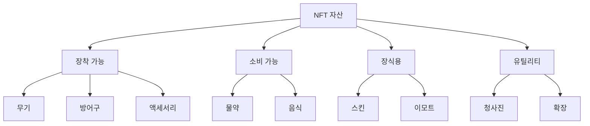
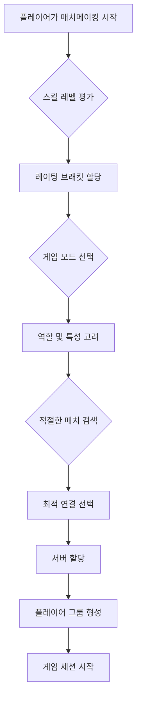

# 핵심 기능

## 개요

Cosmicrafts DAO 플랫폼은 맞춤형 플레이어, NFT 자산, 동적 경제 및 매치메이킹의 4가지 주요 하위 시스템으로 구성됩니다. 이 문서에서는 이러한 시스템 간의 상호작용과 각 시스템의 중요한 기능을 자세히 설명합니다.

::: info 기술 사양
이 섹션에서는 게임플레이와 기능의 개요를 제공합니다. 각 시스템의 구체적인 구현과 기술적 세부사항은 시스템 설계 문서를 참조하세요.
:::

## 플레이어 시스템

플레이어 시스템은 Cosmicrafts의 기반으로, 사용자가 캐릭터를 생성, 맞춤화 및 성장시킬 수 있게 합니다.

### 플레이어 프로필

각 플레이어는 다음 속성을 가진 프로필과 연결되어 있습니다:

| 속성 | 설명 | 업그레이드 가능성 |
|---------|-------------|--------------|
| **ID** | 고유 식별자 | 불가능 |
| **에너지** | 액션을 수행하는 능력 | 가능 |
| **레벨** | 전체 진행 상황 | 경험치에 따라 |
| **스킬** | 특정 능력의 컬렉션 | 훈련과 아이템에 따라 |
| **인벤토리** | 소유한 아이템과 NFT | 용량 업그레이드 가능 |
| **지갑** | 게임 내 통화와 자산 | 거래에 따라 변동 |
| **통계** | 성능 지표 | 자동으로 업데이트 |

### 플레이어 진행

플레이어 진행은 여러 축을 따라 측정됩니다:

1. **캐릭터 레벨** - 전체 진행 상황을 나타냄
2. **스킬 숙련도** - 특정 활동에서의 전문성
3. **자산 수집** - 고유한 아이템과 자원 획득
4. **평판** - 커뮤니티 내에서의 위치

### 커스터마이징 옵션

플레이어는 다음을 통해 캐릭터를 맞춤화할 수 있습니다:

- **외관** - 시각적 특징 및 장식
- **스킬 할당** - 특정 능력에 대한 투자
- **장비 선택** - 장착된 아이템과 그 조합
- **전문화** - 특정 플레이 스타일에 대한 초점

## 자산 시스템

자산 시스템은 게임 내의 모든 수집 가능, 거래 가능 또는 사용 가능한 아이템을 관리합니다. 이 시스템은 NFT와 토큰화된 자산을 모두 지원합니다.

### NFT 카테고리

### NFT 속성

각 NFT는 다음과 같은 특성을 가지고 있습니다:

| 속성 | 설명 | 예시 |
|---------|-------------|-------|
| **희귀도** | 아이템 획득 난이도 | 일반, 희귀, 에픽, 전설 |
| **내구성** | 사용 가능 횟수 | 100/100 |
| **레벨 요구사항** | 사용에 필요한 최소 레벨 | 레벨 30+ |
| **스텟 보너스** | 제공되는 강화 | +5 힘, +10 방어력 |
| **특수 능력** | 고유한 효과 | 범위 데미지, 회복 가속 |
| **거래 제한** | 거래 또는 이전 제한 | 양도 불가, 계정 바인딩 |

### 크래프팅

Cosmicrafts에는 광범위한 크래프팅 시스템이 있어, 플레이어는 다음과 같은 작업이 가능합니다:

1. **재료 수집** - 환경에서 자원 채취
2. **아이템 제작** - 재료 조합으로 새로운 아이템 생성
3. **아이템 강화** - 기존 아이템 개선
4. **분해** - 아이템을 구성 재료로 분해

## 경제 시스템

경제 시스템은 게임 내의 모든 가치 교환과 자원 순환을 관리합니다.

### 통화 유형

| 통화 | 용도 | 획득 방법 | 규모 |
|---------|--------|------------|--------|
| **SPIRAL** | 거버넌스, 프리미엄 구매 | 트레이딩, 스테이킹 | 매크로 경제 |
| **크레딧** | 일상 거래, 기본 아이템 | 플레이로 획득, 과제 | 메인 경제 |
| **명성** | 평판 기반 거래 | 커뮤니티 기여 | 메타게임 |
| **재료** | 크래프팅, 업그레이드 | 자원 수집, 몬스터 처치 | 마이크로 경제 |

### 시장 메커니즘

1. **플레이어 간 거래** - 아이템과 통화의 직접 교환
2. **경매장** - 경쟁 입찰 시스템
3. **NPC 상인** - 고정 가격 거래
4. **자원 싱크** - 통화 유통량을 조절하는 메커니즘

### 인플레이션 통제

- **동적 드롭 비율** - 시장 포화도에 따라 조정
- **시간 기반 제한** - 자원 생성 상한
- **분해 인센티브** - 잉여 아이템 제거 장려
- **프리미엄 싱크** - 필수가 아닌 아이템을 위한 통화 소비

## 매치메이킹 시스템

매치메이킹 시스템은 경쟁적 또는 협력적 게임플레이를 위해 플레이어를 연결합니다.

### 매치메이킹 알고리즘

### 게임 모드

| 모드 | 플레이어 수 | 목적 | 보상 구조 |
|-------|------------|---------|--------------|
| **듀얼** | 1v1 | 경쟁적 플레이어 대 플레이어 | 랭킹 포인트, 고유 아이템 |
| **팀 전투** | 3v3, 5v5 | 협력적 전략 전투 | 팀 보상, 제휴 보너스 |
| **배틀로얄** | 50-100 | 라스트맨 스탠딩 | 생존 기반, 킬 카운트 |
| **레이드** | 10-25 | PvE 도전 | 보스 전용 드롭, 공유 보상 |
| **익스플로러** | 무제한 | 오픈 월드 탐험 | 발견 보상, 채집 아이템 |

### 스킬 기반 매칭

플레이어는 다음 요소를 기반으로 매칭됩니다:

1. **ELO 스타일 레이팅** - 승리와 패배 이력 기반
2. **성능 지표** - 게임 내 능력 측정
3. **플레이스타일 호환성** - 보완적 역할 촉진
4. **연결 품질** - 최적의 게임플레이를 위한 기술적 요인

## NFT 진화

Cosmicrafts 내의 NFT는 정적 수집품이 아니라, 다양한 방식으로 성장 변화하는 동적 자산입니다.

### 진화 메커니즘

| 메커니즘 | 설명 | 요구사항 |
|-----------|-------------|------------|
| **레벨업** | 아이템이 경험을 얻고 능력이 향상 | 아이템 사용, XP 투자 |
| **퓨전** | 여러 NFT를 결합하여 더 강력한 아이템 생성 | 호환 가능한 NFT, 융합 촉매제 |
| **특성 부여** | 새로운 속성이나 능력 추가 | 특성 젬, 의식 수행 |
| **전환** | 아이템 카테고리나 기능의 근본적인 변경 | 희귀 재료, 특별 이벤트 |

### NFT 역사 추적

각 NFT에는 역사가 기록되며, 다음을 포함합니다:

- **생성** - 기원과 제작 방법
- **소유권** - 과거 소유자 목록
- **업적** - 아이템으로 달성한 중요 이벤트
- **변경** - 업그레이드와 변경 세부사항

## 크로스 플랫폼 통합

Cosmicrafts는 여러 플랫폼과 블록체인을 지원하여 원활한 통합과 상호운용성을 제공합니다.

### 지원되는 플랫폼

| 플랫폼 | 통합 수준 | 특징 |
|-----------|-----------------|-----------|
| **PC** | 전체 기능 | 완전한 클라이언트, 모든 기능 |
| **모바일** | 최적화 | 간소화된 인터페이스, 핵심 게임플레이 |
| **브라우저** | 기본 | 자산 관리, 거래, 가벼운 플레이 |
| **VR/AR** | 실험적 | 몰입형 탐험, 특별 이벤트 |

### 블록체인 호환성

| 블록체인 | 사용 사례 | 구현 방법 |
|------------|-----------|--------------|
| **ICP** | 핵심 인프라 | 네이티브 개발 |
| **Ethereum** | 레거시 NFT 호환성 | 브릿지 솔루션 |
| **Solana** | 고처리량 트랜잭션 | 크로스체인 연결 |
| **BNB Chain** | 추가 시장 접근 | 멀티체인 표준 |

## 설계 원칙

Cosmicrafts 개발을 이끄는 핵심 원칙:

1. **플레이어 에이전시** - 의미 있는 선택과 제어
2. **순환 경제** - 지속 가능한 가치 창출 및 순환
3. **모듈식 설계** - 적응성과 확장성
4. **상호 연결 시스템** - 모든 게임 메커닉의 상호작용
5. **포용적 접근성** - 다양한 플레이어 베이스 가능
6. **기술 혁신** - 새로운 가능성의 지속적 탐구