# Teknik Mimari

[[toc:2-2]]

## Genel Bakış

Cosmicrafts'ın teknik mimarisi, blokzincirin gücünü ve gerçek zamanlı iletişimin verimliliğini birleştirerek şunları sağlar:
- Dijital varlıklar için güvenli sahiplik
- Hızlı ve sorunsuz oyun deneyimi
- Şeffaf ve denetlenebilir yönetişim
- Ölçeklenebilir altyapı

## Temel Teknik Tasarım

### Motoko Programlama Dili

Cosmicrafts, Motoko dili kullanılarak geliştirilmiştir ve şunları sağlar:
- Gelişmiş bellek yönetimi
- Verimli durum temsili
- Optimize edilmiş asenkron işlemler
- Derleme zamanı tip güvenliği

### Birleşik Canister Tasarımı

Geleneksel çoklu canister sistemlerinin aksine, Cosmicrafts birleşik bir tasarım kullanır:

| Özellik | Geleneksel Sistem | Cosmicrafts Yaklaşımı |
|---------|------------------|------------------|
| Yanıt Süresi | 2-5 saniye | >500 milisaniye |
| Hesaplama Maliyeti | Yüksek | Düşük |
| Dağıtım Karmaşıklığı | Karmaşık | Basitleştirilmiş |
| Ölçeklenebilirlik | Sınırlı | Yüksek |

### Birleşik Tasarımın Avantajları

1. **Geliştirilmiş Performans**
   - Düşük gecikme
   - Düşük hesaplama maliyeti
   - Bellek verimliliği

2. **Basitleştirilmiş İşlemler**
   - Kolay dağıtım
   - Basit bakım
   - Hızlı güncellemeler

3. **Geliştirilmiş Güvenilirlik**
   - Daha az hata noktası
   - Hızlı kurtarma
   - Daha iyi tutarlılık

## Gerçek Zamanlı İletişim Katmanı

### IC WebSocket Ağ Geçidi

Sistem, çift yönlü iletişim için IC WebSocket ağ geçidini kullanır:

| Özellik | Uygulama | Fayda |
|---------|-------------|----------|
| Mesaj İmzalama | Ed25519 | Mesaj güvenliği |
| SSL/TLS Şifreleme | AES-256 | Veri koruması |
| Veri Sıkıştırma | GZIP | İletim verimliliği |

### Güvenlik Özellikleri

1. **Mesaj Koruması**
   - Dijital imza
   - Bütünlük doğrulama
   - Manipülasyon önleme

2. **Bağlantı Güvenliği**
   - Uçtan uca şifreleme
   - İstemci kimlik doğrulama
   - Saldırı koruması

3. **Veri Koruması**
   - Şifreli depolama
   - Güvenli yedekleme
   - Güvenilir kurtarma

## Kaynak Yönetimi

### Gas Ücretsiz Ortam

Internet Computer, gas ücreti olmayan bir ortam sağlar:

| Özellik | Fayda | Uygulama |
|---------|----------|-------------|
| İşlem Ücreti Yok | Daha iyi kullanıcı deneyimi | Otomatik işleme |
| Destekli Hesaplama | Düşük işletme maliyeti | Akıllı kaynak yönetimi |
| Anlık İşlemler | Geliştirilmiş performans | Eşzamanlı işleme |

### Sistem İşlemleri

1. **Bellek Yönetimi**
   - Dinamik tahsis
   - Otomatik çöp toplama
   - Kullanım optimizasyonu

2. **İşlem İşleme**
   - Paralel yürütme
   - Yük dengeleme
   - Hata kurtarma

3. **Veri Depolama**
   - Verimli bölümleme
   - Dağıtık depolama
   - Otomatik yedekleme

## Bağımlılıklar ve Dış Hizmetler

### Oyun Motoru

| Bileşen | Durum | Gelecek Planları |
|---------|--------|------------------|
| Unity | Mevcut | Düzenli güncellemeler |
| Unreal | Planlanan | 2024 entegrasyonu |
| Godot | Planlanan | 2025 entegrasyonu |

### Ön Uç Bağımlılıkları

- React.js arayüz için
- Three.js grafikler için
- Web3.js entegrasyon için
- Socket.io iletişim için

### Arka Uç Bağımlılıkları

- Motoko akıllı sözleşmeler için
- Rust performans için
- Node.js hizmetler için
- Redis önbellek için

### Altyapı Hizmetleri

1. **Hesaplama**
   - Internet Computer
   - WebSocket sunucuları
   - Dağıtık işleme

2. **Depolama**
   - IPFS varlıklar için
   - IC depolama
   - Dağıtık yedekleme

3. **Ağ**
   - Global CDN
   - Otomatik yük dengeleme
   - DDoS koruması

## Güvenlik İncelemesi

### Mevcut Durum

- Kullanıcı tabanı oluşturmaya odaklanma
- Canister işlevselliğini geliştirme
- Sürekli güvenlik testi

### Gelecek Planları

1. **Kapsamlı Denetim**
   - Kod incelemesi
   - Penetrasyon testi
   - Güvenlik açığı analizi

2. **Güvenlik İyileştirmeleri**
   - Ek şifreleme
   - Gelişmiş kimlik doğrulama
   - Gelişmiş izleme

3. **Güvenlik Dokümantasyonu**
   - Güvenlik politikaları
   - Müdahale prosedürleri
   - Kullanıcı kılavuzları

## Teknik Yol Haritası

### Aşama 1: Temel (1-6 Ay)
- Canister performans iyileştirmesi
- Gerçek zamanlı iletişim güçlendirmesi
- İzleme araçları geliştirme

### Aşama 2: Genişleme (7-12 Ay)
- Yeni oyun motorları ekleme
- Kullanıcı deneyimi iyileştirme
- Ağ kapasitesi genişletme

### Aşama 3: İyileştirme (13+ Ay)
- Gelişmiş özellikleri uygulama
- Yeni teknolojileri entegre etme
- Genel performansı iyileştirme

```mermaid
graph TD
    %% Core User Layer
    User(("👤 Kullanıcı"))
    
    %% Frontend Layer
    subgraph "Ön Uç Katmanı"
        UI["🖥️ Kullanıcı Arayüzü"]
        Client["📱 Oyun İstemcisi"]
    end
    
    %% Communication Layer
    subgraph " "
        WS["📡 WebSocket Ağ Geçidi"]
        API["🔌 API Arayüzü"]
    end
    
    %% Blockchain Layer
    subgraph "Blokzincir Katmanı"
        Canister["⚡ Oyun Canister'ı"]
        DAO["SNS Yönetişimi"]
    end
    
    %% Connections
    User --> UI
    User --> Client
    UI --> WS
    UI --> API
    Client --> WS
    Client --> API
    WS --> Canister
    API --> Canister
    Canister -.->|"Raporlar"| DAO
    DAO -->|"Kontrol"| Canister
    
    %% Styles
    classDef user fill:#1a2d40,stroke:#fff,stroke-width:2px
    classDef frontend fill:#0FB9FD20,stroke:#0FB9FD,stroke-width:2px
    classDef comms fill:#FFB80020,stroke:#FFB800,stroke-width:2px
    classDef blockchain fill:#00E5A420,stroke:#00E5A4,stroke-width:2px
    
    %% Apply styles
    class User user
    class UI,Client frontend
    class WS,API comms
    class Canister,DAO blockchain
```

