# Kiến Trúc Kỹ Thuật

[[toc:2-2]]

## Tổng Quan

Kiến trúc kỹ thuật của Cosmicrafts kết hợp công nghệ blockchain và WebSocket để cung cấp:
- Quyền sở hữu tài sản an toàn và minh bạch
- Gameplay nhanh và mượt mà
- Quản trị minh bạch
- Cơ sở hạ tầng có thể mở rộng

## Thiết Kế Kỹ Thuật Cốt Lõi

### Ngôn Ngữ Lập Trình Motoko

Cosmicrafts được xây dựng bằng [Motoko](https://internetcomputer.org/docs/current/motoko/main/motoko), một ngôn ngữ được thiết kế đặc biệt cho Internet Computer. Điều này cho phép:

- Quản lý bộ nhớ nâng cao
- Biểu diễn trạng thái hiệu quả
- Tối ưu hóa hoạt động bất đồng bộ
- Tích hợp gốc với Internet Computer

### Kiến Trúc Canister Thống Nhất

Khác với các hệ thống đa canister truyền thống, Cosmicrafts sử dụng thiết kế canister đơn:

| Phương Pháp | Truyền Thống | Cosmicrafts |
|------------|--------------|-------------|
| Độ Trễ | Cao (nhiều lệnh gọi) | Thấp (1 lệnh gọi) |
| Chi Phí Tính Toán | Cao (đồng bộ hóa) | Thấp (không đồng bộ) |
| Phức Tạp | Cao (nhiều điểm lỗi) | Thấp (đơn giản hóa) |
| Khả Năng Mở Rộng | Giới hạn | Tuyến tính |

### Lớp Giao Tiếp Thời Gian Thực

Cosmicrafts sử dụng [IC WebSocket Gateway](https://github.com/dfinity/ic-websocket-gateway) cho giao tiếp hai chiều an toàn:

- **Bảo Mật**
  - Ký tin nhắn
  - Mã hóa SSL/TLS
  - Xác thực người dùng

- **Hiệu Suất**
  - Độ trễ thấp
  - Kết nối liên tục
  - Cập nhật trạng thái tức thì

## Quản Lý Tài Nguyên

### Môi Trường Không Gas

Internet Computer cung cấp môi trường không gas, đơn giản hóa trải nghiệm người dùng:

- Không phí gas
- Không cần ví tiền điện tử
- Không rào cản kỹ thuật

### Giám Sát Hoạt Động

| Chỉ Số | Mục Tiêu | Theo Dõi |
|----------|--------|----------|
| Thời Gian Hoạt Động | 99.9% | Liên tục |
| Độ Trễ | <100ms | Hàng giờ |
| Thông Lượng | >1000 TPS | Hàng ngày |
| Sử Dụng Bộ Nhớ | <80% | Hàng tuần |

## Phụ Thuộc và Dịch Vụ Bên Ngoài

### Game Engine

- **Hiện Tại**
  - Unity cho client
  - Motoko cho server
  - WebGL cho web

- **Đã Lên Kế Hoạch**
  - Unreal Engine
  - Native mobile
  - VR/AR support

### Frontend

- **Framework**
  - React
  - TypeScript
  - TailwindCSS

- **Tích Hợp**
  - Internet Identity
  - Plug Wallet
  - NFID

### Backend

- **Cốt Lõi**
  - Internet Computer
  - Motoko
  - Rust

- **Dịch Vụ**
  - IC WebSocket Gateway
  - Asset Canister
  - SNS DAO

### Cơ Sở Hạ Tầng

- **Lưu Trữ**
  - Asset Canister
  - IPFS
  - Arweave

- **Phân Tích**
  - Prometheus
  - Grafana
  - ELK Stack

## Đánh Giá Bảo Mật

::: warning Trạng Thái Kiểm Toán
Chúng tôi đang tập trung vào xây dựng cơ sở người dùng và cải thiện chức năng canister. Kiểm toán bảo mật toàn diện được lên kế hoạch cho tương lai.
:::

### Ưu Tiên Bảo Mật

1. **Bảo Vệ Tài Sản**
   - Mã hóa đầu cuối
   - Xác thực đa yếu tố
   - Khóa lạnh

2. **Bảo Vệ Dữ Liệu**
   - Mã hóa trong lưu trữ
   - Sao lưu tự động
   - Kiểm soát truy cập

3. **Bảo Vệ Giao Dịch**
   - Chống gian lận
   - Phát hiện bất thường
   - Giới hạn tốc độ

## Lộ Trình Kỹ Thuật

### Giai Đoạn 1: Nền Tảng (Q1-Q2 2024)
- Tối ưu hóa canister
- Cải thiện WebSocket
- Mở rộng API

### Giai Đoạn 2: Mở Rộng (Q3-Q4 2024)
- Tích hợp L2
- Hỗ trợ đa chuỗi
- Công cụ phân tích

### Giai Đoạn 3: Tiên Tiến (2025+)
- Tích hợp AI/ML
- Hỗ trợ VR/AR
- Tối ưu hóa quy mô

```mermaid
graph TD
    %% Core User Layer
    User(("🧑 User"))
    
    %% Frontend Layer
    subgraph "Frontend Layer"
        UI["🖥️ User Interface"]
        Client["📱 Game Client"]
    end
    
    %% Communication Layer
    subgraph " "
        WS["📡 WebSocket Gateway"]
        API["🔌 API Interface"]
    end
    
    %% Blockchain Layer
    subgraph "Blockchain Layer"
        Canister["⚡ Game Canister"]
        DAO["SNS Governance"]
    end
    
    %% Connections
    User --> UI
    User --> Client
    UI --> WS
    UI --> API
    Client --> WS
    Client --> API
    WS --> Canister
    API --> Canister
    Canister -.->|"Reports to"| DAO
    DAO -->|"Controls"| Canister
    
    %% Styles
    classDef user fill:#1a2d40,stroke:#fff,stroke-width:2px
    classDef frontend fill:#0FB9FD20,stroke:#0FB9FD,stroke-width:2px
    classDef comms fill:#FFB80020,stroke:#FFB800,stroke-width:2px
    classDef blockchain fill:#00E5A420,stroke:#00E5A4,stroke-width:2px
    
    %% Apply styles
    class User user
    class UI,Client frontend
    class WS,API comms
    class Canister,DAO blockchain
```

