# 架构

## 概述

Cosmicrafts采用区块链和WebSocket相结合的混合架构，实现：

- **安全的资产所有权**: 区块链上可验证的所有权
- **快速的游戏体验**: 低延迟实时通信
- **透明的治理**: 链上决策和执行
- **可扩展的基础设施**: 随增长扩展

## 核心技术设计

### Motoko语言

Cosmicrafts作为Internet Computer上的单一容器实现，具有以下特点：

- **高级内存管理**
  - 高效垃圾回收
  - 优化的堆使用
  - 智能资源分配

- **高效状态表示**
  - 自定义类型系统
  - 压缩数据结构
  - 索引优化

- **优化的异步操作**
  - 并发控制
  - 消息队列
  - 错误处理机制

## 统一容器架构

### 传统多容器 vs 单容器

| 方面 | 多容器 | Cosmicrafts单容器 |
|------|--------|-------------------|
| 延迟 | 容器间通信导致延迟 | 直接访问最小化 |
| 复杂性 | 高（多依赖） | 低（集成系统） |
| 计算开销 | 大（需状态同步） | 小（共享内存空间） |
| 可扩展性 | 水平（但复杂） | 垂直（简单） |
| 维护 | 困难（多次升级） | 容易（单次升级） |

### 性能优势

1. **延迟最小化**
   - 消除容器间通信
   - 直接内存访问
   - 优化状态管理

2. **资源效率**
   - 共享内存空间
   - 高效缓存
   - 最小化复制

3. **简化更新**
   - 单一升级流程
   - 一致状态管理
   - 低停机时间

## 实时通信层

### IC WebSocket网关

实现安全双向通信的关键组件：

- **消息签名**
  - 容器签名验证
  - 防篡改
  - 防重放攻击

- **SSL/TLS加密**
  - 端到端加密
  - 证书管理
  - 协议协商

### 通信流程

1. **连接建立**
   - WebSocket连接初始化
   - 认证握手
   - 会话建立

2. **消息处理**
   - 二进制协议
   - 压缩算法
   - 错误处理

3. **状态同步**
   - 差异更新
   - 冲突解决
   - 重连逻辑

## 资源管理

### 无Gas环境

利用Internet Computer特性实现：

- **用户体验**
  - 无Gas费用
  - 即时交易
  - 无缝操作

- **开发简化**
  - 可预测成本
  - 简化实现
  - 高效资源使用

### 运营监控

| 指标 | 监控项 | 警报阈值 |
|------|--------|----------|
| CPU使用率 | 处理负载 | 80% |
| 内存使用 | 堆状态 | 90% |
| 网络 | 带宽使用 | 75% |
| 延迟 | 响应时间 | 100ms |

## 依赖和外部服务

### 当前游戏引擎依赖

- Unity 2022.3 LTS
- WebGL 2.0
- 自定义渲染管线

### 前端依赖

- React 18
- TypeScript 5
- Tailwind CSS
- Vite

### 后端依赖

- Motoko 0.9
- IC CDK
- 自定义WebSocket网关

### 基础设施服务

- Internet Computer
- CloudFlare
- AWS（备份）
- GitHub

## 安全审查状态

当前重点：

1. **用户基础构建**
   - 社区增长
   - 功能验证
   - 反馈收集

2. **容器功能改进**
   - 性能优化
   - 可扩展性测试
   - 安全增强

未来计划：

- 全面安全审计
- 渗透测试
- 形式化验证
- 社区漏洞赏金

```mermaid
graph TD
    %% Core User Layer
    User(("🧑 User"))
    
    %% Frontend Layer
    subgraph "Frontend Layer"
        UI["🖥️ User Interface"]
        Client["📱 Game Client"]
    end
    
    %% Communication Layer
    subgraph " "
        WS["📡 WebSocket Gateway"]
        API["🔌 API Interface"]
    end
    
    %% Blockchain Layer
    subgraph "Blockchain Layer"
        Canister["⚡ Game Canister"]
        DAO["SNS Governance"]
    end
    
    %% Connections
    User --> UI
    User --> Client
    UI --> WS
    UI --> API
    Client --> WS
    Client --> API
    WS --> Canister
    API --> Canister
    Canister -.->|"Reports to"| DAO
    DAO -->|"Controls"| Canister
    
    %% Styles
    classDef user fill:#1a2d40,stroke:#fff,stroke-width:2px
    classDef frontend fill:#0FB9FD20,stroke:#0FB9FD,stroke-width:2px
    classDef comms fill:#FFB80020,stroke:#FFB800,stroke-width:2px
    classDef blockchain fill:#00E5A420,stroke:#00E5A4,stroke-width:2px
    
    %% Apply styles
    class User user
    class UI,Client frontend
    class WS,API comms
    class Canister,DAO blockchain
```

